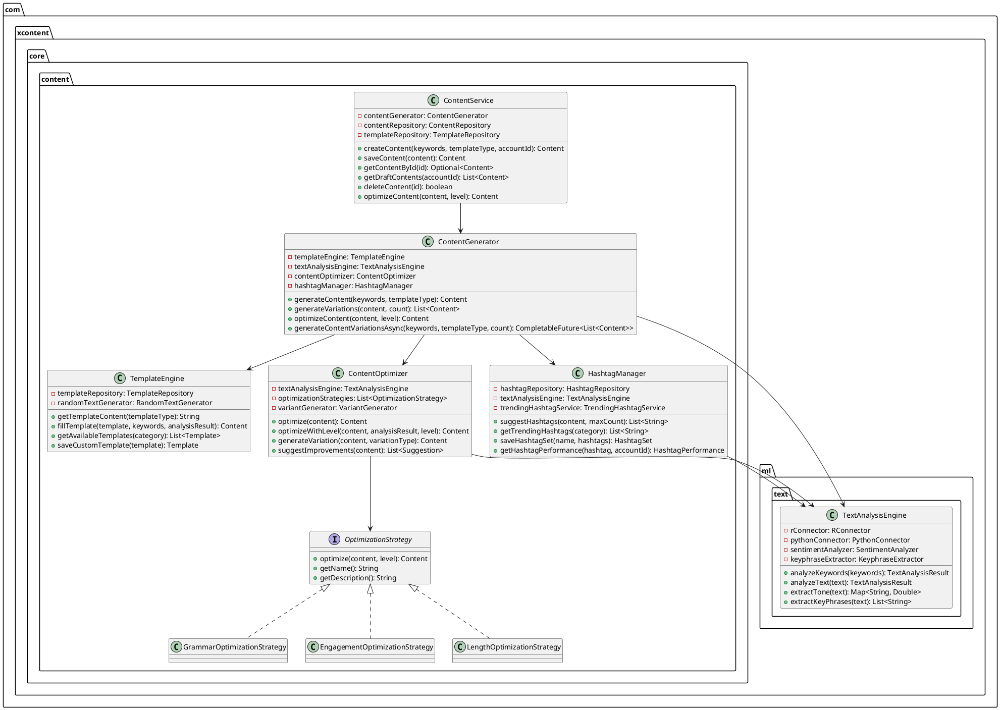
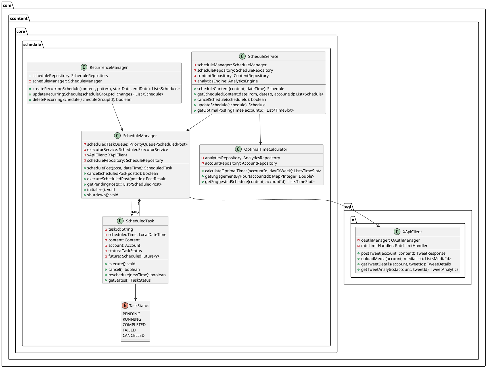
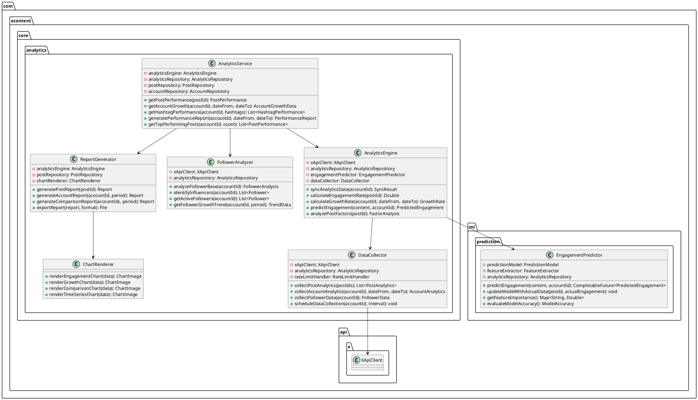
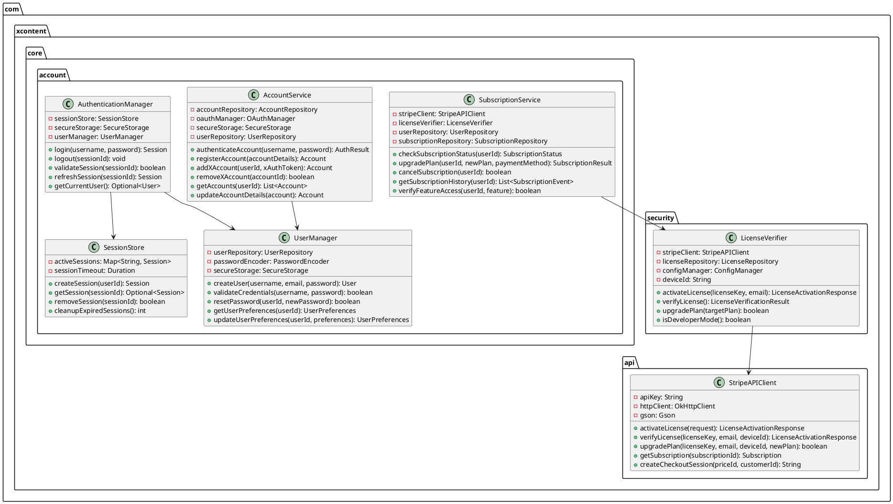
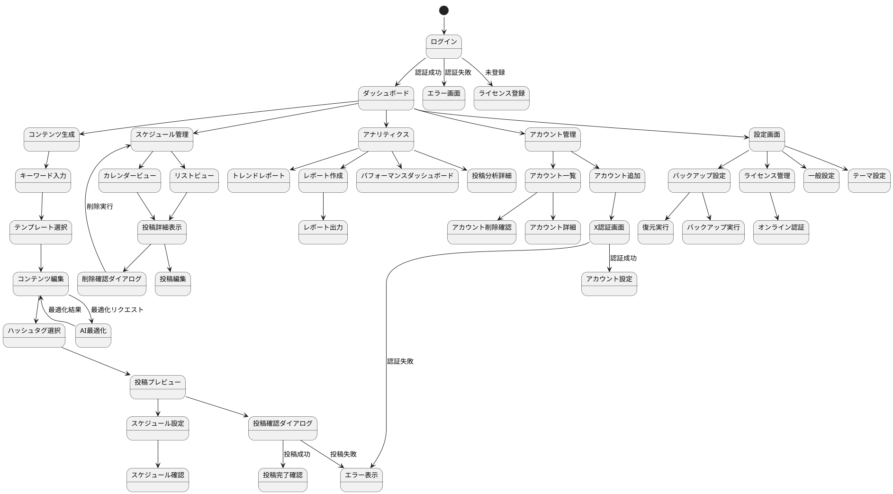

# X.com コンテンツジェネレーター詳細設計書

**文書番号:** XCG-DSD-2025-001  
**バージョン:** 1.0.0  
**作成日:** 2025-04-28  
**最終更新日:** 2025-04-28  
**作成者:** RyuhoW  
**レビュアー:** {レビュアー名}  
**ステータス:** ドラフト

## 変更履歴

| 日付 | バージョン | 担当者 | 変更内容 |
|------|------------|---------|----------|
| 2025-04-28 | 1.0.0 | RyuhoW | 初版作成 |

## 目次

1. [クラス設計](#1-クラス設計)
2. [UI詳細設計](#2-ui詳細設計)
3. [データベース詳細設計](#3-データベース詳細設計)
4. [API連携詳細設計](#4-api連携詳細設計)
5. [機械学習モデル詳細設計](#5-機械学習モデル詳細設計)
6. [セキュリティ実装詳細](#6-セキュリティ実装詳細)
7. [例外処理詳細設計](#7-例外処理詳細設計)
8. [テスト詳細設計](#8-テスト詳細設計)
9. [デプロイメント詳細設計](#9-デプロイメント詳細設計)

## 1. クラス設計

### 1.1 パッケージ構成

アプリケーションの全体パッケージ構成を以下に示します。

```
com.xcontent
├── application         # アプリケーション起動・管理
├── controller          # UIコントローラ
├── core                # コアビジネスロジック
│   ├── content         # コンテンツ関連
│   ├── schedule        # スケジューリング関連
│   ├── analytics       # 分析関連
│   └── account         # アカウント関連
├── data                # データアクセス
│   ├── model           # データモデル
│   ├── repository      # データリポジトリ
│   └── db              # データベース接続
├── api                 # 外部API連携
│   ├── x               # X.com API連携 
│   ├── stripe          # Stripe API連携
│   └── exception       # API例外
├── ml                  # 機械学習モジュール
│   ├── model           # 機械学習モデル
│   ├── text            # テキスト分析
│   ├── prediction      # 予測エンジン
│   └── python          # Python連携
├── security            # セキュリティ
│   ├── crypto          # 暗号化
│   ├── license         # ライセンス管理
│   └── storage         # セキュアストレージ
├── utils               # ユーティリティ
│   ├── async           # 非同期処理
│   ├── config          # 設定管理
│   ├── logging         # ログ機能
│   └── ui              # UI共通
└── exception           # 例外クラス
```

### 1.2 コアビジネスロジック層の詳細設計

#### 1.2.1 コンテンツ生成クラス設計

コンテンツ生成関連のクラス設計UML図を以下に示します。



#### 1.2.2 スケジューリングクラス設計

スケジュール管理関連のクラス設計UML図を以下に示します。



#### 1.2.3 分析クラス設計

分析エンジン関連のクラス設計UML図を以下に示します。



#### 1.2.4 アカウント管理クラス設計

アカウント管理関連のクラス設計UML図を以下に示します。



### 1.3 データアクセス層の詳細設計

データアクセス層のクラス設計UML図を以下に示します。

```plantuml
@startuml

package "com.xcontent.data" {
  package "model" {
    class Content {
      -id: long
      -accountId: long
      -text: String
      -hashtags: List<String>
      -mediaAttachments: List<MediaAttachment>
      -status: Status
      -templateId: long
      -scheduledAt: LocalDateTime
      -postedAt: LocalDateTime
      -createdAt: LocalDateTime
      -updatedAt: LocalDateTime
      -engagementScore: double
      +getId(): long
      +getText(): String
      +getHashtags(): List<String>
      +getStatus(): Status
      // その他のゲッター/セッター
    }
    
    class Account {
      -id: long
      -userId: long
      -username: String
      -displayName: String
      -profileImagePath: String
      -followers: int
      -following: int
      -isDefault: boolean
      -isActive: boolean
      +getId(): long
      +getUsername(): String
      +isDefault(): boolean
      // その他のゲッター/セッター
    }
    
    class Schedule {
      -id: long
      -contentId: long
      -scheduledTime: LocalDateTime
      -status: ScheduleStatus
      -recurringPattern: String
      -recurringGroupId: String
      +getId(): long
      +getScheduledTime(): LocalDateTime
      +isRecurring(): boolean
      // その他のゲッター/セッター
    }
    
    class Analytics {
      -id: long
      -postId: long
      -timestamp: LocalDateTime
      -impressions: int
      -likes: int
      -replies: int
      -reposts: int
      -profileVisits: int
      +getId(): long
      +getImpressions(): int
      +getLikes(): int
      // その他のゲッター/セッター
    }
    
    class User {
      -id: long
      -username: String
      -email: String
      -passwordHash: String
      -registeredAt: LocalDateTime
      -lastLogin: LocalDateTime
      -status: UserStatus
      +getId(): long
      +getUsername(): String
      +getEmail(): String
      // その他のゲッター/セッター
    }
    
    class License {
      -id: long
      -userId: long
      -licenseKey: String
      -licenseType: LicenseType
      -subscriptionPlan: SubscriptionPlan
      -isActive: boolean
      -expiryDate: LocalDateTime
      -lastVerifiedAt: LocalDateTime
      +getId(): long
      +getLicenseKey(): String
      +isActive(): boolean
      // その他のゲッター/セッター
    }
  }
  
  package "repository" {
    interface ContentRepository {
      +saveContent(content: Content): Content
      +getContentById(id: long): Optional<Content>
      +getContentsByAccount(accountId: long, limit: int, offset: int): List<Content>
      +getDraftContents(accountId: long): List<Content>
      +deleteContent(contentId: long): boolean
      +updateContentStatus(contentId: long, status: String, xPostId: String, failureReason: String): void
    }
    
    interface AccountRepository {
      +saveAccount(account: Account): Account
      +getAccountById(id: long): Optional<Account>
      +getAccountsByUserId(userId: long): List<Account>
      +getActiveAccounts(userId: long): List<Account>
      +deleteAccount(accountId: long): boolean
      +setDefaultAccount(accountId: long, userId: long): void
    }
    
    interface ScheduleRepository {
      +saveSchedule(schedule: Schedule): Schedule
      +getScheduleById(id: long): Optional<Schedule>
      +getSchedulesByTimeRange(start: LocalDateTime, end: LocalDateTime, accountId: long): List<Schedule>
      +getPendingSchedules(accountId: long): List<Schedule>
      +deleteSchedule(scheduleId: long): boolean
      +updateScheduleStatus(scheduleId: long, status: ScheduleStatus): void
    }
    
    interface AnalyticsRepository {
      +saveAnalytics(analytics: Analytics): Analytics
      +getAnalyticsByPostId(postId: long): List<Analytics>
      +getAnalyticsByDateRange(accountId: long, from: LocalDateTime, to: LocalDateTime): List<Analytics>
      +getAggregatedAnalytics(accountId: long, period: Period): List<AggregatedAnalytics>
      +deleteAnalytics(analyticsId: long): boolean
    }
    
    interface UserRepository {
      +saveUser(user: User): User
      +getUserById(id: long): Optional<User>
      +getUserByUsername(username: String): Optional<User>
      +getUserByEmail(email: String): Optional<User>
      +deleteUser(userId: long): boolean
      +updateUserStatus(userId: long, status: UserStatus): void
    }
    
    interface LicenseRepository {
      +saveLicense(license: License): License
      +getLicenseByUserId(userId: long): Optional<License>
      +getLicenseByKey(licenseKey: String): Optional<License>
      +updateLicense(license: License): License
      +deleteLicense(licenseId: long): boolean
    }
  }
  
  package "db" {
    class DatabaseManager {
      -connection: Connection
      -dbPath: String
      -instance: DatabaseManager
      +getInstance(): DatabaseManager
      +getConnection(): Connection
      +closeConnection(): void
      -initializeDatabase(): void
      -createTables(): void
      -migrateDatabase(currentVersion: int): void
    }
    
    class SQLiteContentRepository implements ContentRepository {
      -dbManager: DatabaseManager
      +saveContent(content: Content): Content
      // インターフェース実装メソッド
    }
    
    class SQLiteAccountRepository implements AccountRepository {
      -dbManager: DatabaseManager
      +saveAccount(account: Account): Account
      // インターフェース実装メソッド
    }
    
    class SQLiteScheduleRepository implements ScheduleRepository {
      -dbManager: DatabaseManager
      +saveSchedule(schedule: Schedule): Schedule
      // インターフェース実装メソッド
    }
    
    class SQLiteAnalyticsRepository implements AnalyticsRepository {
      -dbManager: DatabaseManager
      +saveAnalytics(analytics: Analytics): Analytics
      // インターフェース実装メソッド
    }
    
    class SQLiteUserRepository implements UserRepository {
      -dbManager: DatabaseManager
      +saveUser(user: User): User
      // インターフェース実装メソッド
    }
    
    class SQLiteLicenseRepository implements LicenseRepository {
      -dbManager: DatabaseManager
      +saveLicense(license: License): License
      // インターフェース実装メソッド
    }
  }
}

ContentRepository <|-- SQLiteContentRepository
AccountRepository <|-- SQLiteAccountRepository
ScheduleRepository <|-- SQLiteScheduleRepository
AnalyticsRepository <|-- SQLiteAnalyticsRepository
UserRepository <|-- SQLiteUserRepository
LicenseRepository <|-- SQLiteLicenseRepository

SQLiteContentRepository --> DatabaseManager
SQLiteAccountRepository --> DatabaseManager
SQLiteScheduleRepository --> DatabaseManager
SQLiteAnalyticsRepository --> DatabaseManager
SQLiteUserRepository --> DatabaseManager
SQLiteLicenseRepository --> DatabaseManager

@enduml
```



### 1.4 API連携層の詳細設計

API連携層のクラス設計UML図を以下に示します。

```plantuml
@startuml

package "com.xcontent.api" {
  package "x" {
    class XApiClient {
      -oauthManager: OAuthManager
      -rateLimitHandler: RateLimitHandler
      -httpClient: OkHttpClient
      +postTweet(account: Account, content: Content): TweetResponse
      +uploadMedia(account: Account, mediaFiles: List<File>): List<MediaId>
      +getTweet(account: Account, tweetId: String): TweetData
      +getTweetAnalytics(account: Account, tweetId: String): TweetAnalytics
      +getFollowers(account: Account, cursor: String, limit: int): FollowersList
      +getTimeline(account: Account, limit: int): List<TweetData>
    }
    
    class OAuthManager {
      -tokenStorage: SecureStorage
      +getAuthorizationUrl(authRequest: AuthRequest): String
      +handleCallback(callbackUrl: String): TokenData
      +refreshToken(account: Account): TokenData
      +buildAuthenticatedRequest(endpoint: String, method: String, params: Map<String, String>, tokenData: TokenData): Request
    }
    
    class RateLimitHandler {
      -rateLimits: Map<String, RateLimitInfo>
      +checkRateLimit(account: Account, endpoint: String): void
      +updateRateLimits(response: Response, account: Account, endpoint: String): void
    }
    
    class TweetResponse {
      -tweetId: String
      -createdAt: LocalDateTime
      -text: String
      -permalinkUrl: String
      +getTweetId(): String
      +getPermalinkUrl(): String
    }
  }
  
  package "stripe" {
    class StripeAPIClient {
      -apiKey: String
      -httpClient: OkHttpClient
      -gson: Gson
      +activateLicense(request: LicenseActivationRequest): LicenseActivationResponse
      +verifyLicense(licenseKey: String, email: String, deviceId: String): LicenseActivationResponse 
      +upgradePlan(licenseKey: String, email: String, deviceId: String, newPlan: SubscriptionPlan): boolean
      +createCustomer(email: String, name: String): String
      +createSubscription(customerId: String, priceId: String): Subscription
      +getSubscription(subscriptionId: String): Subscription
      +cancelSubscription(subscriptionId: String): boolean
      +createCheckoutSession(priceId: String, customerId: String): String
    }
  
    class LicenseActivationRequest {
      -licenseKey: String
      -email: String
      -deviceId: String
      +getLicenseKey(): String
      +getEmail(): String
      +getDeviceId(): String
    }
    
    class LicenseActivationResponse {
      -success: boolean
      -licenseKey: String
      -email: String
      -expiryDate: LocalDateTime
      -licenseType: LicenseType
      -subscriptionPlan: SubscriptionPlan
      -errorMessage: String
      +isSuccess(): boolean
      +getLicenseKey(): String
      +getExpiryDate(): LocalDateTime
      +getErrorMessage(): String
    }
    
    class Subscription {
      -id: String
      -customerId: String
      -status: String
      -currentPeriodStart: LocalDateTime
      -currentPeriodEnd: LocalDateTime
      -cancelAtPeriodEnd: boolean
      +getId(): String
      +getStatus(): String
      +isActive(): boolean
    }
  }
  
  package "exception" {
    class ApiException extends Exception {
      +ApiException(message: String)
      +ApiException(message: String, cause: Throwable)
    }
    
    class RateLimitException extends ApiException {
      -retryAfterSeconds: long
      +RateLimitException(message: String, retryAfterSeconds: long)
      +getRetryAfterSeconds(): long
    }
    
    class AuthException extends ApiException {
      +AuthException(message: String)
      +AuthException(message: String, cause: Throwable)
    }
  }
}

XApiClient --> OAuthManager
XApiClient --> RateLimitHandler
XApiClient ..> TweetResponse
XApiClient ..> ApiException
OAuthManager ..> AuthException
RateLimitHandler ..> RateLimitException
StripeAPIClient ..> LicenseActivationRequest
StripeAPIClient ..> LicenseActivationResponse
StripeAPIClient ..> Subscription
StripeAPIClient ..> ApiException

@enduml
```



### 1.5 ユーティリティと共通コンポーネント

ユーティリティと共通コンポーネントのクラス設計UML図を以下に示します。

```plantuml
@startuml

package "com.xcontent.utils" {
  package "async" {
    class TaskExecutor {
      -executor: ExecutorService
      +submit(task: Callable<T>): CompletableFuture<T>
      +execute(task: Runnable): void
      +scheduleTask(task: Runnable, delay: Duration): ScheduledTask
      +shutdown(): void
    }
    
    class RetryUtil {
      +{static} executeWithRetry(callable: Callable<T>, maxRetries: int, delay: Duration): T
      +{static} executeWithExponentialBackoff(callable: Callable<T>, maxRetries: int, initialDelay: Duration, maxDelay: Duration, retryCondition: Predicate<Throwable>): T
    }
  }
  
  package "config" {
    class ConfigManager {
      -instance: ConfigManager
      -properties: Properties
      -configFile: Path
      +getInstance(): ConfigManager
      +getString(key: String, defaultValue: String): String
      +getInt(key: String, defaultValue: int): int
      +getBoolean(key: String, defaultValue: boolean): boolean
      +setProperty(key: String, value: String): void
      +save(): void
      +getDataDirectoryPath(): String
      +getConfigDirectoryPath(): String
    }
    
    class AppSettings {
      -instance: AppSettings
      -configManager: ConfigManager
      +getInstance(): AppSettings
      +getUiTheme(): Theme
      +setUiTheme(theme: Theme): void
      +getLanguage(): Locale
      +setLanguage(locale: Locale): void
      +isAnalyticsEnabled(): boolean
      +setAnalyticsEnabled(enabled: boolean): void
    }
  }
  
  package "logging" {
    class LogManager {
      +{static} getLogger(clazz: Class<?>): Logger
      +{static} configure(): void
      +{static} setLogLevel(level: LogLevel): void
    }
    
    class FileLogger implements Logger {
      -logFile: Path
      -className: String
      +info(message: String): void
      +debug(message: String): void
      +warning(message: String): void
      +error(message: String): void
      +error(message: String, exception: Throwable): void
    }
    
    interface Logger {
      +info(message: String): void
      +debug(message: String): void
      +warning(message: String): void
      +error(message: String): void
      +error(message: String, exception: Throwable): void
    }
    
    enum LogLevel {
      DEBUG
      INFO
      WARNING
      ERROR
      FATAL
    }
  }
  
  package "ui" {
    class AlertUtil {
      +{static} showInfoDialog(title: String, header: String, content: String): void
      +{static} showWarningDialog(title: String, header: String, content: String): void
      +{static} showErrorDialog(title: String, header: String, content: String): void
      +{static} showConfirmDialog(title: String, header: String, content: String): boolean
      +{static} showProgressDialog(message: String, task: Callable<T>): CompletableFuture<T>
    }
    
    class UIUtils {
      +{static} loadFXML(fxmlPath: String): Parent
      +{static} setStylesheet(scene: Scene, stylesheetPath: String): void
      +{static} createIcon(iconName: String, size: double): Node
      +{static} scaleForDPI(value: double): double
    }
    
    class ThemeManager {
      -currentTheme: Theme
      +applyTheme(theme: Theme): void
      +getCurrentTheme(): Theme
      +getAvailableThemes(): List<Theme>
      +loadCustomTheme(path: String): Theme
    }
  }
}

package "com.xcontent.security" {
  package "crypto" {
    class EncryptionUtil {
      +{static} encrypt(data: String, password: String): String
      +{static} decrypt(encryptedData: String, password: String): String
      +{static} deriveEnvironmentKey(): String
      +{static} hashPassword(password: String): String
      +{static} verifyPassword(password: String, storedHash: String): boolean
      +{static} hmacSha1(data: String, key: String): String
    }
  }
  
  package "storage" {
    class SecureStorage {
      -storagePath: Path
      -encryptionKey: String
      -cache: Map<String, String>
      +put(key: String, value: String): void
      +get(key: String): Optional<String>
      +remove(key: String): void
      +clear(): void
      +containsKey(key: String): boolean
    }
  }
}

ConfigManager --> FileLogger
AppSettings --> ConfigManager
AlertUtil --> UIUtils
ThemeManager ..> UIUtils
SecureStorage --> EncryptionUtil
LogManager ..> FileLogger
LogManager ..> LogLevel
FileLogger ..|> Logger

@enduml
```



## 2. UI詳細設計

### 2.1 画面遷移設計

画面間の遷移を詳細に記述します。



### 2.2 主要画面詳細設計

#### 2.2.1 コンテンツ生成画面

コンテンツ生成画面のFXMLコードを以下に示します：

```xml
<?xml version="1.0" encoding="UTF-8"?>
<?import javafx.scene.control.*?>
<?import javafx.scene.layout.*?>
<?import javafx.geometry.Insets?>
<?import com.xcontent.ui.component.*?>

<BorderPane xmlns="http://javafx.com/javafx" xmlns:fx="http://javafx.com/fxml" 
            fx:controller="com.xcontent.controller.content.ContentCreationController"
            styleClass="content-creation-view">
    
    <!-- ヘッダー部分 -->
    <top>
        <VBox spacing="10">
            <padding><Insets top="15" right="15" bottom="10" left="15"/></padding>
            
            <!-- タイトル -->
            <HBox alignment="CENTER_LEFT">
                <Label text="コンテンツ生成" styleClass="view-title"/>
                <Region HBox.hgrow="ALWAYS" />
                <Button fx:id="helpButton" text="?" styleClass="help-button"/>
            </HBox>
            
            <!-- タブバー -->
            <TabPane fx:id="contentTabPane" tabClosingPolicy="UNAVAILABLE">
                <Tab text="新規作成" fx:id="newContentTab"/>
                <Tab text="下書き" fx:id="draftsTab"/>
                <Tab text="過去の投稿" fx:id="historyTab"/>
            </TabPane>
        </VBox>
    </top>
    
    <!-- メインコンテンツ -->
    <center>
        <SplitPane dividerPositions="0.4" orientation="HORIZONTAL">
            <!-- 左側パネル：キーワードと設定 -->
            <VBox spacing="15" styleClass="content-input-panel">
                <padding><Insets top="15" right="15" bottom="15" left="15"/></padding>
                
                <!-- キーワード入力セクション -->
                <TitledPane text="キーワード入力" expanded="true">
                    <VBox spacing="10">
                        <HBox spacing="10" alignment="CENTER_LEFT">
                            <Label text="プライマリキーワード:" minWidth="150"/>
                            <TextField fx:id="primaryKeywordField" HBox.hgrow="ALWAYS"/>
                        </HBox>
                        
                        <HBox spacing="10" alignment="CENTER_LEFT">
                            <Label text="セカンダリキーワード:" minWidth="150"/>
                            <TextField fx:id="secondaryKeywordField" HBox.hgrow="ALWAYS"/>
                            <Button fx:id="addKeywordBtn" text="+" minWidth="30"/>
                        </HBox>
                        
                        <ListView fx:id="secondaryKeywordsList" prefHeight="80"/>
                        
                        <Button fx:id="suggestKeywordsBtn" text="キーワード候補を表示" 
                                maxWidth="Infinity"/>
                    </VBox>
                </TitledPane>
                
                <!-- テンプレート選択セクション -->
                <TitledPane text="テンプレート選択" expanded="true">
                    <VBox spacing="10">
                        <RadioButton fx:id="newsTemplateRadio" text="ニュース形式" 
                                     toggleGroup="$templateGroup"/>
                        <RadioButton fx:id="questionTemplateRadio" text="質問形式" 
                                     toggleGroup="$templateGroup" selected="true"/>
                        <RadioButton fx:id="quoteTemplateRadio" text="引用形式" 
                                     toggleGroup="$templateGroup"/>
                        <RadioButton fx:id="promotionTemplateRadio" text="プロモーション形式" 
                                     toggleGroup="$templateGroup"/>
                        <RadioButton fx:id="customTemplateRadio" text="カスタム..." 
                                     toggleGroup="$templateGroup"/>
                        
                        <HBox spacing="10" fx:id="customTemplateBox" visible="false">
                            <ComboBox fx:id="customTemplateCombo" HBox.hgrow="ALWAYS" 
                                      maxWidth="Infinity"/>
                            <Button fx:id="manageTemplatesBtn" text="管理"/>
                        </HBox>
                    </VBox>
                </TitledPane>
                
                <!-- トーン設定セクション -->
                <TitledPane text="トーンと長さ" expanded="false">
                    <VBox spacing="10">
                        <HBox spacing="10" alignment="CENTER_LEFT">
                            <Label text="コンテンツのトーン:" minWidth="150"/>
                            <ComboBox fx:id="toneCombo" maxWidth="Infinity" HBox.hgrow="ALWAYS"/>
                        </HBox>
                        
                        <HBox spacing="10" alignment="CENTER_LEFT">
                            <Label text="目標文字数:" minWidth="150"/>
                            <Slider fx:id="lengthSlider" min="50" max="280" value="140" 
                                   showTickMarks="true" showTickLabels="true" 
                                   majorTickUnit="50" minorTickCount="1" 
                                   snapToTicks="true" HBox.hgrow="ALWAYS"/>
                            <Label fx:id="lengthValueLabel" text="140" minWidth="40"/>
                        </HBox>
                    </VBox>
                </TitledPane>
            </VBox>
            
            <!-- 右側パネル：エディタとプレビュー -->
            <VBox spacing="15" styleClass="content-editor-panel">
                <padding><Insets top="15" right="15" bottom="15" left="15"/></padding>
                
                <!-- エディタセクション -->
                <TitledPane text="コンテンツエディタ" expanded="true" VBox.vgrow="ALWAYS">
                    <VBox spacing="10" VBox.vgrow="ALWAYS">
                        <TextArea fx:id="contentEditor" wrapText="true" VBox.vgrow="ALWAYS"/>
                        
                        <HBox spacing="10" alignment="CENTER_LEFT">
                            <Label fx:id="characterCountLabel" text="文字数: 0/280" 
                                  styleClass="character-count"/>
                            <Region HBox.hgrow="ALWAYS"/>
                            <Button fx:id="generateVariantsBtn" text="バリエーション生成"/>
                            <Button fx:id="optimizeBtn" text="AIで最適化"/>
                        </HBox>
                    </VBox>
                </TitledPane>
                
                <!-- ハッシュタグセクション -->
                <TitledPane text="ハッシュタグ" expanded="true">
                    <VBox spacing="10">
                        <FlowPane fx:id="hashtagContainer" hgap="5" vgap="5"/>
                        
                        <HBox spacing="10" alignment="CENTER_LEFT">
                            <TextField fx:id="newHashtagField" promptText="新しいハッシュタグ" 
                                      HBox.hgrow="ALWAYS"/>
                            <Button fx:id="addHashtagBtn" text="追加"/>
                            <Button fx:id="suggestHashtagsBtn" text="自動提案"/>
                        </HBox>
                    </VBox>
                </TitledPane>
                
                <!-- 予測セクション -->
                <TitledPane text="インプレッション予測" expanded="true">
                    <GridPane hgap="10" vgap="10">
                        <columnConstraints>
                            <ColumnConstraints hgrow="NEVER" minWidth="150"/>
                            <ColumnConstraints hgrow="ALWAYS"/>
                        </columnConstraints>
                        
                        <Label text="予測エンゲージメント:" 
                              GridPane.rowIndex="0" GridPane.columnIndex="0"/>
                        <Label fx:id="predictedEngagementLabel" text="計算中..." 
                              GridPane.rowIndex="0" GridPane.columnIndex="1"/>
                        
                        <Label text="予測いいね数:" 
                              GridPane.rowIndex="1" GridPane.columnIndex="0"/>
                        <Label fx:id="predictedLikesLabel" text="計算中..." 
                              GridPane.rowIndex="1" GridPane.columnIndex="1"/>
                        
                        <Label text="最適投稿時間帯:" 
                              GridPane.rowIndex="2" GridPane.columnIndex="0"/>
                        <Label fx:id="optimalTimeLabel" text="計算中..." 
                              GridPane.rowIndex="2" GridPane.columnIndex="1"/>
                        
                        <Button fx:id="detailAnalysisBtn" text="詳細分析..." 
                               GridPane.rowIndex="3" GridPane.columnIndex="0" 
                               GridPane.columnSpan="2" maxWidth="Infinity"/>
                    </GridPane>
                </TitledPane>
            </VBox>
        </SplitPane>
    </center>
    
    <!-- フッター部分：アクション -->
    <bottom>
        <HBox spacing="10" alignment="CENTER_RIGHT" styleClass="action-bar">
            <padding><Insets top="10" right="15" bottom="15" left="15"/></padding>
            
            <Label text="投稿アカウント:" />
            <ComboBox fx:id="accountCombo" prefWidth="150"/>
            <Region HBox.hgrow="ALWAYS"/>
            <Button fx:id="saveAsDraftBtn" text="下書き保存" styleClass="secondary-button"/>
            <Button fx:id="scheduleBtn" text="スケジュール設定..." styleClass="secondary-button"/>
            <Button fx:id="postNowBtn" text="今すぐ投稿" styleClass="primary-button"/>
        </HBox>
    </bottom>
    
    <fx:define>
        <ToggleGroup fx:id="templateGroup"/>
    </fx:define>
</BorderPane>
```

#### 2.2.2 スケジュール管理画面

スケジュール管理画面のFXMLコードを以下に示します：

```xml
<?xml version="1.0" encoding="UTF-8"?>
<?import javafx.scene.control.*?>
<?import javafx.scene.layout.*?>
<?import javafx.geometry.Insets?>
<?import com.xcontent.ui.component.*?>

<BorderPane xmlns="http://javafx.com/javafx" xmlns:fx="http://javafx.com/fxml" 
            fx:controller="com.xcontent.controller.schedule.ScheduleController"
            styleClass="schedule-view">
    
    <!-- ヘッダー部分 -->
    <top>
        <VBox spacing="10">
            <padding><Insets top="15" right="15" bottom="10" left="15"/></padding>
            
            <!-- タイトル -->
            <HBox alignment="CENTER_LEFT">
                <Label text="スケジュール管理" styleClass="view-title"/>
                <Region HBox.hgrow="ALWAYS" />
                <Button fx:id="helpButton" text="?" styleClass="help-button"/>
            </HBox>
            
            <!-- フィルターと表示切替 -->
            <HBox spacing="15" alignment="CENTER_LEFT">
                <Label text="アカウント:"/>
                <ComboBox fx:id="accountFilterCombo" prefWidth="150"/>
                
                <Label text="表示:" />
                <ToggleButton fx:id="calendarViewBtn" text="カレンダー" selected="true" 
                             toggleGroup="$viewToggleGroup"/>
                <ToggleButton fx:id="listViewBtn" text="リスト" 
                             toggleGroup="$viewToggleGroup"/>
                
                <Region HBox.hgrow="ALWAYS" />
                
                <Label text="期間:"/>
                <DatePicker fx:id="startDatePicker" />
                <Label text="～"/>
                <DatePicker fx:id="endDatePicker" />
            </HBox>
        </VBox>
    </top>
    
    <!-- メインコンテンツ -->
    <center>
        <SplitPane dividerPositions="0.7" orientation="HORIZONTAL">
            <!-- 左側: カレンダー/リスト表示 -->
            <StackPane>
                <!-- カレンダービュー -->
                <VBox fx:id="calendarContainer" visible="true">
                    <!-- カレンダーナビゲーション -->
                    <HBox spacing="10" alignment="CENTER">
                        <padding><Insets top="5" right="5" bottom="5" left="5"/></padding>
                        <Button fx:id="prevMonthBtn" text="&lt;"/>
                        <Label fx:id="currentMonthLabel" text="2025年5月" styleClass="month-title"/>
                        <Button fx:id="nextMonthBtn" text="&gt;"/>
                        <Region HBox.hgrow="ALWAYS"/>
                        <Button fx:id="todayBtn" text="Today"/>
                    </HBox>
                    
                    <!-- 曜日ヘッダー -->
                    <GridPane fx:id="dayHeaderGrid" styleClass="day-header-grid">
                        <columnConstraints>
                            <ColumnConstraints hgrow="ALWAYS" percentWidth="14.28"/>
                            <ColumnConstraints hgrow="ALWAYS" percentWidth="14.28"/>
                            <ColumnConstraints hgrow="ALWAYS" percentWidth="14.28"/>
                            <ColumnConstraints hgrow="ALWAYS" percentWidth="14.28"/>
                            <ColumnConstraints hgrow="ALWAYS" percentWidth="14.28"/>
                            <ColumnConstraints hgrow="ALWAYS" percentWidth="14.28"/>
                            <ColumnConstraints hgrow="ALWAYS" percentWidth="14.28"/>
                        </columnConstraints>
                        <Label text="日" GridPane.columnIndex="0" styleClass="sunday-header"/>
                        <Label text="月" GridPane.columnIndex="1"/>
                        <Label text="火" GridPane.columnIndex="2"/>
                        <Label text="水" GridPane.columnIndex="3"/>
                        <Label text="木" GridPane.columnIndex="4"/>
                        <Label text="金" GridPane.columnIndex="5"/>
                        <Label text="土" GridPane.columnIndex="6" styleClass="saturday-header"/>
                    </GridPane>
                    
                    <!-- カレンダーグリッド -->
                    <GridPane fx:id="calendarGrid" VBox.vgrow="ALWAYS" styleClass="calendar-grid">
                        <!-- カレンダーセルは動的に生成 -->
                    </GridPane>
                </VBox>
                
                <!-- リストビュー -->
                <VBox fx:id="listContainer" visible="false">
                    <HBox spacing="10" alignment="CENTER_LEFT">
                        <padding><Insets top="5" right="5" bottom="5" left="5"/></padding>
                        <Label text="ステータス:"/>
                        <ComboBox fx:id="statusFilterCombo"/>
                        <Region HBox.hgrow="ALWAYS"/>
                        <TextField fx:id="searchField" promptText="検索..." prefWidth="200"/>
                    </HBox>
                    
                    <TableView fx:id="scheduledPostsTable" VBox.vgrow="ALWAYS">
                        <columns>
                            <TableColumn fx:id="dateTimeColumn" text="日時" prefWidth="150"/>
                            <TableColumn fx:id="statusColumn" text="状態" prefWidth="100"/>
                            <TableColumn fx:id="contentColumn" text="内容" prefWidth="300"/>
                            <TableColumn fx:id="accountColumn" text="アカウント" prefWidth="150"/>
                            <TableColumn fx:id="actionsColumn" text="アクション" prefWidth="100"/>
                        </columns>
                    </TableView>
                </VBox>
            </StackPane>
            
            <!-- 右側: 詳細表示と操作パネル -->
            <VBox spacing="10" styleClass="details-panel">
                <padding><Insets top="10" right="10" bottom="10" left="10"/></padding>
                
                <!-- 選択中のポスト情報 -->
                <TitledPane text="投稿詳細" expanded="true" VBox.vgrow="ALWAYS">
                    <VBox spacing="10">
                        <Label text="選択された投稿がありません" fx:id="noSelectionLabel"/>
                        
                        <VBox fx:id="postDetailsContainer" visible="false" spacing="15">
                            <!-- アカウント情報 -->
                            <HBox spacing="10" alignment="CENTER_LEFT">
                                <ImageView fx:id="accountImageView" fitHeight="30" fitWidth="30"/>
                                <Label fx:id="accountNameLabel" styleClass="account-name"/>
                            </HBox>
                            
                            <!-- スケジュール情報 -->
                            <GridPane hgap="10" vgap="5">
                                <columnConstraints>
                                    <ColumnConstraints hgrow="NEVER" minWidth="120"/>
                                    <ColumnConstraints hgrow="ALWAYS"/>
                                </columnConstraints>
                                
                                <Label text="投稿日時:" GridPane.rowIndex="0" GridPane.columnIndex="0"/>
                                <Label fx:id="scheduledDateTimeLabel" GridPane.rowIndex="0" 
                                       GridPane.columnIndex="1"/>
                                
                                <Label text="ステータス:" GridPane.rowIndex="1" GridPane.columnIndex="0"/>
                                <Label fx:id="statusLabel" GridPane.rowIndex="1" 
                                       GridPane.columnIndex="1"/>
                                
                                <Label text="作成日:" GridPane.rowIndex="2" GridPane.columnIndex="0"/>
                                <Label fx:id="createdDateLabel" GridPane.rowIndex="2" 
                                       GridPane.columnIndex="1"/>
                            </GridPane>
                            
                            <!-- コンテンツプレビュー -->
                            <Label text="コンテンツ:"/>
                            <TextArea fx:id="contentPreviewArea" wrapText="true" editable="false" 
                                     prefHeight="150"/>
                            
                            <!-- ハッシュタグ -->
                            <Label text="ハッシュタグ:"/>
                            <FlowPane fx:id="hashtagPreviewContainer" hgap="5" vgap="5"/>
                            
                            <!-- メディア -->
                            <Label text="添付メディア:"/>
                            <HBox fx:id="mediaPreviewContainer" spacing="5" maxHeight="100"/>
                        </VBox>
                    </VBox>
                </TitledPane>
                
                <!-- アクションボタン -->
                <HBox spacing="10" alignment="CENTER_RIGHT">
                    <Button fx:id="editBtn" text="編集" disable="true"/>
                    <Button fx:id="duplicateBtn" text="複製" disable="true"/>
                    <Button fx:id="deleteBtn" text="削除" styleClass="warning-button" disable="true"/>
                </HBox>
                
                <!-- スケジュール統計 -->
                <TitledPane text="スケジュール統計" expanded="false">
                    <GridPane hgap="10" vgap="5">
                        <columnConstraints>
                            <ColumnConstraints hgrow="NEVER" minWidth="180"/>
                            <ColumnConstraints hgrow="ALWAYS"/>
                        </columnConstraints>
                        
                        <Label text="今日の予約投稿:" 
                              GridPane.rowIndex="0" GridPane.columnIndex="0"/>
                        <Label fx:id="todayScheduledCountLabel" text="0" 
                              GridPane.rowIndex="0" GridPane.columnIndex="1"/>
                        
                        <Label text="今週の予約投稿:" 
                              GridPane.rowIndex="1" GridPane.columnIndex="0"/>
                        <Label fx:id="weekScheduledCountLabel" text="0" 
                              GridPane.rowIndex="1" GridPane.columnIndex="1"/>
                        
                        <Label text="使用中の週間枠:" 
                              GridPane.rowIndex="2" GridPane.columnIndex="0"/>
                        <Label fx:id="weeklyQuotaLabel" text="0/3" 
                              GridPane.rowIndex="2" GridPane.columnIndex="1"/>
                        
                        <ProgressBar fx:id="weeklyQuotaProgress" progress="0.0" maxWidth="Infinity"
                                   GridPane.rowIndex="3" GridPane.columnIndex="0" 
                                   GridPane.columnSpan="2"/>
                    </GridPane>
                </TitledPane>
            </VBox>
        </SplitPane>
    </center>
    
    <!-- フッター -->
    <bottom>
        <HBox spacing="10" alignment="CENTER_RIGHT" styleClass="action-bar">
            <padding><Insets top="10" right="15" bottom="15" left="15"/></padding>
            
            <Label fx:id="planLimitLabel" text="アマチュアプラン: 週3回までスケジュール可" />
            <Region HBox.hgrow="ALWAYS"/>
            <Button fx:id="refreshBtn" text="更新" styleClass="secondary-button"/>
            <Button fx:id="newScheduleBtn" text="新規スケジュール" styleClass="primary-button"/>
        </HBox>
    </bottom>
    
    <fx:define>
        <ToggleGroup fx:id="viewToggleGroup"/>
    </fx:define>
</BorderPane>
```

#### 2.2.3 UIコントローラーコード例

ContentCreationControllerクラスの一部実装例：

```java
package com.xcontent.controller.content;

import com.xcontent.core.content.ContentService;
import com.xcontent.core.account.AccountService;
import com.xcontent.ml.prediction.PredictionService;
import com.xcontent.data.model.Content;
import com.xcontent.data.model.Keywords;
import com.xcontent.core.content.template.TemplateType;
import com.xcontent.data.model.Account;
import com.xcontent.ml.model.PredictedEngagement;
import com.xcontent.utils.ui.AlertUtil;
import com.xcontent.utils.logging.LogManager;
import com.xcontent.utils.ui.UIUtils;

import javafx.application.Platform;
import javafx.beans.binding.Bindings;
import javafx.beans.property.SimpleStringProperty;
import javafx.beans.property.StringProperty;
import javafx.collections.FXCollections;
import javafx.collections.ObservableList;
import javafx.concurrent.Task;
import javafx.event.ActionEvent;
import javafx.fxml.FXML;
import javafx.fxml.Initializable;
import javafx.scene.control.*;
import javafx.scene.layout.FlowPane;
import javafx.scene.layout.HBox;

import java.net.URL;
import java.util.ArrayList;
import java.util.List;
import java.util.ResourceBundle;
import java.util.concurrent.CompletableFuture;

/**
 * コンテンツ生成画面のコントローラ
 */
public class ContentCreationController implements Initializable {
    private static final Logger logger = LogManager.getLogger(ContentCreationController.class);
    
    // サービス
    private final ContentService contentService;
    private final AccountService accountService;
    private final PredictionService predictionService;
    
    // UIコンポーネント
    @FXML private TextField primaryKeywordField;
    @FXML private TextField secondaryKeywordField;
    @FXML private ListView<String> secondaryKeywordsList;
    @FXML private Button addKeywordBtn;
    @FXML private Button suggestKeywordsBtn;
    
    @FXML private RadioButton newsTemplateRadio;
    @FXML private RadioButton questionTemplateRadio;
    @FXML private RadioButton quoteTemplateRadio;
    @FXML private RadioButton promotionTemplateRadio;
    @FXML private RadioButton customTemplateRadio;
    @FXML private ComboBox<String> customTemplateCombo;
    @FXML private HBox customTemplateBox;
    
    @FXML private ComboBox<String> toneCombo;
    @FXML private Slider lengthSlider;
    @FXML private Label lengthValueLabel;
    
    @FXML private TextArea contentEditor;
    @FXML private Label characterCountLabel;
    @FXML private Button generateVariantsBtn;
    @FXML private Button optimizeBtn;
    
    @FXML private FlowPane hashtagContainer;
    @FXML private TextField newHashtagField;
    @FXML private Button addHashtagBtn;
    @FXML private Button suggestHashtagsBtn;
    
    @FXML private Label predictedEngagementLabel;
    @FXML private Label predictedLikesLabel;
    @FXML private Label optimalTimeLabel;
    @FXML private Button detailAnalysisBtn;
    
    @FXML private ComboBox<Account> accountCombo;
    @FXML private Button saveAsDraftBtn;
    @FXML private Button scheduleBtn;
    @FXML private Button postNowBtn;
    
    // データモデル
    private final ObservableList<String> secondaryKeywords = FXCollections.observableArrayList();
    private final ObservableList<String> hashtags = FXCollections.observableArrayList();
    private final ObservableList<Account> accounts = FXCollections.observableArrayList();
    private Content currentContent = new Content();
    private final StringProperty contentText = new SimpleStringProperty("");
    
    /**
     * コンストラクタ
     * @param contentService コンテンツサービス
     * @param accountService アカウントサービス
     * @param predictionService 予測サービス
     */
    public ContentCreationController(ContentService contentService, AccountService accountService, PredictionService predictionService) {
        this.contentService = contentService;
        this.accountService = accountService;
        this.predictionService = predictionService;
    }
    
    @Override
    public void initialize(URL location, ResourceBundle resources) {
        logger.debug("Initializing ContentCreationController");
        
        initDataBindings();
        initEventHandlers();
        loadAccounts();
        initToneOptions();
        
        // 文字数カウント設定
        lengthSlider.valueProperty().addListener((obs, oldVal, newVal) -> 
                lengthValueLabel.setText(String.valueOf(newVal.intValue())));
        
        contentText.addListener((obs, oldVal, newVal) -> {
            updateCharacterCount(newVal);
            if (!newVal.equals(contentEditor.getText())) {
                contentEditor.setText(newVal);
            }
            
            // 十分なコンテンツがある場合のみ予測を実行
            if (newVal.length() > 10) {
                triggerEngagementPrediction();
            }
        });
        
        contentEditor.textProperty().addListener((obs, oldVal, newVal) -> {
            if (!newVal.equals(contentText.get())) {
                contentText.set(newVal);
            }
        });
        
        customTemplateRadio.selectedProperty().addListener((obs, oldVal, newVal) -> 
                customTemplateBox.setVisible(newVal));
    }
    
    /**
     * データバインディングの初期化
     */
    private void initDataBindings() {
        secondaryKeywordsList.setItems(secondaryKeywords);
        accountCombo.setItems(accounts);
        
        // アカウント表示のセル設定
        accountCombo.setCellFactory(listView -> new ListCell<>() {
            @Override
            protected void updateItem(Account item, boolean empty) {
                super.updateItem(item, empty);
                if (empty || item == null) {
                    setText(null);
                } else {
                    setText(item.getDisplayName() + " (@" + item.getUsername() + ")");
                }
            }
        });
        
        // 選択表示も同じフォーマット
        accountCombo.setButtonCell(new ListCell<>() {
            @Override
            protected void updateItem(Account item, boolean empty) {
                super.updateItem(item, empty);
                if (empty || item == null) {
                    setText(null);
                } else {
                    setText(item.getDisplayName() + " (@" + item.getUsername() + ")");
                }
            }
        });
        
        // ボタン有効/無効の状態制御
        postNowBtn.disableProperty().bind(
                Bindings.isEmpty(contentText)
                .or(accountCombo.valueProperty().isNull())
        );
        
        scheduleBtn.disableProperty().bind(
                Bindings.isEmpty(contentText)
                .or(accountCombo.valueProperty().isNull())
        );
        
        addHashtagBtn.disableProperty().bind(Bindings.isEmpty(newHashtagField.textProperty()));
    }
    
    /**
     * イベントハンドラの初期化
     */
    private void initEventHandlers() {
        // キーワード追加ボタン
        addKeywordBtn.setOnAction(this::handleAddKeyword);
        
        // キーワード候補ボタン
        suggestKeywordsBtn.setOnAction(this::handleSuggestKeywords);
        
        // 生成ボタン
        generateVariantsBtn.setOnAction(this::handleGenerateVariants);
        
        // 最適化ボタン
        optimizeBtn.setOnAction(this::handleOptimize);
        
        // ハッシュタグ追加ボタン
        addHashtagBtn.setOnAction(this::handleAddHashtag);
        
        // ハッシュタグ候補ボタン
        suggestHashtagsBtn.setOnAction(this::handleSuggestHashtags);
        
        // 下書き保存ボタン
        saveAsDraftBtn.setOnAction(this::handleSaveAsDraft);
        
        // スケジュールボタン
        scheduleBtn.setOnAction(this::handleSchedule);
        
        // 投稿ボタン
        postNowBtn.setOnAction(this::handlePostNow);
        
        // テンプレート選択時の処理
        newsTemplateRadio.setOnAction(event -> generateFromTemplate(TemplateType.NEWS));
        questionTemplateRadio.setOnAction(event -> generateFromTemplate(TemplateType.QUESTION));
        quoteTemplateRadio.setOnAction(event -> generateFromTemplate(TemplateType.QUOTE));
        promotionTemplateRadio.setOnAction(event -> generateFromTemplate(TemplateType.PROMOTION));
    }
    
    /**
     * アクティブなアカウントを読み込み
     */
    private void loadAccounts() {
        try {
            accounts.clear();
            accounts.addAll(accountService.getActiveAccounts());
            
            if (!accounts.isEmpty()) {
                accountCombo.getSelectionModel().selectFirst();
            }
        } catch (Exception e) {
            logger.error("Failed to load accounts", e);
            AlertUtil.showErrorDialog("アカウント読み込みエラー", "アカウントの読み込みに失敗しました", e.getMessage());
        }
    }
    
    /**
     * トーンオプションの初期化
     */
    private void initToneOptions() {
        toneCombo.getItems().addAll(
                "フレンドリー",
                "プロフェッショナル", 
                "カジュアル", 
                "フォーマル", 
                "熱意ある", 
                "説明的"
        );
        toneCombo.getSelectionModel().select("カジュアル");
    }
    
    /**
     * キーワードを追加
     */
    private void handleAddKeyword(ActionEvent event) {
        String keyword = secondaryKeywordField.getText().trim();
        if (!keyword.isEmpty() && !secondaryKeywords.contains(keyword)) {
            secondaryKeywords.add(keyword);
            secondaryKeywordField.clear();
            generateFromKeywords();
        }
    }
    
    /**
     * キーワード候補を表示
     */
    private void handleSuggestKeywords(ActionEvent event) {
        String primaryKeyword = primaryKeywordField.getText().trim();
        if (primaryKeyword.isEmpty()) {
            AlertUtil.showWarningDialog("入力エラー", "キーワードが必要です", "関連キーワードを取得するにはプライマリキーワードを入力してください。");
            return;
        }
        
        // UIを一時的に無効化
        suggestKeywordsBtn.setDisable(true);
        
        Task<List<String>> task = new Task<>() {
            @Override
            protected List<String> call() throws Exception {
                // キーワード候補取得処理
                return contentService.suggestRelatedKeywords(primaryKeyword, 10);
            }
        };
        
        task.setOnSucceeded(e -> {
            List<String> suggestions = task.getValue();
            suggestKeywordsBtn.setDisable(false);
            
            if (suggestions.isEmpty()) {
                AlertUtil.showInfoDialog("結果", "候補なし", "関連キーワードが見つかりませんでした。");
                return;
            }
            
            // キーワード選択ダイアログを表示
            showKeywordSelectionDialog(suggestions);
        });
        
        task.setOnFailed(e -> {
            suggestKeywordsBtn.setDisable(false);
            logger.error("Failed to get keyword suggestions", task.getException());
            AlertUtil.showErrorDialog("エラー", "キーワード候補の取得に失敗しました", task.getException().getMessage());
        });
        
        new Thread(task).start();
    }
    
    /**
     * キーワード選択ダイアログを表示
     */
    private void showKeywordSelectionDialog(List<String> keywords) {
        // ダイアログコードの実装
    }
    
    /**
     * テンプレートからコンテンツを生成
     */
    private void generateFromTemplate(TemplateType templateType) {
        String primaryKeyword = primaryKeywordField.getText().trim();
        if (primaryKeyword.isEmpty()) {
            return;
        }
        
        // キーワードオブジェクトの作成
        Keywords keywords = new Keywords(primaryKeyword);
        keywords.setSecondaryKeywords(new ArrayList<>(secondaryKeywords));
        
        // 選択されているアカウント
        Account selectedAccount = accountCombo.getValue();
        if (selectedAccount == null) {
            AlertUtil.showWarningDialog("アカウント未選択", "アカウントが選択されていません", "投稿するアカウントを選択してください。");
            return;
        }
        
        try {
            // コンテンツ生成を実行
            Content generatedContent = contentService.createContent(keywords, templateType, selectedAccount.getId());
            
            // UIを更新
            updateUIWithGeneratedContent(generatedContent);
        } catch (Exception e) {
            logger.error("Content generation failed", e);
            AlertUtil.showErrorDialog("生成エラー", "コンテンツの生成に失敗しました", e.getMessage());
        }
    }
    
    /**
     * キーワードから直接コンテンツを生成
     */
    private void generateFromKeywords() {
        String primaryKeyword = primaryKeywordField.getText().trim();
        if (primaryKeyword.isEmpty() || secondaryKeywords.isEmpty()) {
            return;
        }
        
        // 選択されているテンプレートタイプを取得
        TemplateType templateType = getSelectedTemplateType();
        
        // 生成処理を実行
        generateFromTemplate(templateType);
    }
    
    /**
     * 生成されたコンテンツでUIを更新
     */
    private void updateUIWithGeneratedContent(Content generatedContent) {
        if (generatedContent == null) return;
        
        currentContent = generatedContent;
        contentText.set(generatedContent.getText());
        
        // ハッシュタグを更新
        hashtags.clear();
        if (generatedContent.getHashtags() != null) {
            hashtags.addAll(generatedContent.getHashtags());
        }
        updateHashtagsView();
        
        // エンゲージメント予測をトリガー
        triggerEngagementPrediction();
    }
    
    /**
     * エンゲージメント予測を実行
     */
    private void triggerEngagementPrediction() {
        // 選択中のアカウント
        Account selectedAccount = accountCombo.getValue();
        if (selectedAccount == null) return;
        
        // コンテンツが空の場合はスキップ
        if (contentText.get().isEmpty()) return;
        
        // 現在のコンテンツをモデルに設定
        Content content = new Content();
        content.setText(contentText.get());
        content.setHashtags(new ArrayList<>(hashtags));
        
        // 予測実行
        CompletableFuture<PredictedEngagement> future = predictionService.predictEngagement(content, selectedAccount.getId());
        future.thenAccept(this::updatePredictionUI)
              .exceptionally(ex -> {
                  logger.error("Prediction failed", ex);
                  Platform.runLater(() -> {
                      predictedEngagementLabel.setText("予測不能");
                      predictedLikesLabel.setText("--");
                      optimalTimeLabel.setText("--");
                  });
                  return null;
              });
    }
    
    /**
     * 予測結果をUIに反映
     */
    private void updatePredictionUI(PredictedEngagement prediction) {
        if (prediction == null) return;
        
        Platform.runLater(() -> {
            predictedEngagementLabel.setText(String.format("%.1f / 10", prediction.getEngagementScore() * 10));
            predictedLikesLabel.setText(String.format("%d - %d", 
                    prediction.getEstimatedLikes() - 5, 
                    prediction.getEstimatedLikes() + 5));
            optimalTimeLabel.setText(prediction.getOptimalPostingTime());
        });
    }
    
    /**
     * 文字数カウントを更新
     */
    private void updateCharacterCount(String text) {
        int length = text.length();
        characterCountLabel.setText(String.format("文字数: %d/280", length));
        
        // 文字数に応じてスタイルを変更
        if (length > 270) {
            characterCountLabel.getStyleClass().add("character-count-warning");
        } else {
            characterCountLabel.getStyleClass().remove("character-count-warning");
        }
    }
    
    /**
     * 選択されているテンプレートタイプを取得
     */
    private TemplateType getSelectedTemplateType() {
        if (newsTemplateRadio.isSelected()) return TemplateType.NEWS;
        if (questionTemplateRadio.isSelected()) return TemplateType.QUESTION;
        if (quoteTemplateRadio.isSelected()) return TemplateType.QUOTE;
        if (promotionTemplateRadio.isSelected()) return TemplateType.PROMOTION;
        
        // カスタムテンプレートの場合もデフォルトを返す
        return TemplateType.GENERAL;
    }
    
    /**
     * ハッシュタグビューを更新
     */
    private void updateHashtagsView() {
        hashtagContainer.getChildren().clear();
        
        for (String hashtag : hashtags) {
            Label hashtagLabel = new Label("#" + hashtag);
            hashtagLabel.getStyleClass().add("hashtag-chip");
            
            Button removeBtn = new Button("×");
            removeBtn.getStyleClass().add("hashtag-remove-btn");
            removeBtn.setOnAction(e -> {
                hashtags.remove(hashtag);
                updateHashtagsView();
            });
            
            HBox chip = new HBox(hashtagLabel, removeBtn);
            chip.getStyleClass().add("hashtag-chip-container");
            
            hashtagContainer.getChildren().add(chip);
        }
    }
    
    /**
     * ハッシュタグ追加ハンドラ
     */
    private void handleAddHashtag(ActionEvent event) {
        String hashtag = newHashtagField.getText().trim();
        
        // #記号を削除
        if (hashtag.startsWith("#")) {
            hashtag = hashtag.substring(1);
        }
        
        // 空でなく、まだ追加されていなければ追加
        if (!hashtag.isEmpty() && !hashtags.contains(hashtag)) {
            hashtags.add(hashtag);
            newHashtagField.clear();
            updateHashtagsView();
        }
    }
    
    /**
     * ハッシュタグ候補表示ハンドラ
     */
    private void handleSuggestHashtags(ActionEvent event) {
        // 内容が空の場合は実行しない
        if (contentText.get().isEmpty()) {
            AlertUtil.showWarningDialog("入力エラー", "コンテンツが必要です", 
                    "ハッシュタグを提案するにはコンテンツを入力してください。");
            return;
        }
        
        // ハッシュタグ候補取得処理
        suggestHashtagsBtn.setDisable(true);
        
        Task<List<String>> task = new Task<>() {
            @Override
            protected List<String> call() throws Exception {
                Content content = new Content();
                content.setText(contentText.get());
                return contentService.suggestHashtags(content, 5);
            }
        };
        
        task.setOnSucceeded(e -> {
            List<String> suggestions = task.getValue();
            suggestHashtagsBtn.setDisable(false);
            
            if (suggestions.isEmpty()) {
                AlertUtil.showInfoDialog("結果", "候補なし", "ハッシュタグ候補が見つかりませんでした。");
                return;
            }
            
            // ハッシュタグ選択ダイアログ表示
            showHashtagSelectionDialog(suggestions);
        });
        
        task.setOnFailed(e -> {
            suggestHashtagsBtn.setDisable(false);
            logger.error("Failed to get hashtag suggestions", task.getException());
            AlertUtil.showErrorDialog("エラー", "ハッシュタグ候補の取得に失敗しました", task.getException().getMessage());
        });
        
        new Thread(task).start();
    }
    
    /**
     * ハッシュタグ選択ダイアログを表示
     */
    private void showHashtagSelectionDialog(List<String> suggestedHashtags) {
        // ダイアログコードの実装
    }
    
    /**
     * バリエーション生成ハンドラ
     */
    private void handleGenerateVariants(ActionEvent event) {
        // コンテンツが空の場合は実行しない
        if (contentText.get().isEmpty()) {
            AlertUtil.showWarningDialog("入力エラー", "コンテンツが必要です", 
                    "バリエーションを生成するにはコンテンツを入力してください。");
            return;
        }
        
        // TODO: バリエーション生成ダイアログを表示
    }
    
    /**
     * AI最適化ハンドラ
     */
    private void handleOptimize(ActionEvent event) {
        // コンテンツが空の場合は実行しない
        if (contentText.get().isEmpty()) {
            AlertUtil.showWarningDialog("入力エラー", "コンテンツが必要です", 
                    "最適化するにはコンテンツを入力してください。");
            return;
        }
        
        // 最適化処理
        optimizeBtn.setDisable(true);
        
        Task<Content> task = new Task<>() {
            @Override
            protected Content call() throws Exception {
                Content content = new Content();
                content.setText(contentText.get());
                content.setHashtags(new ArrayList<>(hashtags));
                return contentService.optimizeContent(content, 3); // 最適化レベル3
            }
        };
        
        task.setOnSucceeded(e -> {
            Content optimizedContent = task.getValue();
            optimizeBtn.setDisable(false);
            
            if (optimizedContent != null) {
                updateUIWithGeneratedContent(optimizedContent);
            }
        });
        
        task.setOnFailed(e -> {
            optimizeBtn.setDisable(false);
            logger.error("Content optimization failed", task.getException());
            AlertUtil.showErrorDialog("最適化エラー", "コンテンツの最適化に失敗しました", task.getException().getMessage());
        });
        
        new Thread(task).start();
    }
    
    /**
     * 下書き保存ハンドラ
     */
    private void handleSaveAsDraft(ActionEvent event) {
        // 現在のコンテンツを保存
        saveCurrentContent(Content.Status.DRAFT);
    }
    
    /**
     * スケジュール設定ハンドラ
     */
    private void handleSchedule(ActionEvent event) {
        // 入力チェック
        if (contentText.get().isEmpty() || accountCombo.getValue() == null) {
            AlertUtil.showWarningDialog("入力エラー", "入力が不足しています", 
                    "コンテンツとアカウントを指定してください。");
            return;
        }
        
        // 現在のコンテンツを保存
        Content savedContent = saveCurrentContent(Content.Status.DRAFT);
        if (savedContent == null) return;
        
        // スケジュール設定ウィンドウを開く
        UIUtils.openScheduleDialog(savedContent, accountCombo.getValue());
    }
    
    /**
     * 即時投稿ハンドラ
     */
    private void handlePostNow(ActionEvent event) {
        // 入力チェック
        if (contentText.get().isEmpty() || accountCombo.getValue() == null) {
            AlertUtil.showWarningDialog("入力エラー", "入力が不足しています", 
                    "コンテンツとアカウントを指定してください。");
            return;
        }
        
        // 確認ダイアログ
        boolean confirmed = AlertUtil.showConfirmDialog("投稿確認", "投稿を実行しますか？", 
                "このコンテンツを@" + accountCombo.getValue().getUsername() + "で投稿します。");
        
        if (!confirmed) return;
        
        // 投稿処理
        postNowBtn.setDisable(true);
        
        Task<Content> task = new Task<>() {
            @Override
            protected Content call() throws Exception {
                // 現在のコンテンツをモデルに格納
                Content content = new Content();
                content.setText(contentText.get());
                content.setHashtags(new ArrayList<>(hashtags));
                content.setAccountId(accountCombo.getValue().getId());
                
                // 投稿処理
                return contentService.postContent(content);
            }
        };
        
        task.setOnSucceeded(e -> {
            postNowBtn.setDisable(false);
            Content postedContent = task.getValue();
            
            // 投稿成功
            AlertUtil.showInfoDialog("投稿成功", "投稿が完了しました", 
                    "コンテンツはX.comに投稿されました。");
            
            // フォームをリセット
            resetForm();
        });
        
        task.setOnFailed(e -> {
            postNowBtn.setDisable(false);
            logger.error("Posting failed", task.getException());
            AlertUtil.showErrorDialog("投稿エラー", "投稿に失敗しました", task.getException().getMessage());
        });
        
        new Thread(task).start();
    }
    
    /**
     * 現在のコンテンツを保存
     * @param status コンテンツのステータス
     * @return 保存されたContent、失敗時はnull
     */
    private Content saveCurrentContent(Content.Status status) {
        try {
            // 現在のコンテンツをモデルに格納
            Content content = new Content();
            content.setText(contentText.get());
            content.setHashtags(new ArrayList<>(hashtags));
            content.setAccountId(accountCombo.getValue().getId());
            content.setStatus(status);
            
            // テンプレートID設定
            if (currentContent.getTemplateId() > 0) {
                content.setTemplateId(currentContent.getTemplateId());
            }
            
            // IDがあれば更新
            if (currentContent.getId() > 0) {
                content.setId(currentContent.getId());
            }
            
            // 保存処理
            return contentService.saveContent(content);
            
        } catch (Exception e) {
            logger.error("Failed to save content", e);
            AlertUtil.showErrorDialog("保存エラー", "コンテンツの保存に失敗しました", e.getMessage());
            return null;
        }
    }
    
    /**
     * フォームをリセット
     */
    private void resetForm() {
        contentText.set("");
        hashtags.clear();
        updateHashtagsView();
        currentContent = new Content();
        
        // キーワードはクリアしない
    }
}
```

## 3. データベース詳細設計

### 3.1 テーブル定義詳細

以下に各テーブルのSQL定義を記載します。

#### 3.1.1 accounts テーブル

```sql
CREATE TABLE accounts (
    account_id INTEGER PRIMARY KEY AUTOINCREMENT,
    user_id INTEGER NOT NULL,
    username TEXT NOT NULL UNIQUE,
    display_name TEXT NOT NULL,
    auth_token TEXT NOT NULL,
    auth_token_secret TEXT NOT NULL,
    is_active BOOLEAN DEFAULT 1 NOT NULL,
    is_default BOOLEAN DEFAULT 0 NOT NULL,
    profile_image_path TEXT,
    followers_count INTEGER DEFAULT 0,
    following_count INTEGER DEFAULT 0,
    last_sync_at TIMESTAMP,
    created_at TIMESTAMP DEFAULT CURRENT_TIMESTAMP,
    updated_at TIMESTAMP DEFAULT CURRENT_TIMESTAMP,
    
    FOREIGN KEY (user_id) REFERENCES users(user_id),
    CONSTRAINT unique_default_account CHECK (
        NOT (is_default = 1 AND (
            SELECT COUNT(*) FROM accounts a WHERE a.is_default = 1 AND a.account_id != account_id AND a.user_id = user_id
        ) > 0)
    )
);

-- トリガー: 最終更新日時を自動更新
CREATE TRIGGER update_accounts_timestamp 
AFTER UPDATE ON accounts
FOR EACH ROW
BEGIN
    UPDATE accounts SET updated_at = CURRENT_TIMESTAMP 
    WHERE account_id = OLD.account_id;
END;

-- インデックス
CREATE INDEX idx_accounts_username ON accounts(username);
CREATE INDEX idx_accounts_user_id ON accounts(user_id);
CREATE INDEX idx_accounts_active_default ON accounts(is_active, is_default);
```

#### 3.1.2 users テーブル

```sql
CREATE TABLE users (
    user_id INTEGER PRIMARY KEY AUTOINCREMENT,
    username TEXT NOT NULL UNIQUE,
    email TEXT NOT NULL UNIQUE,
    password_hash TEXT NOT NULL,
    status TEXT NOT NULL DEFAULT 'active' CHECK (status IN ('active', 'inactive', 'suspended')),
    role TEXT NOT NULL DEFAULT 'user' CHECK (role IN ('user', 'admin')),
    last_login_at TIMESTAMP,
    created_at TIMESTAMP DEFAULT CURRENT_TIMESTAMP,
    updated_at TIMESTAMP DEFAULT CURRENT_TIMESTAMP
);

-- トリガー: 最終更新日時を自動更新
CREATE TRIGGER update_users_timestamp 
AFTER UPDATE ON users
FOR EACH ROW
BEGIN
    UPDATE users SET updated_at = CURRENT_TIMESTAMP 
    WHERE user_id = OLD.user_id;
END;

-- インデックス
CREATE INDEX idx_users_username ON users(username);
CREATE INDEX idx_users_email ON users(email);
CREATE INDEX idx_users_status ON users(status);
```

#### 3.1.3 content_templates テーブル

```sql
CREATE TABLE content_templates (
    template_id INTEGER PRIMARY KEY AUTOINCREMENT,
    name TEXT NOT NULL,
    category TEXT NOT NULL,
    template_text TEXT NOT NULL,
    variables TEXT,  -- JSON形式で変数情報を保存
    user_id INTEGER,  -- NULLの場合はシステムデフォルトテンプレート
    is_default BOOLEAN DEFAULT 0 NOT NULL,
    created_at TIMESTAMP DEFAULT CURRENT_TIMESTAMP,
    updated_at TIMESTAMP DEFAULT CURRENT_TIMESTAMP,
    
    FOREIGN KEY (user_id) REFERENCES users(user_id) ON DELETE CASCADE
);

-- トリガー: 最終更新日時を自動更新
CREATE TRIGGER update_content_templates_timestamp 
AFTER UPDATE ON content_templates
FOR EACH ROW
BEGIN
    UPDATE content_templates SET updated_at = CURRENT_TIMESTAMP 
    WHERE template_id = OLD.template_id;
END;

-- インデックス
CREATE INDEX idx_templates_category ON content_templates(category);
CREATE INDEX idx_templates_user_id ON content_templates(user_id);
CREATE INDEX idx_templates_is_default ON content_templates(is_default);
```

#### 3.1.4 posts テーブル

```sql
CREATE TABLE posts (
    post_id INTEGER PRIMARY KEY AUTOINCREMENT,
    account_id INTEGER NOT NULL,
    template_id INTEGER,
    content TEXT NOT NULL,
    hashtags TEXT,  -- カンマ区切りのハッシュタグリスト
    x_post_id TEXT,  -- X.com上のポストID
    scheduled_at TIMESTAMP,  -- スケジュール予定時刻
    posted_at TIMESTAMP,  -- 実際に投稿された時刻
    status TEXT NOT NULL CHECK (status IN ('draft', 'scheduled', 'posted', 'failed')),
    failure_reason TEXT,  -- 投稿失敗の理由
    media_attachments TEXT,  -- JSON形式でメディア情報を保存
    is_reply_to TEXT,  -- 返信先のX.com投稿ID
    engagement_score DOUBLE,  -- エンゲージメントスコア
    created_at TIMESTAMP DEFAULT CURRENT_TIMESTAMP,
    updated_at TIMESTAMP DEFAULT CURRENT_TIMESTAMP,
    
    FOREIGN KEY (account_id) REFERENCES accounts(account_id) ON DELETE CASCADE,
    FOREIGN KEY (template_id) REFERENCES content_templates(template_id) ON DELETE SET NULL
);

-- トリガー: 最終更新日時を自動更新
CREATE TRIGGER update_posts_timestamp 
AFTER UPDATE ON posts
FOR EACH ROW
BEGIN
    UPDATE posts SET updated_at = CURRENT_TIMESTAMP 
    WHERE post_id = OLD.post_id;
END;

-- インデックス
CREATE INDEX idx_posts_account_id ON posts(account_id);
CREATE INDEX idx_posts_status ON posts(status);
CREATE INDEX idx_posts_scheduled_at ON posts(scheduled_at);
CREATE INDEX idx_posts_x_post_id ON posts(x_post_id);
```

#### 3.1.5 comments テーブル

```sql
CREATE TABLE comments (
    comment_id INTEGER PRIMARY KEY AUTOINCREMENT,
    post_id INTEGER NOT NULL,
    x_comment_id TEXT NOT NULL,
    author_username TEXT NOT NULL,
    author_display_name TEXT,
    content TEXT NOT NULL,
    relevance_score DOUBLE,
    is_hidden BOOLEAN DEFAULT 0 NOT NULL,
    hidden_reason TEXT,
    commented_at TIMESTAMP,
    created_at TIMESTAMP DEFAULT CURRENT_TIMESTAMP,
    updated_at TIMESTAMP DEFAULT CURRENT_TIMESTAMP,
    
    FOREIGN KEY (post_id) REFERENCES posts(post_id) ON DELETE CASCADE
);

-- トリガー: 最終更新日時を自動更新
CREATE TRIGGER update_comments_timestamp 
AFTER UPDATE ON comments
FOR EACH ROW
BEGIN
    UPDATE comments SET updated_at = CURRENT_TIMESTAMP 
    WHERE comment_id = OLD.comment_id;
END;

-- インデックス
CREATE INDEX idx_comments_post_id ON comments(post_id);
CREATE INDEX idx_comments_x_id ON comments(x_comment_id);
CREATE INDEX idx_comments_relevance ON comments(relevance_score);
CREATE INDEX idx_comments_hidden ON comments(is_hidden);
```

#### 3.1.6 user_subscription テーブル

```sql
CREATE TABLE user_subscription (
    subscription_id INTEGER PRIMARY KEY AUTOINCREMENT,
    license_key TEXT NOT NULL UNIQUE,
    email TEXT NOT NULL,
    plan_type TEXT NOT NULL CHECK (plan_type IN ('BEGINNER', 'AMATEUR', 'PROFESSIONAL', 'BLACK')),
    start_date TIMESTAMP NOT NULL,
    expiry_date TIMESTAMP NOT NULL,
    is_active BOOLEAN DEFAULT 1 NOT NULL,
    payment_status TEXT NOT NULL DEFAULT 'active' CHECK (payment_status IN ('active', 'pending', 'failed', 'canceled')),
    last_verified_at TIMESTAMP,
    created_at TIMESTAMP DEFAULT CURRENT_TIMESTAMP,
    updated_at TIMESTAMP DEFAULT CURRENT_TIMESTAMP
);

-- トリガー: 最終更新日時を自動更新
CREATE TRIGGER update_user_subscription_timestamp 
AFTER UPDATE ON user_subscription
FOR EACH ROW
BEGIN
    UPDATE user_subscription SET updated_at = CURRENT_TIMESTAMP 
    WHERE subscription_id = OLD.subscription_id;
END;

-- インデックス
CREATE INDEX idx_subscription_license ON user_subscription(license_key);
CREATE INDEX idx_subscription_email ON user_subscription(email);
CREATE INDEX idx_subscription_expiry ON user_subscription(expiry_date);
CREATE INDEX idx_subscription_status ON user_subscription(is_active, payment_status);
```

#### 3.1.7 learning_data テーブル

```sql
CREATE TABLE learning_data (
    data_id INTEGER PRIMARY KEY AUTOINCREMENT,
    content_type TEXT NOT NULL,
    features TEXT NOT NULL, -- JSON形式で特徴データを格納
    performance TEXT NOT NULL, -- JSON形式でパフォーマンスデータを格納
    post_id INTEGER,
    created_at TIMESTAMP DEFAULT CURRENT_TIMESTAMP,
    
    FOREIGN KEY (post_id) REFERENCES posts(post_id) ON DELETE SET NULL
);

-- インデックス
CREATE INDEX idx_learning_content_type ON learning_data(content_type);
CREATE INDEX idx_learning_post_id ON learning_data(post_id);
```

### 3.2 データアクセス層クラス設計

#### 3.2.1 DatabaseManager クラス

```java
package com.xcontent.data.db;

import com.xcontent.utils.logging.LogManager;
import com.xcontent.utils.config.ConfigManager;
import com.xcontent.data.exception.DatabaseException;

import java.sql.Connection;
import java.sql.DriverManager;
import java.sql.SQLException;
import java.sql.Statement;
import java.nio.file.Files;
import java.nio.file.Path;
import java.nio.file.Paths;

/**
 * データベース接続およびセットアップを管理するクラス
 */
public class DatabaseManager {
    private static final Logger logger = LogManager.getLogger(DatabaseManager.class);
    private static final String DB_NAME = "xcontent.db";
    private static final int CURRENT_DB_VERSION = 3;
    private static DatabaseManager instance;
    
    private final String dbPath;
    private Connection connection;
    
    /**
     * シングルトンインスタンスを取得
     * @return DatabaseManagerのインスタンス
     */
    public static synchronized DatabaseManager getInstance() {
        if (instance == null) {
            instance = new DatabaseManager();
        }
        return instance;
    }
    
    /**
     * コンストラクタ（プライベート）
     */
    private DatabaseManager() {
        // アプリケーションのデータディレクトリにデータベースファイルを配置
        ConfigManager configManager = ConfigManager.getInstance();
        String dataDir = configManager.getDataDirectoryPath();
        this.dbPath = Paths.get(dataDir, DB_NAME).toString();
        
        logger.info("Database path: {}", dbPath);
    }
    
    /**
     * データベースに接続
     * @return データベース接続
     * @throws DatabaseException 接続に失敗した場合
     */
    public synchronized Connection getConnection() throws DatabaseException {
        try {
            if (connection == null || connection.isClosed()) {
                // データディレクトリが存在することを確認
                Path dbDir = Paths.get(dbPath).getParent();
                if (!Files.exists(dbDir)) {
                    Files.createDirectories(dbDir);
                }
                
                // SQLiteドライバの読み込み
                Class.forName("org.sqlite.JDBC");
                
                // 接続を初期化
                connection = DriverManager.getConnection("jdbc:sqlite:" + dbPath);
                connection.setAutoCommit(false);
                
                // WALモード（Write-Ahead Logging）を有効化してパフォーマンスを改善
                try (Statement stmt = connection.createStatement()) {
                    stmt.execute("PRAGMA journal_mode=WAL;");
                    stmt.execute("PRAGMA foreign_keys=ON;");
                    stmt.execute("PRAGMA synchronous=NORMAL;");
                    stmt.execute("PRAGMA cache_size=10000;");
                    stmt.execute("PRAGMA temp_store=MEMORY;");
                }
                
                // データベース初期化チェック
                initializeDatabase();
            }
            return connection;
        } catch (SQLException e) {
            logger.error("Failed to connect to database", e);
            throw new DatabaseException("データベース接続に失敗しました: " + e.getMessage(), e);
        } catch (Exception e) {
            logger.error("Database initialization error", e);
            throw new DatabaseException("データベース初期化中にエラーが発生しました: " + e.getMessage(), e);
        }
    }
    
    /**
     * データベース接続を閉じる
     */
    public synchronized void closeConnection() {
        if (connection != null) {
            try {
                connection.close();
                logger.info("Database connection closed");
            } catch (SQLException e) {
                logger.error("Error closing database connection", e);
            } finally {
                connection = null;
            }
        }
    }
    
    /**
     * データベースの初期化
     * @throws SQLException SQL実行中にエラーが発生した場合
     * @throws DatabaseException データベース操作に失敗した場合
     */
    private void initializeDatabase() throws SQLException, DatabaseException {
        // ユーザーバージョンを取得して初回実行やマイグレーションの必要性を判断
        int userVersion = getUserVersion();
        
        if (userVersion == 0) {
            // 初回実行の場合はテーブル作成
            createTables();
            insertDefaultData();
            setUserVersion(CURRENT_DB_VERSION);
        } else if (userVersion < CURRENT_DB_VERSION) {
            // バージョンが古い場合はマイグレーション
            migrateDatabase(userVersion);
            setUserVersion(CURRENT_DB_VERSION);
        }
    }
    
    /**
     * 現在のデータベースバージョンを取得
     * @return バージョン番号
     * @throws SQLException SQL実行中にエラーが発生した場合
     */
    private int getUserVersion() throws SQLException {
        try (Statement stmt = connection.createStatement()) {
            var resultSet = stmt.executeQuery("PRAGMA user_version;");
            if (resultSet.next()) {
                return resultSet.getInt(1);
            }
            return 0;
        }
    }
    
    /**
     * データベースバージョンを設定
     * @param version バージョン番号
     * @throws SQLException SQL実行中にエラーが発生した場合
     */
    private void setUserVersion(int version) throws SQLException {
        try (Statement stmt = connection.createStatement()) {
            stmt.execute("PRAGMA user_version = " + version + ";");
            connection.commit();
            logger.info("Database version set to: {}", version);
        }
    }
    
    /**
     * すべてのテーブルを作成
     * @throws SQLException SQL実行中にエラーが発生した場合
     * @throws DatabaseException データベース操作に失敗した場合
     */
    private void createTables() throws SQLException, DatabaseException {
        logger.info("Creating database tables...");
        
        try (Statement stmt = connection.createStatement()) {
            // accounts テーブル
            stmt.execute(
                "CREATE TABLE accounts (" +
                "    account_id INTEGER PRIMARY KEY AUTOINCREMENT," +
                "    user_id INTEGER NOT NULL," +
                "    username TEXT NOT NULL UNIQUE," +
                "    display_name TEXT NOT NULL," +
                "    auth_token TEXT NOT NULL," +
                "    auth_token_secret TEXT NOT NULL," +
                "    is_active BOOLEAN DEFAULT 1 NOT NULL," +
                "    is_default BOOLEAN DEFAULT 0 NOT NULL," +
                "    profile_image_path TEXT," +
                "    followers_count INTEGER DEFAULT 0," +
                "    following_count INTEGER DEFAULT 0," +
                "    last_sync_at TIMESTAMP," +
                "    created_at TIMESTAMP DEFAULT CURRENT_TIMESTAMP," +
                "    updated_at TIMESTAMP DEFAULT CURRENT_TIMESTAMP," +
                "    FOREIGN KEY (user_id) REFERENCES users(user_id)," +
                "    CONSTRAINT unique_default_account CHECK (" +
                "        NOT (is_default = 1 AND (" +
                "            SELECT COUNT(*) FROM accounts a WHERE a.is_default = 1 AND a.account_id != account_id AND a.user_id = user_id" +
                "        ) > 0)" +
                "    )" +
                ");"
            );
            
            // accounts トリガー
            stmt.execute(
                "CREATE TRIGGER update_accounts_timestamp " +
                "AFTER UPDATE ON accounts " +
                "FOR EACH ROW " +
                "BEGIN " +
                "    UPDATE accounts SET updated_at = CURRENT_TIMESTAMP " +
                "    WHERE account_id = OLD.account_id; " +
                "END;"
            );
            
            // accounts インデックス
            stmt.execute("CREATE INDEX idx_accounts_username ON accounts(username);");
            stmt.execute("CREATE INDEX idx_accounts_user_id ON accounts(user_id);");
            stmt.execute("CREATE INDEX idx_accounts_active_default ON accounts(is_active, is_default);");
            
            // その他のテーブル、トリガー、インデックスも同様に作成
            // ...
            
            connection.commit();
            logger.info("Database tables created successfully");
        } catch (SQLException e) {
            connection.rollback();
            logger.error("Failed to create database tables", e);
            throw new DatabaseException("テーブル作成に失敗しました: " + e.getMessage(), e);
        }
    }
    
    /**
     * デフォルトデータの挿入
     * @throws SQLException SQL実行中にエラーが発生した場合
     * @throws DatabaseException データベース操作に失敗した場合
     */
    private void insertDefaultData() throws SQLException, DatabaseException {
        logger.info("Inserting default data...");
        
        try {
            // デフォルトのテンプレートを挿入
            insertDefaultTemplates();
            
            connection.commit();
            logger.info("Default data inserted successfully");
        } catch (Exception e) {
            connection.rollback();
            logger.error("Failed to insert default data", e);
            throw new DatabaseException("デフォルトデータの挿入に失敗しました: " + e.getMessage(), e);
        }
    }
    
    /**
     * デフォルトのテンプレートを挿入
     * @throws SQLException SQL実行中にエラーが発生した場合
     */
    private void insertDefaultTemplates() throws SQLException {
        try (var stmt = connection.prepareStatement(
                "INSERT INTO content_templates (name, category, template_text, variables, is_default) " +
                "VALUES (?, ?, ?, ?, 1)")) {
            
            // 質問形式テンプレート
            stmt.setString(1, "基本的な質問");
            stmt.setString(2, "question");
            stmt.setString(3, "{keyword}について皆さんはどう思いますか？\n\n私は{random:最近|最近になって|この頃}特に気になっています。\n\n#質問 #{keyword} #意見求む");
            stmt.setString(4, "{\"placeholders\": [\"keyword\"]}");
            stmt.executeUpdate();
            
            stmt.setString(1, "アドバイス求む");
            stmt.setString(2, "question");
            stmt.setString(3, "{keyword}に関するアドバイスやおすすめを教えてください！\n\n{random:初めて|これから|今度}挑戦するので参考にしたいです。\n\n#アドバイス #おすすめ #{keyword}");
            stmt.setString(4, "{\"placeholders\": [\"keyword\"]}");
            stmt.executeUpdate();
            
            // ニュース形式テンプレート
            stmt.setString(1, "ニュース共有");
            stmt.setString(2, "news");
            stmt.setString(3, "【最新情報】{keyword}に関する新たな展開がありました。\n\n{random:注目すべき|重要な|見逃せない}ポイントは{related_keyword}への影響です。\n\n#ニュース #{keyword} #{related_keyword}");
            stmt.setString(4, "{\"placeholders\": [\"keyword\", \"related_keyword\"]}");
            stmt.executeUpdate();
            
            stmt.setString(1, "トレンド情報");
            stmt.setString(2, "news");
            stmt.setString(3, "【トレンド】{keyword}が今{random:話題|注目の的|大きな関心}を集めています。\n\n特に{related_keyword}との関連性が指摘されています。皆さんの見解はいかがですか？\n\n#トレンド #{keyword}");
            stmt.setString(4, "{\"placeholders\": [\"keyword\", \"related_keyword\"]}");
            stmt.executeUpdate();
            
            // 引用形式テンプレート
            stmt.setString(1, "シンプル引用");
            stmt.setString(2, "quote");
            stmt.setString(3, "「{keyword}は{random:私たちの|現代の|これからの}{random:生活|社会|世界}を{random:変える|形作る|豊かにする}大きな要素だ」\n\n#{keyword} #名言");
            stmt.setString(4, "{\"placeholders\": [\"keyword\"]}");
            stmt.executeUpdate();
            
            // プロモーション形式テンプレート
            stmt.setString(1, "シンプルプロモーション");
            stmt.setString(2, "promotion");
            stmt.setString(3, "【お知らせ】{keyword}に関する{random:新しい|待望の|画期的な}情報を公開しました！\n\n詳細は{random:プロフィールリンク|Bio|プロフィール}からチェックしてください。\n\n#{keyword} #新情報 #チェックしてね");
            stmt.setString(4, "{\"placeholders\": [\"keyword\"]}");
            stmt.executeUpdate();
        }
    }
    
    /**
     * データベースのマイグレーション
     * @param currentVersion 現在のバージョン
     * @throws SQLException SQL実行中にエラーが発生した場合
     * @throws DatabaseException データベース操作に失敗した場合
     */
    private void migrateDatabase(int currentVersion) throws SQLException, DatabaseException {
        logger.info("Migrating database from version {} to {}", currentVersion, CURRENT_DB_VERSION);
        
        try {
            // 各バージョンに応じたマイグレーション処理
            if (currentVersion < 2) {
                applyMigrationToV2();
            }
            
            if (currentVersion < 3) {
                applyMigrationToV3();
            }
            
            connection.commit();
            logger.info("Database migration completed successfully");
        } catch (Exception e) {
            connection.rollback();
            logger.error("Database migration failed", e);
            throw new DatabaseException("データベースマイグレーションに失敗しました: " + e.getMessage(), e);
        }
    }
    
    /**
     * バージョン2へのマイグレーション
     * @throws SQLException SQL実行中にエラーが発生した場合
     */
    private void applyMigrationToV2() throws SQLException {
        logger.info("Applying migration to version 2...");
        
        try (Statement stmt = connection.createStatement()) {
            // コメントテーブルの追加
            stmt.execute(
                "CREATE TABLE comments (" +
                "    comment_id INTEGER PRIMARY KEY AUTOINCREMENT," +
                "    post_id INTEGER NOT NULL," +
                "    x_comment_id TEXT NOT NULL," +
                "    author_username TEXT NOT NULL," +
                "    author_display_name TEXT," +
                "    content TEXT NOT NULL," +
                "    relevance_score REAL," +
                "    is_hidden BOOLEAN DEFAULT 0 NOT NULL," +
                "    hidden_reason TEXT," +
                "    commented_at TIMESTAMP," +
                "    created_at TIMESTAMP DEFAULT CURRENT_TIMESTAMP," +
                "    updated_at TIMESTAMP DEFAULT CURRENT_TIMESTAMP," +
                "    FOREIGN KEY (post_id) REFERENCES posts(post_id) ON DELETE CASCADE" +
                ");"
            );
            
            // コメントテーブルのトリガー
            stmt.execute(
                "CREATE TRIGGER update_comments_timestamp " +
                "AFTER UPDATE ON comments " +
                "FOR EACH ROW " +
                "BEGIN " +
                "    UPDATE comments SET updated_at = CURRENT_TIMESTAMP " +
                "    WHERE comment_id = OLD.comment_id; " +
                "END;"
            );
            
            // コメントテーブルのインデックス
            stmt.execute("CREATE INDEX idx_comments_post_id ON comments(post_id);");
            stmt.execute("CREATE INDEX idx_comments_x_id ON comments(x_comment_id);");
            stmt.execute("CREATE INDEX idx_comments_relevance ON comments(relevance_score);");
            stmt.execute("CREATE INDEX idx_comments_hidden ON comments(is_hidden);");
        }
    }
    
    /**
     * バージョン3へのマイグレーション
     * @throws SQLException SQL実行中にエラーが発生した場合
     */
    private void applyMigrationToV3() throws SQLException {
        logger.info("Applying migration to version 3...");
        
        try (Statement stmt = connection.createStatement()) {
            // 投稿テーブルにエンゲージメントスコア列を追加
            stmt.execute("ALTER TABLE posts ADD COLUMN engagement_score REAL;");
            
            // 学習データテーブルの追加
            stmt.execute(
                "CREATE TABLE learning_data (" +
                "    data_id INTEGER PRIMARY KEY AUTOINCREMENT," +
                "    content_type TEXT NOT NULL," +
                "    features TEXT NOT NULL," +
                "    performance TEXT NOT NULL," +
                "    post_id INTEGER," +
                "    created_at TIMESTAMP DEFAULT CURRENT_TIMESTAMP," +
                "    FOREIGN KEY (post_id) REFERENCES posts(post_id) ON DELETE SET NULL" +
                ");"
            );
            
            // 学習データテーブルのインデックス
            stmt.execute("CREATE INDEX idx_learning_content_type ON learning_data(content_type);");
            stmt.execute("CREATE INDEX idx_learning_post_id ON learning_data(post_id);");
        }
    }
}
```

#### 3.2.2 ContentRepository クラス

```java
package com.xcontent.data.repository;

import com.xcontent.data.db.DatabaseManager;
import com.xcontent.data.exception.DatabaseException;
import com.xcontent.data.model.Content;
import com.xcontent.data.model.MediaAttachment;
import com.xcontent.utils.logging.LogManager;
import com.google.gson.Gson;
import com.google.gson.GsonBuilder;
import com.google.gson.reflect.TypeToken;

import java.sql.*;
import java.time.LocalDateTime;
import java.util.ArrayList;
import java.util.List;
import java.util.Optional;

/**
 * コンテンツデータへのアクセスを担当するリポジトリ
 */
public class ContentRepository {
    private static final Logger logger = LogManager.getLogger(ContentRepository.class);
    private final DatabaseManager dbManager;
    private final Gson gson;
    
    /**
     * コンストラクタ
     * @param dbManager データベースマネージャ
     */
    public ContentRepository(DatabaseManager dbManager) {
        this.dbManager = dbManager;
        this.gson = new GsonBuilder().setPrettyPrinting().create();
    }
    
    /**
     * コンテンツを保存（新規または更新）
     * @param content 保存するコンテンツオブジェクト
     * @return 保存されたコンテンツ（IDが設定される）
     * @throws DatabaseException 保存に失敗した場合
     */
    public Content saveContent(Content content) throws DatabaseException {
        Connection conn = null;
        PreparedStatement stmt = null;
        ResultSet rs = null;
        
        try {
            conn = dbManager.getConnection();
            
            if (content.getId() > 0) {
                // 既存コンテンツの更新
                stmt = conn.prepareStatement(
                        "UPDATE posts SET " +
                        "account_id = ?, " +
                        "template_id = ?, " +
                        "content = ?, " +
                        "hashtags = ?, " +
                        "x_post_id = ?, " +
                        "scheduled_at = ?, " +
                        "posted_at = ?, " +
                        "status = ?, " +
                        "failure_reason = ?, " +
                        "media_attachments = ?, " +
                        "is_reply_to = ? " +
                        "WHERE post_id = ?");
                
                setContentParameters(stmt, content);
                stmt.setLong(12, content.getId());
                
                int rowsUpdated = stmt.executeUpdate();
                if (rowsUpdated == 0) {
                    throw new DatabaseException("コンテンツの更新に失敗しました: ID " + content.getId());
                }
            } else {
                // 新規コンテンツの挿入
                stmt = conn.prepareStatement(
                        "INSERT INTO posts (" +
                        "account_id, template_id, content, hashtags, x_post_id, " +
                        "scheduled_at, posted_at, status, failure_reason, media_attachments, is_reply_to) " +
                        "VALUES (?, ?, ?, ?, ?, ?, ?, ?, ?, ?, ?)",
                        Statement.RETURN_GENERATED_KEYS);
                
                setContentParameters(stmt, content);
                
                int rowsInserted = stmt.executeUpdate();
                if (rowsInserted > 0) {
                    rs = stmt.getGeneratedKeys();
                    if (rs.next()) {
                        content.setId(rs.getLong(1));
                    }
                } else {
                    throw new DatabaseException("コンテンツの保存に失敗しました");
                }
            }
            
            conn.commit();
            logger.debug("Saved content with ID: {}", content.getId());
            return content;
            
        } catch (SQLException e) {
            try {
                if (conn != null) conn.rollback();
            } catch (SQLException rollbackEx) {
                logger.error("Failed to rollback transaction", rollbackEx);
            }
            
            logger.error("Database error saving content", e);
            throw new DatabaseException("コンテンツ保存中にデータベースエラーが発生しました: " + e.getMessage(), e);
        } finally {
            closeResources(rs, stmt, conn);
        }
    }
    
    /**
     * IDによるコンテンツの取得
     * @param id コンテンツID
     * @return 見つかった場合はコンテンツを含むOptional、見つからない場合は空のOptional
     * @throws DatabaseException データベース操作エラーの場合
     */
    public Optional<Content> getContentById(long id) throws DatabaseException {
        Connection conn = null;
        PreparedStatement stmt = null;
        ResultSet rs = null;
        
        try {
            conn = dbManager.getConnection();
            
            stmt = conn.prepareStatement(
                    "SELECT * FROM posts WHERE post_id = ?");
            stmt.setLong(1, id);
            
            rs = stmt.executeQuery();
            
            if (rs.next()) {
                Content content = mapResultSetToContent(rs);
                return Optional.of(content);
            } else {
                return Optional.empty();
            }
            
        } catch (SQLException e) {
            logger.error("Database error retrieving content", e);
            throw new DatabaseException("コンテンツ取得中にデータベースエラーが発生しました: " + e.getMessage(), e);
        } finally {
            closeResources(rs, stmt, conn);
        }
    }
    
    /**
     * アカウントIDによるコンテンツの取得
     * @param accountId アカウントID
     * @param limit 取得する最大件数
     * @param offset 開始位置
     * @return コンテンツのリスト
     * @throws DatabaseException データベース操作エラーの場合
     */
    public List<Content> getContentsByAccount(long accountId, int limit, int offset) throws DatabaseException {
        Connection conn = null;
        PreparedStatement stmt = null;
        ResultSet rs = null;
        
        try {
            conn = dbManager.getConnection();
            
            stmt = conn.prepareStatement(
                    "SELECT * FROM posts WHERE account_id = ? " +
                    "ORDER BY created_at DESC LIMIT ? OFFSET ?");
            stmt.setLong(1, accountId);
            stmt.setInt(2, limit);
            stmt.setInt(3, offset);
            
            rs = stmt.executeQuery();
            
            List<Content> contents = new ArrayList<>();
            while (rs.next()) {
                contents.add(mapResultSetToContent(rs));
            }
            
            return contents;
            
        } catch (SQLException e) {
            logger.error("Database error retrieving content by account", e);
            throw new DatabaseException("アカウント別コンテンツ取得中にデータベースエラーが発生しました: " + e.getMessage(), e);
        } finally {
            closeResources(rs, stmt, conn);
        }
    }
    
    /**
     * 下書きコンテンツの取得
     * @param accountId アカウントID
     * @return 下書きコンテンツのリスト
     * @throws DatabaseException データベース操作エラーの場合
     */
    public List<Content> getDraftContents(long accountId) throws DatabaseException {
                Connection conn = null;
        PreparedStatement stmt = null;
        ResultSet rs = null;
        
        try {
            conn = dbManager.getConnection();
            
            stmt = conn.prepareStatement(
                    "SELECT * FROM posts WHERE account_id = ? AND status = 'draft' " +
                    "ORDER BY created_at DESC");
            stmt.setLong(1, accountId);
            
            rs = stmt.executeQuery();
            
            List<Content> drafts = new ArrayList<>();
            while (rs.next()) {
                drafts.add(mapResultSetToContent(rs));
            }
            
            return drafts;
            
        } catch (SQLException e) {
            logger.error("Database error retrieving draft contents", e);
            throw new DatabaseException("下書きコンテンツ取得中にデータベースエラーが発生しました: " + e.getMessage(), e);
        } finally {
            closeResources(rs, stmt, conn);
        }
    }
    
    /**
     * コンテンツの削除
     * @param contentId 削除するコンテンツのID
     * @return 削除に成功した場合はtrue、失敗した場合はfalse
     * @throws DatabaseException データベース操作エラーの場合
     */
    public boolean deleteContent(long contentId) throws DatabaseException {
        Connection conn = null;
        PreparedStatement stmt = null;
        
        try {
            conn = dbManager.getConnection();
            
            stmt = conn.prepareStatement(
                    "DELETE FROM posts WHERE post_id = ?");
            stmt.setLong(1, contentId);
            
            int rowsDeleted = stmt.executeUpdate();
            conn.commit();
            
            return rowsDeleted > 0;
            
        } catch (SQLException e) {
            try {
                if (conn != null) conn.rollback();
            } catch (SQLException rollbackEx) {
                logger.error("Failed to rollback transaction", rollbackEx);
            }
            
            logger.error("Database error deleting content", e);
            throw new DatabaseException("コンテンツ削除中にデータベースエラーが発生しました: " + e.getMessage(), e);
        } finally {
            closeResources(null, stmt, conn);
        }
    }
    
    /**
     * コンテンツステータスの更新
     * @param contentId コンテンツID
     * @param status 新しいステータス
     * @param xPostId X.com投稿ID（投稿成功時）
     * @param failureReason 失敗理由（投稿失敗時）
     * @throws DatabaseException データベース操作エラーの場合
     */
    public void updateContentStatus(long contentId, Content.Status status, 
                                   String xPostId, String failureReason) throws DatabaseException {
        Connection conn = null;
        PreparedStatement stmt = null;
        
        try {
            conn = dbManager.getConnection();
            
            StringBuilder sql = new StringBuilder(
                    "UPDATE posts SET status = ?");
            
            // posted状態の場合は投稿日時も更新
            LocalDateTime postedAt = null;
            if (status == Content.Status.POSTED) {
                sql.append(", posted_at = ?");
                postedAt = LocalDateTime.now();
            }
            
            if (xPostId != null) {
                sql.append(", x_post_id = ?");
            }
            
            if (failureReason != null) {
                sql.append(", failure_reason = ?");
            }
            
            sql.append(" WHERE post_id = ?");
            
            stmt = conn.prepareStatement(sql.toString());
            
            int paramIndex = 1;
            stmt.setString(paramIndex++, status.name());
            
            if (postedAt != null) {
                stmt.setTimestamp(paramIndex++, Timestamp.valueOf(postedAt));
            }
            
            if (xPostId != null) {
                stmt.setString(paramIndex++, xPostId);
            }
            
            if (failureReason != null) {
                stmt.setString(paramIndex++, failureReason);
            }
            
            stmt.setLong(paramIndex, contentId);
            
            int rowsUpdated = stmt.executeUpdate();
            conn.commit();
            
            if (rowsUpdated == 0) {
                logger.warn("No content was updated for ID: {}", contentId);
            }
            
        } catch (SQLException e) {
            try {
                if (conn != null) conn.rollback();
            } catch (SQLException rollbackEx) {
                logger.error("Failed to rollback transaction", rollbackEx);
            }
            
            logger.error("Database error updating content status", e);
            throw new DatabaseException("コンテンツステータス更新中にデータベースエラーが発生しました: " + e.getMessage(), e);
        } finally {
            closeResources(null, stmt, conn);
        }
    }
    
    /**
     * PreparedStatementにコンテンツパラメータを設定
     * @param stmt PreparedStatement
     * @param content コンテンツオブジェクト
     * @throws SQLException SQL例外発生時
     */
    private void setContentParameters(PreparedStatement stmt, Content content) throws SQLException {
        int paramIndex = 1;
        
        stmt.setLong(paramIndex++, content.getAccountId());
        
        if (content.getTemplateId() > 0) {
            stmt.setLong(paramIndex++, content.getTemplateId());
        } else {
            stmt.setNull(paramIndex++, Types.INTEGER);
        }
        
        stmt.setString(paramIndex++, content.getText());
        
        // ハッシュタグはカンマ区切りで格納
        if (content.getHashtags() != null && !content.getHashtags().isEmpty()) {
            stmt.setString(paramIndex++, String.join(",", content.getHashtags()));
        } else {
            stmt.setNull(paramIndex++, Types.VARCHAR);
        }
        
        // X.com投稿ID
        if (content.getXPostId() != null) {
            stmt.setString(paramIndex++, content.getXPostId());
        } else {
            stmt.setNull(paramIndex++, Types.VARCHAR);
        }
        
        // スケジュール日時
        if (content.getScheduledAt() != null) {
            stmt.setTimestamp(paramIndex++, Timestamp.valueOf(content.getScheduledAt()));
        } else {
            stmt.setNull(paramIndex++, Types.TIMESTAMP);
        }
        
        // 投稿日時
        if (content.getPostedAt() != null) {
            stmt.setTimestamp(paramIndex++, Timestamp.valueOf(content.getPostedAt()));
        } else {
            stmt.setNull(paramIndex++, Types.TIMESTAMP);
        }
        
        // ステータス
        stmt.setString(paramIndex++, content.getStatus().name());
        
        // 失敗理由
        if (content.getFailureReason() != null) {
            stmt.setString(paramIndex++, content.getFailureReason());
        } else {
            stmt.setNull(paramIndex++, Types.VARCHAR);
        }
        
        // メディア添付物（JSON化）
        if (content.getMediaAttachments() != null && !content.getMediaAttachments().isEmpty()) {
            String mediaJson = gson.toJson(content.getMediaAttachments());
            stmt.setString(paramIndex++, mediaJson);
        } else {
            stmt.setNull(paramIndex++, Types.VARCHAR);
        }
        
        // 返信先投稿ID
        if (content.getReplyToId() != null) {
            stmt.setString(paramIndex, content.getReplyToId());
        } else {
            stmt.setNull(paramIndex, Types.VARCHAR);
        }
    }
    
    /**
     * ResultSetからContentオブジェクトを生成
     * @param rs ResultSet
     * @return 生成されたContentオブジェクト
     * @throws SQLException SQL例外発生時
     */
    private Content mapResultSetToContent(ResultSet rs) throws SQLException {
        Content content = new Content();
        content.setId(rs.getLong("post_id"));
        content.setAccountId(rs.getLong("account_id"));
        content.setTemplateId(rs.getLong("template_id"));
        content.setText(rs.getString("content"));
        
        // ハッシュタグをカンマ区切りから配列に変換
        String hashtagsStr = rs.getString("hashtags");
        if (hashtagsStr != null && !hashtagsStr.isEmpty()) {
            content.setHashtags(List.of(hashtagsStr.split(",")));
        }
        
        content.setXPostId(rs.getString("x_post_id"));
        
        Timestamp scheduledAt = rs.getTimestamp("scheduled_at");
        if (scheduledAt != null) {
            content.setScheduledAt(scheduledAt.toLocalDateTime());
        }
        
        Timestamp postedAt = rs.getTimestamp("posted_at");
        if (postedAt != null) {
            content.setPostedAt(postedAt.toLocalDateTime());
        }
        
        String statusStr = rs.getString("status");
        if (statusStr != null) {
            content.setStatus(Content.Status.valueOf(statusStr.toUpperCase()));
        }
        
        content.setFailureReason(rs.getString("failure_reason"));
        
        // メディア添付物（JSON文字列からオブジェクトに変換）
        String mediaJson = rs.getString("media_attachments");
        if (mediaJson != null && !mediaJson.isEmpty()) {
            try {
                List<MediaAttachment> mediaList = gson.fromJson(mediaJson, 
                        new TypeToken<List<MediaAttachment>>() {}.getType());
                content.setMediaAttachments(mediaList);
            } catch (Exception e) {
                logger.error("Failed to parse media attachments JSON: {}", mediaJson, e);
            }
        }
        
        content.setReplyToId(rs.getString("is_reply_to"));
        
        Timestamp createdAt = rs.getTimestamp("created_at");
        if (createdAt != null) {
            content.setCreatedAt(createdAt.toLocalDateTime());
        }
        
        return content;
    }
    
    /**
     * データベースリソースを閉じる
     * @param rs ResultSet
     * @param stmt PreparedStatement
     * @param conn Connection
     */
    private void closeResources(ResultSet rs, PreparedStatement stmt, Connection conn) {
        if (rs != null) {
            try {
                rs.close();
            } catch (SQLException e) {
                logger.error("Failed to close ResultSet", e);
            }
        }
        
        if (stmt != null) {
            try {
                stmt.close();
            } catch (SQLException e) {
                logger.error("Failed to close PreparedStatement", e);
            }
        }
        
        if (conn != null) {
            try {
                conn.close();
            } catch (SQLException e) {
                logger.error("Failed to close Connection", e);
            }
        }
    }
}
```

## 4. API連携詳細設計

### 4.1 X.com API連携

#### 4.1.1 XApiClient クラス

```java
package com.xcontent.api.x;

import com.xcontent.api.exception.ApiException;
import com.xcontent.api.exception.AuthException;
import com.xcontent.api.exception.RateLimitException;
import com.xcontent.data.model.Account;
import com.xcontent.data.model.Content;
import com.xcontent.data.model.MediaAttachment;
import com.xcontent.utils.logging.LogManager;

import java.io.File;
import java.io.IOException;
import java.net.URI;
import java.net.http.HttpClient;
import java.net.http.HttpRequest;
import java.net.http.HttpResponse;
import java.nio.file.Files;
import java.time.Duration;
import java.util.ArrayList;
import java.util.HashMap;
import java.util.List;
import java.util.Map;
import java.util.concurrent.CompletableFuture;

import com.google.gson.Gson;
import com.google.gson.GsonBuilder;
import com.google.gson.JsonObject;
import com.google.gson.JsonParser;
import okhttp3.MediaType;
import okhttp3.MultipartBody;
import okhttp3.OkHttpClient;
import okhttp3.Request;
import okhttp3.RequestBody;
import okhttp3.Response;

/**
 * X.com API（旧Twitter API）との連携を行うクライアントクラス
 */
public class XApiClient {
    private static final Logger logger = LogManager.getLogger(XApiClient.class);
    
    private static final String API_BASE_URL = "https://api.twitter.com";
    private static final String API_V2_URL = API_BASE_URL + "/2";
    private static final String API_V1_1_URL = API_BASE_URL + "/1.1";
    
    private final OAuthManager oauthManager;
    private final RateLimitHandler rateLimitHandler;
    private final HttpClient httpClient;
    private final OkHttpClient okHttpClient;
    private final Gson gson;
    
    /**
     * コンストラクタ
     * @param oauthManager OAuth認証マネージャ
     * @param rateLimitHandler レート制限ハンドラ
     */
    public XApiClient(OAuthManager oauthManager, RateLimitHandler rateLimitHandler) {
        this.oauthManager = oauthManager;
        this.rateLimitHandler = rateLimitHandler;
        
        this.httpClient = HttpClient.newBuilder()
                .connectTimeout(Duration.ofSeconds(15))
                .build();
        
        this.okHttpClient = new OkHttpClient.Builder()
                .connectTimeout(Duration.ofSeconds(15))
                .readTimeout(Duration.ofSeconds(30))
                .build();
        
        this.gson = new GsonBuilder().setPrettyPrinting().create();
        
        logger.info("XApiClient initialized");
    }
    
    /**
     * コンテンツを投稿する
     * @param account 投稿するアカウント
     * @param content 投稿するコンテンツ
     * @return 投稿レスポンス
     * @throws ApiException API呼び出し中にエラーが発生した場合
     */
    public TweetResponse postTweet(Account account, Content content) throws ApiException {
        try {
            logger.debug("Posting tweet for account: {}", account.getUsername());
            
            // レート制限をチェック
            rateLimitHandler.checkRateLimit(account, "tweets");
            
            // メディアがある場合はアップロード
            List<String> mediaIds = new ArrayList<>();
            if (content.getMediaAttachments() != null && !content.getMediaAttachments().isEmpty()) {
                for (MediaAttachment media : content.getMediaAttachments()) {
                    String mediaId = uploadMedia(account, new File(media.getPath()));
                    if (mediaId != null) {
                        mediaIds.add(mediaId);
                    }
                }
            }
            
            // Tweet APIリクエスト本文を作成
            JsonObject requestBody = new JsonObject();
            requestBody.addProperty("text", content.getText());
            
            // 返信先があれば設定
            if (content.getReplyToId() != null && !content.getReplyToId().isEmpty()) {
                JsonObject reply = new JsonObject();
                reply.addProperty("in_reply_to_tweet_id", content.getReplyToId());
                requestBody.add("reply", reply);
            }
            
            // メディアIDがあれば設定
            if (!mediaIds.isEmpty()) {
                JsonObject media = new JsonObject();
                JsonObject mediaIds_object = new JsonObject();
                StringBuilder mediaIdsStr = new StringBuilder();
                for (String id : mediaIds) {
                    if (mediaIdsStr.length() > 0) {
                        mediaIdsStr.append(",");
                    }
                    mediaIdsStr.append(id);
                }
                mediaIds_object.addProperty("media_ids", mediaIdsStr.toString());
                requestBody.add("media", media);
            }
            
            // API呼び出し
            String endpoint = API_V2_URL + "/tweets";
            String requestBodyJson = requestBody.toString();
            
            HttpRequest request = buildAuthenticatedRequest(account, endpoint, "POST", requestBodyJson);
            HttpResponse<String> response = httpClient.send(request, HttpResponse.BodyHandlers.ofString());
            
            // レート制限の更新
            rateLimitHandler.updateRateLimits(response, account, "tweets");
            
            // レスポンス解析
            handleApiErrors(response);
            
            JsonObject jsonResponse = JsonParser.parseString(response.body()).getAsJsonObject();
            JsonObject data = jsonResponse.getAsJsonObject("data");
            
            TweetResponse tweetResponse = new TweetResponse();
            tweetResponse.setTweetId(data.get("id").getAsString());
            tweetResponse.setCreatedAt(data.get("created_at").getAsString());
            tweetResponse.setText(data.get("text").getAsString());
            
            logger.info("Tweet posted successfully: {}", tweetResponse.getTweetId());
            return tweetResponse;
            
        } catch (RateLimitException e) {
            logger.warn("Rate limit exceeded for account: {}", account.getUsername());
            throw e;
        } catch (IOException e) {
            logger.error("IO error posting tweet", e);
            throw new ApiException("ツイート投稿中にIOエラーが発生しました: " + e.getMessage(), e);
        } catch (InterruptedException e) {
            logger.error("Thread interrupted when posting tweet", e);
            Thread.currentThread().interrupt();
            throw new ApiException("ツイート投稿中に処理が中断されました", e);
        } catch (ApiException e) {
            throw e;
        } catch (Exception e) {
            logger.error("Unexpected error posting tweet", e);
            throw new ApiException("ツイート投稿中に予期せぬエラーが発生しました: " + e.getMessage(), e);
        }
    }
    
    /**
     * メディアをアップロードする
     * @param account アカウント
     * @param mediaFile メディアファイル
     * @return メディアID
     * @throws ApiException API呼び出し中にエラーが発生した場合
     */
    public String uploadMedia(Account account, File mediaFile) throws ApiException {
        try {
            logger.debug("Uploading media: {}", mediaFile.getName());
            
            // メディアタイプを判断
            String mediaType;
            String fileName = mediaFile.getName().toLowerCase();
            if (fileName.endsWith(".jpg") || fileName.endsWith(".jpeg")) {
                mediaType = "image/jpeg";
            } else if (fileName.endsWith(".png")) {
                mediaType = "image/png";
            } else if (fileName.endsWith(".gif")) {
                mediaType = "image/gif";
            } else if (fileName.endsWith(".mp4")) {
                mediaType = "video/mp4";
            } else {
                throw new ApiException("サポートされていないメディア形式です: " + fileName);
            }
            
            // ファイルサイズをチェック
            long fileSize = mediaFile.length();
            if (fileSize > 15 * 1024 * 1024) { // 15MB上限
                throw new ApiException("ファイルサイズが大きすぎます: " + (fileSize / (1024 * 1024)) + "MB");
            }
            
            // メディアアップロードAPIエンドポイント
            String endpoint = API_V1_1_URL + "/media/upload.json";
            
            // マルチパートフォームデータの構築
            byte[] fileData = Files.readAllBytes(mediaFile.toPath());
            
            RequestBody requestBody = new MultipartBody.Builder()
                    .setType(MultipartBody.FORM)
                    .addFormDataPart("media", mediaFile.getName(),
                            RequestBody.create(fileData, MediaType.parse(mediaType)))
                    .build();
            
            // リクエスト準備
            TokenData tokenData = oauthManager.getTokenData(account);
            
            // OAuthヘッダーを構築
            Map<String, String> params = new HashMap<>();
            params.put("oauth_consumer_key", tokenData.getConsumerKey());
            params.put("oauth_token", tokenData.getAccessToken());
            
            String authHeader = oauthManager.generateAuthorizationHeader(endpoint, "POST", params, tokenData);
            
            Request request = new Request.Builder()
                    .url(endpoint)
                    .header("Authorization", authHeader)
                    .post(requestBody)
                    .build();
            
            // メディアアップロード実行
            Response response;
            try (Response resp = okHttpClient.newCall(request).execute()) {
                response = resp;
                
                if (!response.isSuccessful()) {
                    String errorBody = response.body() != null ? response.body().string() : "No response body";
                    logger.error("Failed to upload media: {}", errorBody);
                    throw new ApiException("メディアのアップロードに失敗しました: " + response.code() + " " + errorBody);
                }
                
                String responseBody = response.body() != null ? response.body().string() : "{}";
                JsonObject jsonResponse = JsonParser.parseString(responseBody).getAsJsonObject();
                
                // メディアIDを取得
                String mediaId = jsonResponse.get("media_id_string").getAsString();
                logger.debug("Media uploaded successfully: {}", mediaId);
                
                return mediaId;
            }
            
        } catch (IOException e) {
            logger.error("IO error uploading media", e);
            throw new ApiException("メディアアップロード中にIOエラーが発生しました: " + e.getMessage(), e);
        } catch (ApiException e) {
            throw e;
        } catch (Exception e) {
            logger.error("Unexpected error uploading media", e);
            throw new ApiException("メディアアップロード中に予期せぬエラーが発生しました: " + e.getMessage(), e);
        }
    }
    
    /**
     * ツイート詳細を取得
     * @param account アカウント
     * @param tweetId ツイートID
     * @return ツイートデータ
     * @throws ApiException API呼び出し中にエラーが発生した場合
     */
    public TweetData getTweet(Account account, String tweetId) throws ApiException {
        try {
            logger.debug("Getting tweet data for tweet ID: {}", tweetId);
            
            // レート制限をチェック
            rateLimitHandler.checkRateLimit(account, "tweets");
            
            String endpoint = API_V2_URL + "/tweets/" + tweetId 
                    + "?expansions=author_id,attachments.media_ids"
                    + "&tweet.fields=created_at,public_metrics,text"
                    + "&user.fields=name,username,profile_image_url"
                    + "&media.fields=url,preview_image_url";
            
            HttpRequest request = buildAuthenticatedRequest(account, endpoint, "GET", null);
            HttpResponse<String> response = httpClient.send(request, HttpResponse.BodyHandlers.ofString());
            
            // レート制限の更新
            rateLimitHandler.updateRateLimits(response, account, "tweets");
            
            // レスポンス解析
            handleApiErrors(response);
            
            JsonObject jsonResponse = JsonParser.parseString(response.body()).getAsJsonObject();
            
            // ツイートデータ構築
            TweetData tweetData = parseTweetData(jsonResponse);
            
            logger.debug("Tweet data retrieved successfully");
            return tweetData;
            
        } catch (RateLimitException e) {
            logger.warn("Rate limit exceeded for account: {}", account.getUsername());
            throw e;
        } catch (IOException e) {
            logger.error("IO error getting tweet", e);
            throw new ApiException("ツイート取得中にIOエラーが発生しました: " + e.getMessage(), e);
        } catch (InterruptedException e) {
            logger.error("Thread interrupted when getting tweet", e);
            Thread.currentThread().interrupt();
            throw new ApiException("ツイート取得中に処理が中断されました", e);
        } catch (ApiException e) {
            throw e;
        } catch (Exception e) {
            logger.error("Unexpected error getting tweet", e);
            throw new ApiException("ツイート取得中に予期せぬエラーが発生しました: " + e.getMessage(), e);
        }
    }
    
    /**
     * ツイート分析データを取得
     * @param account アカウント
     * @param tweetId ツイートID
     * @return ツイート分析データ
     * @throws ApiException API呼び出し中にエラーが発生した場合
     */
    public TweetAnalytics getTweetAnalytics(Account account, String tweetId) throws ApiException {
        try {
            logger.debug("Getting tweet analytics for tweet ID: {}", tweetId);
            
            // レート制限をチェック
            rateLimitHandler.checkRateLimit(account, "tweets/metrics");
            
            String endpoint = API_V2_URL + "/tweets/" + tweetId 
                    + "/metrics?tweet.fields=public_metrics,non_public_metrics,organic_metrics,promoted_metrics";
            
            HttpRequest request = buildAuthenticatedRequest(account, endpoint, "GET", null);
            HttpResponse<String> response = httpClient.send(request, HttpResponse.BodyHandlers.ofString());
            
            // レート制限の更新
            rateLimitHandler.updateRateLimits(response, account, "tweets/metrics");
            
            // レスポンス解析
            handleApiErrors(response);
            
            JsonObject jsonResponse = JsonParser.parseString(response.body()).getAsJsonObject();
            JsonObject data = jsonResponse.getAsJsonObject("data");
            
            // 各種メトリクスを取得
            JsonObject publicMetrics = data.getAsJsonObject("public_metrics");
            JsonObject nonPublicMetrics = data.getAsJsonObject("non_public_metrics");
            JsonObject organicMetrics = data.getAsJsonObject("organic_metrics");
            
            // 分析データ構築
            TweetAnalytics analytics = new TweetAnalytics();
            analytics.setTweetId(tweetId);
            
            // パブリックメトリクス
            analytics.setRetweetCount(publicMetrics.get("retweet_count").getAsInt());
            analytics.setReplyCount(publicMetrics.get("reply_count").getAsInt());
            analytics.setLikeCount(publicMetrics.get("like_count").getAsInt());
            analytics.setQuoteCount(publicMetrics.get("quote_count").getAsInt());
            
            // 非パブリックメトリクス
            analytics.setImpressionCount(nonPublicMetrics.get("impression_count").getAsInt());
            
            // オーガニックメトリクス
            analytics.setProfileClickCount(organicMetrics.get("user_profile_clicks").getAsInt());
            analytics.setLinkClickCount(organicMetrics.get("url_link_clicks").getAsInt());
            
            logger.debug("Tweet analytics retrieved successfully");
            return analytics;
            
        } catch (RateLimitException e) {
            logger.warn("Rate limit exceeded for account: {}", account.getUsername());
            throw e;
        } catch (IOException e) {
            logger.error("IO error getting tweet analytics", e);
            throw new ApiException("ツイート分析データ取得中にIOエラーが発生しました: " + e.getMessage(), e);
        } catch (InterruptedException e) {
            logger.error("Thread interrupted when getting tweet analytics", e);
            Thread.currentThread().interrupt();
            throw new ApiException("ツイート分析データ取得中に処理が中断されました", e);
        } catch (ApiException e) {
            throw e;
        } catch (Exception e) {
            logger.error("Unexpected error getting tweet analytics", e);
            throw new ApiException("ツイート分析データ取得中に予期せぬエラーが発生しました: " + e.getMessage(), e);
        }
    }
    
    /**
     * タイムラインを取得
     * @param account アカウント
     * @param limit 取得件数
     * @return ツイートリスト
     * @throws ApiException API呼び出し中にエラーが発生した場合
     */
    public List<TweetData> getTimeline(Account account, int limit) throws ApiException {
        try {
            logger.debug("Getting timeline for account: {}", account.getUsername());
            
            // レート制限をチェック
            rateLimitHandler.checkRateLimit(account, "users/tweets");
            
            String endpoint = API_V2_URL + "/users/me/timelines/reverse_chronological"
                    + "?max_results=" + Math.min(100, limit)
                    + "&expansions=author_id,attachments.media_ids"
                    + "&tweet.fields=created_at,public_metrics,text"
                    + "&user.fields=name,username,profile_image_url"
                    + "&media.fields=url,preview_image_url";
            
            HttpRequest request = buildAuthenticatedRequest(account, endpoint, "GET", null);
            HttpResponse<String> response = httpClient.send(request, HttpResponse.BodyHandlers.ofString());
            
            // レート制限の更新
            rateLimitHandler.updateRateLimits(response, account, "users/tweets");
            
            // レスポンス解析
            handleApiErrors(response);
            
            JsonObject jsonResponse = JsonParser.parseString(response.body()).getAsJsonObject();
            
            // ツイートリスト構築
            List<TweetData> tweets = new ArrayList<>();
            for (var element : jsonResponse.getAsJsonArray("data")) {
                JsonObject tweetObject = element.getAsJsonObject();
                TweetData tweet = parseTweetData(tweetObject);
                tweets.add(tweet);
            }
            
            logger.debug("Timeline retrieved successfully, {} tweets", tweets.size());
            return tweets;
            
        } catch (RateLimitException e) {
            logger.warn("Rate limit exceeded for account: {}", account.getUsername());
            throw e;
        } catch (IOException e) {
            logger.error("IO error getting timeline", e);
            throw new ApiException("タイムライン取得中にIOエラーが発生しました: " + e.getMessage(), e);
        } catch (InterruptedException e) {
            logger.error("Thread interrupted when getting timeline", e);
            Thread.currentThread().interrupt();
            throw new ApiException("タイムライン取得中に処理が中断されました", e);
        } catch (ApiException e) {
            throw e;
        } catch (Exception e) {
            logger.error("Unexpected error getting timeline", e);
            throw new ApiException("タイムライン取得中に予期せぬエラーが発生しました: " + e.getMessage(), e);
        }
    }
    
    /**
     * フォロワーリストの取得
     * @param account アカウント
     * @param cursor ページングカーソル
     * @param limit 取得件数
     * @return フォロワーリスト
     * @throws ApiException API呼び出し中にエラーが発生した場合
     */
    public FollowersList getFollowers(Account account, String cursor, int limit) throws ApiException {
        try {
            logger.debug("Getting followers for account: {}", account.getUsername());
            
            // レート制限をチェック
            rateLimitHandler.checkRateLimit(account, "followers");
            
            StringBuilder endpointBuilder = new StringBuilder(API_V2_URL + "/users/me/followers");
            endpointBuilder.append("?max_results=").append(Math.min(100, limit));
            endpointBuilder.append("&user.fields=name,username,profile_image_url,description,public_metrics");
            
            if (cursor != null && !cursor.isEmpty()) {
                endpointBuilder.append("&pagination_token=").append(cursor);
            }
            
            String endpoint = endpointBuilder.toString();
            
            HttpRequest request = buildAuthenticatedRequest(account, endpoint, "GET", null);
            HttpResponse<String> response = httpClient.send(request, HttpResponse.BodyHandlers.ofString());
            
            // レート制限の更新
            rateLimitHandler.updateRateLimits(response, account, "followers");
            
            // レスポンス解析
            handleApiErrors(response);
            
            JsonObject jsonResponse = JsonParser.parseString(response.body()).getAsJsonObject();
            
            FollowersList followersList = new FollowersList();
            
            // フォロワーリスト構築
            List<UserData> followers = new ArrayList<>();
            if (jsonResponse.has("data")) {
                for (var element : jsonResponse.getAsJsonArray("data")) {
                    JsonObject userObject = element.getAsJsonObject();
                    UserData user = new UserData();
                    user.setId(userObject.get("id").getAsString());
                    user.setUsername(userObject.get("username").getAsString());
                    user.setName(userObject.get("name").getAsString());
                    
                    if (userObject.has("profile_image_url")) {
                        user.setProfileImageUrl(userObject.get("profile_image_url").getAsString());
                    }
                    
                    if (userObject.has("description")) {
                        user.setBio(userObject.get("description").getAsString());
                    }
                    
                    if (userObject.has("public_metrics")) {
                        JsonObject metrics = userObject.getAsJsonObject("public_metrics");
                        user.setFollowersCount(metrics.get("followers_count").getAsInt());
                        user.setFollowingCount(metrics.get("following_count").getAsInt());
                        user.setTweetCount(metrics.get("tweet_count").getAsInt());
                    }
                    
                    followers.add(user);
                }
            }
            
            followersList.setFollowers(followers);
            
            // ページング情報
            if (jsonResponse.has("meta") && jsonResponse.getAsJsonObject("meta").has("next_token")) {
                followersList.setNextCursor(jsonResponse.getAsJsonObject("meta").get("next_token").getAsString());
            }
            
            logger.debug("Followers retrieved successfully, {} users", followers.size());
            return followersList;
            
        } catch (RateLimitException e) {
            logger.warn("Rate limit exceeded for account: {}", account.getUsername());
            throw e;
        } catch (IOException e) {
            logger.error("IO error getting followers", e);
            throw new ApiException("フォロワー取得中にIOエラーが発生しました: " + e.getMessage(), e);
        } catch (InterruptedException e) {
            logger.error("Thread interrupted when getting followers", e);
            Thread.currentThread().interrupt();
            throw new ApiException("フォロワー取得中に処理が中断されました", e);
        } catch (ApiException e) {
            throw e;
        } catch (Exception e) {
            logger.error("Unexpected error getting followers", e);
            throw new ApiException("フォロワー取得中に予期せぬエラーが発生しました: " + e.getMessage(), e);
        }
    }
    
    /**
     * レスポンスJSONからツイートデータを解析
     * @param jsonResponse APIレスポンスJSON
     * @return ツイートデータ
     */
    private TweetData parseTweetData(JsonObject jsonResponse) {
        JsonObject data = jsonResponse.getAsJsonObject("data");
        
        TweetData tweetData = new TweetData();
        tweetData.setId(data.get("id").getAsString());
        tweetData.setText(data.get("text").getAsString());
        
        if (data.has("created_at")) {
            tweetData.setCreatedAt(data.get("created_at").getAsString());
        }
        
        // 公開メトリクスがある場合は設定
        if (data.has("public_metrics")) {
            JsonObject metrics = data.getAsJsonObject("public_metrics");
            tweetData.setRetweetCount(metrics.get("retweet_count").getAsInt());
            tweetData.setReplyCount(metrics.get("reply_count").getAsInt());
            tweetData.setLikeCount(metrics.get("like_count").getAsInt());
            tweetData.setQuoteCount(metrics.get("quote_count").getAsInt());
        }
        
        // 著者情報がある場合は設定
        if (jsonResponse.has("includes") && jsonResponse.getAsJsonObject("includes").has("users")) {
            // TODO: ユーザー情報の解析
        }
        
        return tweetData;
    }
    
    /**
     * API認証ヘッダー付きのHTTPリクエストを構築
     * @param account アカウント
     * @param endpoint APIエンドポイント
     * @param method HTTPメソッド
     * @param body リクエストボディ（POSTの場合）
     * @return HttpRequest
     * @throws AuthException 認証に失敗した場合
     */
    private HttpRequest buildAuthenticatedRequest(Account account, String endpoint, String method, String body) 
            throws AuthException {
        TokenData tokenData = oauthManager.getTokenData(account);
        
        HttpRequest.Builder requestBuilder = HttpRequest.newBuilder()
                .uri(URI.create(endpoint))
                .header("Authorization", "Bearer " + tokenData.getBearerToken())
                .header("Content-Type", "application/json");
        
        if (method.equals("GET")) {
            requestBuilder.GET();
        } else if (method.equals("POST")) {
            requestBuilder.POST(HttpRequest.BodyPublishers.ofString(body != null ? body : ""));
        }
        
        return requestBuilder.build();
    }
    
    /**
     * APIエラーレスポンスを処理
     * @param response APIレスポンス
     * @throws ApiException APIエラーが発生した場合
     * @throws RateLimitException レート制限に達した場合
     * @throws AuthException 認証エラーの場合
     */
    private void handleApiErrors(HttpResponse<String> response) throws ApiException, RateLimitException, AuthException {
        int statusCode = response.statusCode();
        
        if (statusCode == 200) {
            return; // 成功レスポンス
        }
        
        String responseBody = response.body();
        String errorMessage = "APIエラー: " + statusCode;
        
        try {
            if (responseBody != null && !responseBody.isEmpty()) {
                JsonObject jsonResponse = JsonParser.parseString(responseBody).getAsJsonObject();
                if (jsonResponse.has("errors") && jsonResponse.getAsJsonArray("errors").size() > 0) {
                    JsonObject error = jsonResponse.getAsJsonArray("errors").get(0).getAsJsonObject();
                    if (error.has("message")) {
                        errorMessage = error.get("message").getAsString();
                    }
                }
            }
        } catch (Exception e) {
            logger.warn("Failed to parse error response: {}", responseBody, e);
        }
        
        logger.error("API error: {}, {}", statusCode, errorMessage);
        
        // エラーコードに応じた例外をスロー
        if (statusCode == 401 || statusCode == 403) {
            throw new AuthException("認証エラー: " + errorMessage);
        } else if (statusCode == 429) {
            // ヘッダーからリトライ情報を取得
            long retryAfter = 60; // デフォルト値（1分）
            try {
                String retryHeader = response.headers().firstValue("x-rate-limit-reset").orElse(null);
                if (retryHeader != null) {
                    long resetTime = Long.parseLong(retryHeader);
                    long currentTime = System.currentTimeMillis() / 1000;
                    retryAfter = Math.max(1, resetTime - currentTime);
                }
            } catch (Exception e) {
                logger.warn("Failed to parse retry-after header", e);
            }
            
            throw new RateLimitException("レート制限に達しました: " + errorMessage, retryAfter);
        } else {
            throw new ApiException("API呼び出しに失敗しました: " + errorMessage);
        }
    }
    
    /**
     * 非同期でツイートを投稿
     * @param account アカウント
     * @param content コンテンツ
     * @return TweetResponseを含むCompletableFuture
     */
    public CompletableFuture<TweetResponse> postTweetAsync(Account account, Content content) {
        return CompletableFuture.supplyAsync(() -> {
            try {
                return postTweet(account, content);
            } catch (ApiException e) {
                throw new CompletionException(e);
            }
        });
    }
}
```

#### 4.1.2 OAuthManager クラス

```java
package com.xcontent.api.x;

import com.xcontent.api.exception.AuthException;
import com.xcontent.data.model.Account;
import com.xcontent.security.storage.SecureStorage;
import com.xcontent.utils.logging.LogManager;
import com.google.gson.Gson;
import com.google.gson.JsonObject;
import com.google.gson.JsonParser;

import javax.crypto.Mac;
import javax.crypto.spec.SecretKeySpec;
import java.io.IOException;
import java.net.URI;
import java.net.URLEncoder;
import java.net.http.HttpClient;
import java.net.http.HttpRequest;
import java.net.http.HttpResponse;
import java.nio.charset.StandardCharsets;
import java.security.InvalidKeyException;
import java.security.NoSuchAlgorithmException;
import java.time.Duration;
import java.util.*;
import java.util.concurrent.CompletableFuture;

/**
 * X.com（旧Twitter）のOAuth認証を管理するクラス
 */
public class OAuthManager {
    private static final Logger logger = LogManager.getLogger(OAuthManager.class);
    
    private static final String OAUTH_REQUEST_TOKEN_URL = "https://api.twitter.com/oauth/request_token";
    private static final String OAUTH_AUTHORIZE_URL = "https://api.twitter.com/oauth/authorize";
    private static final String OAUTH_ACCESS_TOKEN_URL = "https://api.twitter.com/oauth/access_token";
    
    private final String consumerKey;
    private final String consumerSecret;
    private final SecureStorage secureStorage;
    private final HttpClient httpClient;
    private final Map<Long, TokenData> tokenCache;
    
    /**
     * コンストラクタ
     * @param consumerKey X.com APIコンシューマーキー
     * @param consumerSecret X.com APIコンシューマーシークレット
     * @param secureStorage セキュアストレージ
     */
    public OAuthManager(String consumerKey, String consumerSecret, SecureStorage secureStorage) {
        this.consumerKey = consumerKey;
        this.consumerSecret = consumerSecret;
        this.secureStorage = secureStorage;
        this.httpClient = HttpClient.newBuilder()
                .connectTimeout(Duration.ofSeconds(10))
                .build();
        this.tokenCache = new HashMap<>();
        
        logger.info("OAuthManager initialized");
    }
    
    /**
     * OAuth認証URLを取得
     * @param authRequest 認証リクエスト情報
     * @return 認証URL
     * @throws AuthException 認証に失敗した場合
     */
    public String getAuthorizationUrl(AuthRequest authRequest) throws AuthException {
        try {
            logger.debug("Getting OAuth authorization URL");
            
            // OAuth認証コールバックURLを準備
            String callbackUrl = "xcg://oauth/callback";
            
            // リクエストトークン取得のためのパラメータ
            SortedMap<String, String> params = new TreeMap<>();
            params.put("oauth_callback", callbackUrl);
            
            // 認証ヘッダーの構築
            String authHeader = buildAuthorizationHeader(OAUTH_REQUEST_TOKEN_URL, "POST", params, null);
            
            // リクエストトークン取得リクエスト
            HttpRequest request = HttpRequest.newBuilder()
                    .uri(URI.create(OAUTH_REQUEST_TOKEN_URL))
                    .header("Authorization", authHeader)
                    .POST(HttpRequest.BodyPublishers.noBody())
                    .build();
            
            // リクエスト実行
            HttpResponse<String> response = httpClient.send(request, HttpResponse.BodyHandlers.ofString());
            
            // レスポンス解析
            if (response.statusCode() != 200) {
                logger.error("Failed to get request token: {}", response.statusCode());
                throw new AuthException("リクエストトークンの取得に失敗しました: " + response.body());
            }
            
            // レスポンスからリクエストトークンを抽出
            Map<String, String> responseParams = parseResponseParams(response.body());
            
            String requestToken = responseParams.get("oauth_token");
            String requestTokenSecret = responseParams.get("oauth_token_secret");
            
            // リクエストトークンシークレットを一時保存
            secureStorage.put("oauth_token_secret_" + requestToken, requestTokenSecret);
            
            // 認可ページのURLを構築
            String authorizationUrl = OAUTH_AUTHORIZE_URL + "?oauth_token=" + requestToken;
            
            logger.debug("Authorization URL created: {}", authorizationUrl);
            return authorizationUrl;
            
        } catch (IOException e) {
            logger.error("IO error during authorization URL creation", e);
            throw new AuthException("認証URL作成中にIOエラーが発生しました: " + e.getMessage(), e);
        } catch (InterruptedException e) {
            logger.error("Thread interrupted during authorization URL creation", e);
            Thread.currentThread().interrupt();
            throw new AuthException("認証URL作成中に処理が中断されました", e);
        } catch (Exception e) {
            logger.error("Failed to get authorization URL", e);
            throw new AuthException("認証URLの取得に失敗しました: " + e.getMessage(), e);
        }
    }
    
    /**
     * コールバックURLからアクセストークンを取得
     * @param callbackUrl コールバックURL
     * @return トークンデータ
     * @throws AuthException 認証に失敗した場合
     */
    public TokenData handleCallback(String callbackUrl) throws AuthException {
        try {
            logger.debug("Handling OAuth callback: {}", callbackUrl);
            
            // コールバックURLからパラメータを抽出
            URI uri = new URI(callbackUrl);
            String query = uri.getQuery();
            Map<String, String> queryParams = parseResponseParams(query);
            
            String token = queryParams.get("oauth_token");
            String verifier = queryParams.get("oauth_verifier");
            
            if (token == null || verifier == null) {
                throw new AuthException("認証コールバックからtokenまたはverifierが取得できませんでした");
            }
            
            // リクエストトークンシークレットを取得
            Optional<String> tokenSecretOpt = secureStorage.get("oauth_token_secret_" + token);
            String tokenSecret = tokenSecretOpt.orElseThrow(() -> 
                    new AuthException("リクエストトークンシークレットが見つかりません"));
            
            // アクセストークン取得のためのパラメータ
            SortedMap<String, String> params = new TreeMap<>();
            params.put("oauth_token", token);
            params.put("oauth_verifier", verifier);
            
            // トークンシークレットを含むトークンデータを作成
            TokenData tempTokenData = new TokenData();
            tempTokenData.setConsumerKey(consumerKey);
            tempTokenData.setConsumerSecret(consumerSecret);
            tempTokenData.setAccessToken(token);
            tempTokenData.setAccessTokenSecret(tokenSecret);
            
            // 認証ヘッダーの構築
            String authHeader = buildAuthorizationHeader(OAUTH_ACCESS_TOKEN_URL, "POST", params, tempTokenData);
            
            // アクセストークン取得リクエスト
            HttpRequest request = HttpRequest.newBuilder()
                    .uri(URI.create(OAUTH_ACCESS_TOKEN_URL))
                    .header("Authorization", authHeader)
                    .POST(HttpRequest.BodyPublishers.noBody())
                    .build();
            
            // リクエスト実行
            HttpResponse<String> response = httpClient.send(request, HttpResponse.BodyHandlers.ofString());
            
            // レスポンス解析
            if (response.statusCode() != 200) {
                logger.error("Failed to get access token: {}", response.statusCode());
                throw new AuthException("アクセストークンの取得に失敗しました: " + response.body());
            }
            
            // レスポンスからアクセストークンを抽出
            Map<String, String> responseParams = parseResponseParams(response.body());
            
            String accessToken = responseParams.get("oauth_token");
            String accessTokenSecret = responseParams.get("oauth_token_secret");
            String userId = responseParams.get("user_id");
            String screenName = responseParams.get("screen_name");
            
            // トークンデータを作成
            TokenData tokenData = new TokenData();
            tokenData.setConsumerKey(consumerKey);
            tokenData.setConsumerSecret(consumerSecret);
            tokenData.setAccessToken(accessToken);
            tokenData.setAccessTokenSecret(accessTokenSecret);
            tokenData.setUserId(userId);
            tokenData.setScreenName(screenName);
            
            // ベアラートークンを取得
            String bearerToken = getBearerToken();
            tokenData.setBearerToken(bearerToken);
            
            // 一時トークンを削除
            secureStorage.remove("oauth_token_secret_" + token);
            
            logger.info("Successfully obtained access token for user: {}", screenName);
            return tokenData;
            
        } catch (AuthException e) {
            throw e;
        } catch (Exception e) {
            logger.error("Failed to handle OAuth callback", e);
            throw new AuthException("OAuth認証コールバックの処理に失敗しました: " + e.getMessage(), e);
        }
    }
    
    /**
     * アクセストークンを更新
     * @param account アカウント
     * @return 更新されたトークンデータ
     * @throws AuthException 認証に失敗した場合
     */
    public TokenData refreshToken(Account account) throws AuthException {
        // X.com APIではトークンの有効期限がないため、実際の更新は必要ない
        // 代わりにトークンの有効性を確認する処理を実装
        try {
            logger.debug("Verifying token for account: {}", account.getUsername());
            
            // トークンデータを取得
            TokenData tokenData = getTokenData(account);
            
            // APIを呼び出してトークンを検証
            HttpRequest request = HttpRequest.newBuilder()
                    .uri(URI.create("https://api.twitter.com/1.1/account/verify_credentials.json"))
                    .header("Authorization", "Bearer " + tokenData.getBearerToken())
                    .GET()
                    .build();
            
            HttpResponse<String> response = httpClient.send(request, HttpResponse.BodyHandlers.ofString());
            
            if (response.statusCode() != 200) {
                logger.error("Token validation failed: {}", response.statusCode());
                throw new AuthException("トークンの検証に失敗しました: " + response.body());
            }
            
            logger.debug("Token validated successfully for account: {}", account.getUsername());
            return tokenData;
            
        } catch (IOException e) {
            logger.error("IO error during token refresh", e);
            throw new AuthException("トークン更新中にIOエラーが発生しました: " + e.getMessage(), e);
        } catch (InterruptedException e) {
            logger.error("Thread interrupted during token refresh", e);
            Thread.currentThread().interrupt();
            throw new AuthException("トークン更新中に処理が中断されました", e);
        } catch (Exception e) {
            logger.error("Failed to refresh token", e);
            throw new AuthException("トークンの更新に失敗しました: " + e.getMessage(), e);
        }
    }
    
    /**
     * 認証ヘッダーを構築
     * @param url リクエストURL
     * @param method HTTPメソッド
     * @param params リクエストパラメータ
     * @param tokenData トークンデータ（nullの場合はリクエストトークン取得に使用）
     * @return 認証ヘッダー
     * @throws AuthException 認証ヘッダー構築に失敗した場合
     */
    public String buildAuthorizationHeader(String url, String method, Map<String, String> params, TokenData tokenData) 
            throws AuthException {
        try {
            // OAuth共通パラメータを追加
            SortedMap<String, String> oauthParams = new TreeMap<>(params);
            oauthParams.put("oauth_consumer_key", consumerKey);
            oauthParams.put("oauth_nonce", generateNonce());
            oauthParams.put("oauth_signature_method", "HMAC-SHA1");
            oauthParams.put("oauth_timestamp", String.valueOf(System.currentTimeMillis() / 1000));
            oauthParams.put("oauth_version", "1.0");
            
            // 署名対象のパラメータ文字列を構築
            StringBuilder paramString = new StringBuilder();
            for (Map.Entry<String, String> entry : oauthParams.entrySet()) {
                if (paramString.length() > 0) {
                    paramString.append("&");
                }
                paramString.append(encode(entry.getKey()))
                        .append("=")
                        .append(encode(entry.getValue()));
            }
            
            // 署名ベース文字列を構築
            String signatureBaseString = method + "&" + encode(url) + "&" + encode(paramString.toString());
            
            // 署名キーを構築
            String signatureKey = encode(consumerSecret) + "&";
            if (tokenData != null && tokenData.getAccessTokenSecret() != null) {
                signatureKey += encode(tokenData.getAccessTokenSecret());
            }
            
            // 署名を計算
            String signature = generateHmacSha1Signature(signatureBaseString, signatureKey);
            
            // 認証ヘッダーを構築
            StringBuilder authHeader = new StringBuilder("OAuth ");
            
            // ヘッダーパラメータを構築
            SortedMap<String, String> headerParams = new TreeMap<>(oauthParams);
            headerParams.put("oauth_signature", signature);
            
            // アクセストークンを追加（ある場合）
            if (tokenData != null && tokenData.getAccessToken() != null) {
                headerParams.put("oauth_token", tokenData.getAccessToken());
            }
            
            // ヘッダー文字列を構築
            boolean first = true;
            for (Map.Entry<String, String> entry : headerParams.entrySet()) {
                if (!first) {
                    authHeader.append(", ");
                }
                authHeader.append(encode(entry.getKey()))
                        .append("=\"")
                        .append(encode(entry.getValue()))
                        .append("\"");
                first = false;
            }
            
            return authHeader.toString();
            
        } catch (Exception e) {
            logger.error("Failed to build authorization header", e);
            throw new AuthException("認証ヘッダーの構築に失敗しました: " + e.getMessage(), e);
        }
    }
    
    /**
     * アカウントに対応するトークンデータを取得
     * @param account アカウント
     * @return トークンデータ
     * @throws AuthException 認証情報の取得に失敗した場合
     */
    public TokenData getTokenData(Account account) throws AuthException {
        // キャッシュからトークンデータを取得
        TokenData tokenData = tokenCache.get(account.getId());
        
        // キャッシュになければ新規作成
        if (tokenData == null) {
            tokenData = new TokenData();
            tokenData.setConsumerKey(consumerKey);
            tokenData.setConsumerSecret(consumerSecret);
            tokenData.setAccessToken(account.getAuthToken());
            tokenData.setAccessTokenSecret(account.getAuthTokenSecret());
            tokenData.setUserId(String.valueOf(account.getId()));
            tokenData.setScreenName(account.getUsername());
            
            // ベアラートークンを取得
            String bearerToken = getBearerToken();
            tokenData.setBearerToken(bearerToken);
            
            // キャッシュに保存
            tokenCache.put(account.getId(), tokenData);
        }
        
        return tokenData;
    }
    
    /**
     * ベアラートークンを取得
     * @return ベアラートークン
     * @throws AuthException 認証に失敗した場合
     */
    private String getBearerToken() throws AuthException {
        try {
            // セキュアストレージからベアラートークンを取得
            Optional<String> cachedToken = secureStorage.get("twitter_bearer_token");
            if (cachedToken.isPresent()) {
                return cachedToken.get();
            }
            
            logger.debug("Getting new bearer token");
            
            // ベアラートークン取得のためのパラメータ
            String credentials = encode(consumerKey) + ":" + encode(consumerSecret);
            String encodedCredentials = Base64.getEncoder().encodeToString(credentials.getBytes(StandardCharsets.UTF_8));
            
            // ベアラートークン取得リクエスト
            HttpRequest request = HttpRequest.newBuilder()
                    .uri(URI.create("https://api.twitter.com/oauth2/token"))
                    .header("Authorization", "Basic " + encodedCredentials)
                    .header("Content-Type", "application/x-www-form-urlencoded;charset=UTF-8")
                    .POST(HttpRequest.BodyPublishers.ofString("grant_type=client_credentials"))
                    .build();
            
            // リクエスト実行
            HttpResponse<String> response = httpClient.send(request, HttpResponse.BodyHandlers.ofString());
            
            // レスポンス解析
            if (response.statusCode() != 200) {
                logger.error("Failed to get bearer token: {}", response.statusCode());
                throw new AuthException("ベアラートークンの取得に失敗しました: " + response.body());
            }
            
            // レスポンスからベアラートークンを抽出
            JsonObject jsonResponse = JsonParser.parseString(response.body()).getAsJsonObject();
            String tokenType = jsonResponse.get("token_type").getAsString();
            String accessToken = jsonResponse.get("access_token").getAsString();
            
            if (!"bearer".equalsIgnoreCase(tokenType)) {
                throw new AuthException("不正なトークンタイプ: " + tokenType);
            }
            
            // ベアラートークンを保存
            secureStorage.put("twitter_bearer_token", accessToken);
            
            logger.debug("Bearer token obtained successfully");
            return accessToken;
            
        } catch (IOException e) {
            logger.error("IO error during bearer token retrieval", e);
            throw new AuthException("ベアラートークン取得中にIOエラーが発生しました: " + e.getMessage(), e);
        } catch (InterruptedException e) {
            logger.error("Thread interrupted during bearer token retrieval", e);
            Thread.currentThread().interrupt();
            throw new AuthException("ベアラートークン取得中に処理が中断されました", e);
        } catch (Exception e) {
            logger.error("Failed to get bearer token", e);
            throw new AuthException("ベアラートークンの取得に失敗しました: " + e.getMessage(), e);
        }
    }
    
    /**
     * レスポンスパラメータを解析
     * @param responseStr レスポンス文字列
     * @return パラメータマップ
     */
    private Map<String, String> parseResponseParams(String responseStr) {
        Map<String, String> params = new HashMap<>();
        
        if (responseStr == null || responseStr.isEmpty()) {
            return params;
        }
        
        String[] pairs = responseStr.split("&");
                for (String pair : pairs) {
            int idx = pair.indexOf('=');
            if (idx > 0) {
                String key = pair.substring(0, idx);
                String value = pair.substring(idx + 1);
                params.put(key, value);
            }
        }
        
        return params;
    }
    
    /**
     * ランダムなノンス（nonce）を生成
     * @return ノンス文字列
     */
    private String generateNonce() {
        return UUID.randomUUID().toString().replace("-", "");
    }
    
    /**
     * HMAC-SHA1署名を生成
     * @param data 署名するデータ
     * @param key 署名キー
     * @return 生成された署名
     * @throws AuthException 署名に失敗した場合
     */
    private String generateHmacSha1Signature(String data, String key) throws AuthException {
        try {
            SecretKeySpec signingKey = new SecretKeySpec(key.getBytes(StandardCharsets.UTF_8), "HmacSHA1");
            Mac mac = Mac.getInstance("HmacSHA1");
            mac.init(signingKey);
            byte[] rawHmac = mac.doFinal(data.getBytes(StandardCharsets.UTF_8));
            return Base64.getEncoder().encodeToString(rawHmac);
        } catch (NoSuchAlgorithmException | InvalidKeyException e) {
            logger.error("Failed to generate HMAC-SHA1 signature", e);
            throw new AuthException("HMAC-SHA1署名の生成に失敗しました: " + e.getMessage(), e);
        }
    }
    
    /**
     * URLエンコード
     * @param value エンコードする値
     * @return エンコードされた文字列
     */
    private String encode(String value) {
        if (value == null) {
            return "";
        }
        
        try {
            return URLEncoder.encode(value, StandardCharsets.UTF_8.name())
                    .replace("+", "%20")
                    .replace("*", "%2A")
                    .replace("%7E", "~");
        } catch (Exception e) {
            logger.error("Failed to URL encode: {}", value, e);
            return value;
        }
    }
    
    /**
     * トークンキャッシュをクリア
     */
    public void clearTokenCache() {
        tokenCache.clear();
    }
    
    /**
     * 指定アカウントのトークンキャッシュをクリア
     * @param accountId アカウントID
     */
    public void clearTokenCache(long accountId) {
        tokenCache.remove(accountId);
    }
}
```

### 4.2 Stripe API連携

#### 4.2.1 StripeAPIClient クラス

```java
package com.xcontent.api.stripe;

import com.xcontent.api.exception.ApiException;
import com.xcontent.api.exception.PaymentException;
import com.xcontent.data.model.SubscriptionPlan;
import com.xcontent.security.license.LicenseType;
import com.xcontent.utils.logging.LogManager;

import com.google.gson.Gson;
import com.google.gson.GsonBuilder;
import com.google.gson.JsonObject;
import com.google.gson.JsonParser;

import okhttp3.*;
import java.io.IOException;
import java.time.LocalDateTime;
import java.time.ZoneOffset;
import java.util.HashMap;
import java.util.Map;
import java.util.concurrent.TimeUnit;

/**
 * Stripe APIと連携するクライアントクラス
 */
public class StripeAPIClient {
    private static final Logger logger = LogManager.getLogger(StripeAPIClient.class);
    
    private static final String API_BASE_URL = "https://api.stripe.com/v1";
    private static final String API_VERSION = "2023-10-16";
    
    private final String apiKey;
    private final OkHttpClient httpClient;
    private final Gson gson;
    
    /**
     * コンストラクタ
     * @param apiKey Stripe APIキー
     */
    public StripeAPIClient(String apiKey) {
        this.apiKey = apiKey;
        
        this.httpClient = new OkHttpClient.Builder()
                .connectTimeout(30, TimeUnit.SECONDS)
                .readTimeout(30, TimeUnit.SECONDS)
                .writeTimeout(30, TimeUnit.SECONDS)
                .build();
        
        this.gson = new GsonBuilder().setPrettyPrinting().create();
        
        logger.info("StripeAPIClient initialized with API version: {}", API_VERSION);
    }
    
    /**
     * ライセンスをアクティベートする
     * @param request ライセンスアクティベーションリクエスト
     * @return ライセンスアクティベーションレスポンス
     * @throws ApiException API呼び出し中にエラーが発生した場合
     */
    public LicenseActivationResponse activateLicense(LicenseActivationRequest request) throws ApiException {
        try {
            logger.debug("Activating license for email: {}", request.getEmail());
            
            // 顧客情報を検索/作成
            String customerId = findOrCreateCustomer(request.getEmail(), null);
            
            // サブスクリプションを検索/検証
            Subscription subscription = findSubscription(customerId, request.getLicenseKey());
            
            // レスポンス構築
            LicenseActivationResponse response = new LicenseActivationResponse();
            
            if (subscription != null && subscription.isActive()) {
                logger.info("License activated successfully for email: {}", request.getEmail());
                
                response.setSuccess(true);
                response.setLicenseKey(request.getLicenseKey());
                response.setEmail(request.getEmail());
                
                // サブスクリプション情報を設定
                response.setExpiryDate(subscription.getCurrentPeriodEnd());
                response.setSubscriptionPlan(determineSubscriptionPlan(subscription.getPriceId()));
                response.setLicenseType(LicenseType.FULL);
            } else {
                logger.warn("License activation failed for email: {}", request.getEmail());
                
                response.setSuccess(false);
                response.setErrorMessage("有効なサブスクリプションが見つかりません");
            }
            
            return response;
            
        } catch (ApiException e) {
            throw e;
        } catch (Exception e) {
            logger.error("Failed to activate license", e);
            throw new ApiException("ライセンスのアクティベーションに失敗しました: " + e.getMessage(), e);
        }
    }
    
    /**
     * ライセンスを検証する
     * @param licenseKey ライセンスキー
     * @param email メールアドレス
     * @param deviceId デバイスID
     * @return ライセンスアクティベーションレスポンス
     * @throws ApiException API呼び出し中にエラーが発生した場合
     */
    public LicenseActivationResponse verifyLicense(String licenseKey, String email, String deviceId) throws ApiException {
        try {
            logger.debug("Verifying license: {}, email: {}", licenseKey, email);
            
            // 顧客情報を検索
            String customerId = findCustomer(email);
            if (customerId == null) {
                LicenseActivationResponse response = new LicenseActivationResponse();
                response.setSuccess(false);
                response.setErrorMessage("顧客情報が見つかりません");
                return response;
            }
            
            // サブスクリプションを検索/検証
            Subscription subscription = findSubscription(customerId, licenseKey);
            
            // レスポンス構築
            LicenseActivationResponse response = new LicenseActivationResponse();
            
            if (subscription != null && subscription.isActive()) {
                logger.info("License verified successfully for email: {}", email);
                
                response.setSuccess(true);
                response.setLicenseKey(licenseKey);
                response.setEmail(email);
                
                // サブスクリプション情報を設定
                response.setExpiryDate(subscription.getCurrentPeriodEnd());
                response.setSubscriptionPlan(determineSubscriptionPlan(subscription.getPriceId()));
                response.setLicenseType(LicenseType.FULL);
            } else {
                logger.warn("License verification failed for email: {}", email);
                
                response.setSuccess(false);
                response.setErrorMessage("有効なサブスクリプションが見つかりません");
            }
            
            return response;
            
        } catch (ApiException e) {
            throw e;
        } catch (Exception e) {
            logger.error("Failed to verify license", e);
            throw new ApiException("ライセンスの検証に失敗しました: " + e.getMessage(), e);
        }
    }
    
    /**
     * サブスクリプションプランをアップグレードする
     * @param licenseKey ライセンスキー
     * @param email メールアドレス
     * @param deviceId デバイスID
     * @param newPlan 新しいサブスクリプションプラン
     * @return アップグレードに成功した場合はtrue、失敗した場合はfalse
     * @throws ApiException API呼び出し中にエラーが発生した場合
     */
    public boolean upgradePlan(String licenseKey, String email, String deviceId, SubscriptionPlan newPlan) throws ApiException {
        try {
            logger.debug("Upgrading plan for email: {} to plan: {}", email, newPlan);
            
            // 顧客情報を検索
            String customerId = findCustomer(email);
            if (customerId == null) {
                throw new ApiException("顧客情報が見つかりません");
            }
            
            // サブスクリプションを検索
            Subscription subscription = findSubscription(customerId, licenseKey);
            if (subscription == null) {
                throw new ApiException("サブスクリプションが見つかりません");
            }
            
            // 新しいプランのプライスIDを取得
            String newPriceId = getPriceIdForPlan(newPlan);
            
            // サブスクリプションを更新
            Map<String, Object> params = new HashMap<>();
            params.put("proration_behavior", "create_prorations");
            params.put("items[0][id]", subscription.getDefaultPaymentMethodId());
            params.put("items[0][price]", newPriceId);
            
            // API呼び出し
            String endpoint = API_BASE_URL + "/subscriptions/" + subscription.getId();
            
            // POSTリクエスト
            JsonObject response = makePostRequest(endpoint, params);
            
            logger.info("Plan upgraded successfully for email: {} to plan: {}", email, newPlan);
            return true;
            
        } catch (ApiException e) {
            throw e;
        } catch (Exception e) {
            logger.error("Failed to upgrade plan", e);
            throw new ApiException("プランのアップグレードに失敗しました: " + e.getMessage(), e);
        }
    }
    
    /**
     * 顧客を作成する
     * @param email メールアドレス
     * @param name 名前
     * @return 顧客ID
     * @throws ApiException API呼び出し中にエラーが発生した場合
     */
    public String createCustomer(String email, String name) throws ApiException {
        try {
            logger.debug("Creating customer for email: {}", email);
            
            Map<String, Object> params = new HashMap<>();
            params.put("email", email);
            
            if (name != null && !name.isEmpty()) {
                params.put("name", name);
            }
            
            // API呼び出し
            String endpoint = API_BASE_URL + "/customers";
            
            // POSTリクエスト
            JsonObject response = makePostRequest(endpoint, params);
            
            String customerId = response.get("id").getAsString();
            
            logger.info("Customer created successfully: {}", customerId);
            return customerId;
            
        } catch (Exception e) {
            logger.error("Failed to create customer", e);
            throw new ApiException("顧客の作成に失敗しました: " + e.getMessage(), e);
        }
    }
    
    /**
     * サブスクリプションを作成する
     * @param customerId 顧客ID
     * @param priceId 価格ID
     * @return サブスクリプション
     * @throws ApiException API呼び出し中にエラーが発生した場合
     */
    public Subscription createSubscription(String customerId, String priceId) throws ApiException {
        try {
            logger.debug("Creating subscription for customer: {} with price: {}", customerId, priceId);
            
            Map<String, Object> params = new HashMap<>();
            params.put("customer", customerId);
            params.put("items[0][price]", priceId);
            
            // API呼び出し
            String endpoint = API_BASE_URL + "/subscriptions";
            
            // POSTリクエスト
            JsonObject response = makePostRequest(endpoint, params);
            
            // サブスクリプションオブジェクト構築
            Subscription subscription = parseSubscription(response);
            
            logger.info("Subscription created successfully: {}", subscription.getId());
            return subscription;
            
        } catch (Exception e) {
            logger.error("Failed to create subscription", e);
            throw new ApiException("サブスクリプションの作成に失敗しました: " + e.getMessage(), e);
        }
    }
    
    /**
     * サブスクリプション情報を取得する
     * @param subscriptionId サブスクリプションID
     * @return サブスクリプション
     * @throws ApiException API呼び出し中にエラーが発生した場合
     */
    public Subscription getSubscription(String subscriptionId) throws ApiException {
        try {
            logger.debug("Getting subscription: {}", subscriptionId);
            
            // API呼び出し
            String endpoint = API_BASE_URL + "/subscriptions/" + subscriptionId;
            
            // GETリクエスト
            JsonObject response = makeGetRequest(endpoint);
            
            // サブスクリプションオブジェクト構築
            Subscription subscription = parseSubscription(response);
            
            logger.debug("Subscription retrieved successfully: {}", subscriptionId);
            return subscription;
            
        } catch (Exception e) {
            logger.error("Failed to get subscription", e);
            throw new ApiException("サブスクリプション情報の取得に失敗しました: " + e.getMessage(), e);
        }
    }
    
    /**
     * サブスクリプションをキャンセルする
     * @param subscriptionId サブスクリプションID
     * @return キャンセルに成功した場合はtrue、失敗した場合はfalse
     * @throws ApiException API呼び出し中にエラーが発生した場合
     */
    public boolean cancelSubscription(String subscriptionId) throws ApiException {
        try {
            logger.debug("Cancelling subscription: {}", subscriptionId);
            
            Map<String, Object> params = new HashMap<>();
            params.put("cancel_at_period_end", true);
            
            // API呼び出し
            String endpoint = API_BASE_URL + "/subscriptions/" + subscriptionId;
            
            // POSTリクエスト
            JsonObject response = makePostRequest(endpoint, params);
            
            boolean cancelAtPeriodEnd = response.get("cancel_at_period_end").getAsBoolean();
            
            logger.info("Subscription cancelled successfully: {}", subscriptionId);
            return cancelAtPeriodEnd;
            
        } catch (Exception e) {
            logger.error("Failed to cancel subscription", e);
            throw new ApiException("サブスクリプションのキャンセルに失敗しました: " + e.getMessage(), e);
        }
    }
    
    /**
     * Checkout セッションを作成する
     * @param priceId 価格ID
     * @param customerId 顧客ID
     * @return チェックアウトセッションID
     * @throws ApiException API呼び出し中にエラーが発生した場合
     */
    public String createCheckoutSession(String priceId, String customerId) throws ApiException {
        try {
            logger.debug("Creating checkout session for price: {}, customer: {}", priceId, customerId);
            
            Map<String, Object> params = new HashMap<>();
            params.put("mode", "subscription");
            params.put("line_items[0][price]", priceId);
            params.put("line_items[0][quantity]", 1);
            params.put("success_url", "https://xcontent-generator.com/success?session_id={CHECKOUT_SESSION_ID}");
            params.put("cancel_url", "https://xcontent-generator.com/cancel");
            
            if (customerId != null && !customerId.isEmpty()) {
                params.put("customer", customerId);
            }
            
            // API呼び出し
            String endpoint = API_BASE_URL + "/checkout/sessions";
            
            // POSTリクエスト
            JsonObject response = makePostRequest(endpoint, params);
            
            String sessionId = response.get("id").getAsString();
            
            logger.info("Checkout session created successfully: {}", sessionId);
            return sessionId;
            
        } catch (Exception e) {
            logger.error("Failed to create checkout session", e);
            throw new ApiException("チェックアウトセッションの作成に失敗しました: " + e.getMessage(), e);
        }
    }
    
    /**
     * 顧客を検索
     * @param email メールアドレス
     * @return 顧客ID、見つからない場合はnull
     * @throws ApiException API呼び出し中にエラーが発生した場合
     */
    private String findCustomer(String email) throws ApiException {
        try {
            logger.debug("Finding customer for email: {}", email);
            
            // API呼び出し
            String endpoint = API_BASE_URL + "/customers";
            
            Map<String, Object> params = new HashMap<>();
            params.put("email", email);
            params.put("limit", 1);
            
            // GETリクエスト
            JsonObject response = makeGetRequest(endpoint, params);
            
            // 顧客データを取得
            if (response.has("data") && response.getAsJsonArray("data").size() > 0) {
                String customerId = response.getAsJsonArray("data").get(0).getAsJsonObject().get("id").getAsString();
                logger.debug("Customer found: {}", customerId);
                return customerId;
            } else {
                logger.debug("Customer not found for email: {}", email);
                return null;
            }
            
        } catch (Exception e) {
            logger.error("Failed to find customer", e);
            throw new ApiException("顧客の検索に失敗しました: " + e.getMessage(), e);
        }
    }
    
    /**
     * 顧客を検索し、存在しない場合は作成
     * @param email メールアドレス
     * @param name 名前
     * @return 顧客ID
     * @throws ApiException API呼び出し中にエラーが発生した場合
     */
    private String findOrCreateCustomer(String email, String name) throws ApiException {
        String customerId = findCustomer(email);
        
        if (customerId == null) {
            customerId = createCustomer(email, name);
        }
        
        return customerId;
    }
    
    /**
     * サブスクリプションを検索
     * @param customerId 顧客ID
     * @param licenseKey ライセンスキー
     * @return サブスクリプション、見つからない場合はnull
     * @throws ApiException API呼び出し中にエラーが発生した場合
     */
    private Subscription findSubscription(String customerId, String licenseKey) throws ApiException {
        try {
            logger.debug("Finding subscription for customer: {}", customerId);
            
            // API呼び出し
            String endpoint = API_BASE_URL + "/subscriptions";
            
            Map<String, Object> params = new HashMap<>();
            params.put("customer", customerId);
            params.put("status", "active");
            
            // GETリクエスト
            JsonObject response = makeGetRequest(endpoint, params);
            
            // サブスクリプションデータを取得
            if (response.has("data") && response.getAsJsonArray("data").size() > 0) {
                // 最初のアクティブなサブスクリプションを使用
                JsonObject subData = response.getAsJsonArray("data").get(0).getAsJsonObject();
                
                // ライセンスキーの検証（メタデータから）
                if (subData.has("metadata") && subData.getAsJsonObject("metadata").has("license_key")) {
                    String storedLicenseKey = subData.getAsJsonObject("metadata").get("license_key").getAsString();
                    
                    if (!storedLicenseKey.equals(licenseKey)) {
                        logger.warn("License key mismatch: {} vs {}", licenseKey, storedLicenseKey);
                        return null;
                    }
                }
                
                Subscription subscription = parseSubscription(subData);
                logger.debug("Subscription found: {}", subscription.getId());
                return subscription;
            } else {
                logger.debug("No active subscription found for customer: {}", customerId);
                return null;
            }
            
        } catch (Exception e) {
            logger.error("Failed to find subscription", e);
            throw new ApiException("サブスクリプションの検索に失敗しました: " + e.getMessage(), e);
        }
    }
    
    /**
     * サブスクリプションJSONからSubscriptionオブジェクトを構築
     * @param subData サブスクリプションJSON
     * @return Subscriptionオブジェクト
     */
    private Subscription parseSubscription(JsonObject subData) {
        Subscription subscription = new Subscription();
        
        subscription.setId(subData.get("id").getAsString());
        subscription.setCustomerId(subData.get("customer").getAsString());
        subscription.setStatus(subData.get("status").getAsString());
        
        // 期間情報
        long currentPeriodStart = subData.get("current_period_start").getAsLong();
        long currentPeriodEnd = subData.get("current_period_end").getAsLong();
        
        subscription.setCurrentPeriodStart(
                LocalDateTime.ofEpochSecond(currentPeriodStart, 0, ZoneOffset.UTC));
        subscription.setCurrentPeriodEnd(
                LocalDateTime.ofEpochSecond(currentPeriodEnd, 0, ZoneOffset.UTC));
        
        // キャンセル情報
        subscription.setCancelAtPeriodEnd(subData.get("cancel_at_period_end").getAsBoolean());
        
        // アイテム情報（プライスID）
        if (subData.has("items") && subData.getAsJsonObject("items").has("data")) {
            JsonObject item = subData.getAsJsonObject("items")
                    .getAsJsonArray("data")
                    .get(0)
                    .getAsJsonObject();
            
            String priceId = item.getAsJsonObject("price").get("id").getAsString();
            subscription.setPriceId(priceId);
            
            // アイテムID（デフォルト支払い方法ID）
            subscription.setDefaultPaymentMethodId(item.get("id").getAsString());
        }
        
        return subscription;
    }
    
    /**
     * プランタイプに対応するプライスIDを取得
     * @param plan サブスクリプションプラン
     * @return プライスID
     */
    private String getPriceIdForPlan(SubscriptionPlan plan) {
        switch (plan) {
            case AMATEUR:
                return "price_amateur_monthly";
            case PROFESSIONAL:
                return "price_professional_monthly";
            case BLACK:
                return "price_black_monthly";
            default:
                return "price_amateur_monthly"; // デフォルト
        }
    }
    
    /**
     * プライスIDからサブスクリプションプランを判断
     * @param priceId プライスID
     * @return サブスクリプションプラン
     */
    private SubscriptionPlan determineSubscriptionPlan(String priceId) {
        if (priceId == null) {
            return SubscriptionPlan.BEGINNER;
        }
        
        if (priceId.contains("amateur")) {
            return SubscriptionPlan.AMATEUR;
        } else if (priceId.contains("professional")) {
            return SubscriptionPlan.PROFESSIONAL;
        } else if (priceId.contains("black")) {
            return SubscriptionPlan.BLACK;
        } else {
            return SubscriptionPlan.BEGINNER;
        }
    }
    
    /**
     * POSTリクエストを実行する
     * @param endpoint エンドポイント
     * @param params リクエストパラメータ
     * @return レスポンスJSON
     * @throws ApiException API呼び出し中にエラーが発生した場合
     */
    private JsonObject makePostRequest(String endpoint, Map<String, Object> params) throws ApiException {
        try {
            FormBody.Builder formBodyBuilder = new FormBody.Builder();
            
            // パラメータをフォームボディに追加
            for (Map.Entry<String, Object> entry : params.entrySet()) {
                formBodyBuilder.add(entry.getKey(), String.valueOf(entry.getValue()));
            }
            
            RequestBody requestBody = formBodyBuilder.build();
            
            // リクエスト構築
            Request request = new Request.Builder()
                    .url(endpoint)
                    .header("Authorization", "Bearer " + apiKey)
                    .header("Stripe-Version", API_VERSION)
                    .post(requestBody)
                    .build();
            
            // リクエスト実行
            Response response = httpClient.newCall(request).execute();
            
            // レスポンス解析
            String responseBody = response.body().string();
            JsonObject jsonResponse = JsonParser.parseString(responseBody).getAsJsonObject();
            
            if (!response.isSuccessful()) {
                handleErrorResponse(jsonResponse);
            }
            
            return jsonResponse;
            
        } catch (ApiException e) {
            throw e;
        } catch (IOException e) {
            logger.error("IO error during API call", e);
            throw new ApiException("API呼び出し中にIOエラーが発生しました: " + e.getMessage(), e);
        } catch (Exception e) {
            logger.error("Unexpected error during API call", e);
            throw new ApiException("API呼び出し中に予期せぬエラーが発生しました: " + e.getMessage(), e);
        }
    }
    
    /**
     * GETリクエストを実行する
     * @param endpoint エンドポイント
     * @return レスポンスJSON
     * @throws ApiException API呼び出し中にエラーが発生した場合
     */
    private JsonObject makeGetRequest(String endpoint) throws ApiException {
        return makeGetRequest(endpoint, null);
    }
    
    /**
     * GETリクエストを実行する
     * @param endpoint エンドポイント
     * @param params リクエストパラメータ
     * @return レスポンスJSON
     * @throws ApiException API呼び出し中にエラーが発生した場合
     */
    private JsonObject makeGetRequest(String endpoint, Map<String, Object> params) throws ApiException {
        try {
            HttpUrl.Builder urlBuilder = HttpUrl.parse(endpoint).newBuilder();
            
            // パラメータをクエリに追加
            if (params != null) {
                for (Map.Entry<String, Object> entry : params.entrySet()) {
                    urlBuilder.addQueryParameter(entry.getKey(), String.valueOf(entry.getValue()));
                }
            }
            
            // リクエスト構築
            Request request = new Request.Builder()
                    .url(urlBuilder.build())
                    .header("Authorization", "Bearer " + apiKey)
                    .header("Stripe-Version", API_VERSION)
                    .get()
                    .build();
            
            // リクエスト実行
            Response response = httpClient.newCall(request).execute();
            
            // レスポンス解析
            String responseBody = response.body().string();
            JsonObject jsonResponse = JsonParser.parseString(responseBody).getAsJsonObject();
            
            if (!response.isSuccessful()) {
                handleErrorResponse(jsonResponse);
            }
            
            return jsonResponse;
            
        } catch (ApiException e) {
            throw e;
        } catch (IOException e) {
            logger.error("IO error during API call", e);
            throw new ApiException("API呼び出し中にIOエラーが発生しました: " + e.getMessage(), e);
        } catch (Exception e) {
            logger.error("Unexpected error during API call", e);
            throw new ApiException("API呼び出し中に予期せぬエラーが発生しました: " + e.getMessage(), e);
        }
    }
    
    /**
     * エラーレスポンスを処理する
     * @param errorResponse エラーレスポンスJSON
     * @throws ApiException API例外
     * @throws PaymentException 支払い例外
     */
    private void handleErrorResponse(JsonObject errorResponse) throws ApiException, PaymentException {
        try {
            if (errorResponse.has("error")) {
                JsonObject error = errorResponse.getAsJsonObject("error");
                
                String type = error.get("type").getAsString();
                String code = error.has("code") ? error.get("code").getAsString() : null;
                String message = error.get("message").getAsString();
                
                logger.error("Stripe API error: {}, {}, {}", type, code, message);
                
                // エラータイプに応じた例外をスロー
                if (type.equals("card_error") || type.equals("payment_intent_error")) {
                    throw new PaymentException("支払い処理エラー: " + message, code);
                } else {
                    throw new ApiException("Stripe APIエラー: " + message);
                }
            } else {
                throw new ApiException("Stripe APIエラー: 詳細不明");
            }
        } catch (ApiException | PaymentException e) {
            throw e;
        } catch (Exception e) {
            logger.error("Failed to parse error response", e);
            throw new ApiException("Stripe APIエラーの解析に失敗しました: " + e.getMessage(), e);
        }
    }
}
```

#### 4.2.2 関連モデルクラス

```java
package com.xcontent.api.stripe;

import com.xcontent.data.model.SubscriptionPlan;
import com.xcontent.security.license.LicenseType;

import java.time.LocalDateTime;

/**
 * ライセンスアクティベーションリクエスト
 */
public class LicenseActivationRequest {
    private String licenseKey;
    private String email;
    private String deviceId;
    
    // ゲッター・セッター
    public String getLicenseKey() { return licenseKey; }
    public void setLicenseKey(String licenseKey) { this.licenseKey = licenseKey; }
    
    public String getEmail() { return email; }
    public void setEmail(String email) { this.email = email; }
    
    public String getDeviceId() { return deviceId; }
    public void setDeviceId(String deviceId) { this.deviceId = deviceId; }
}

/**
 * ライセンスアクティベーションレスポンス
 */
public class LicenseActivationResponse {
    private boolean success;
    private String licenseKey;
    private String email;
    private LocalDateTime expiryDate;
    private LicenseType licenseType;
    private SubscriptionPlan subscriptionPlan;
    private String errorMessage;
    
    // ゲッター・セッター
    public boolean isSuccess() { return success; }
    public void setSuccess(boolean success) { this.success = success; }
    
    public String getLicenseKey() { return licenseKey; }
    public void setLicenseKey(String licenseKey) { this.licenseKey = licenseKey; }
    
    public String getEmail() { return email; }
    public void setEmail(String email) { this.email = email; }
    
    public LocalDateTime getExpiryDate() { return expiryDate; }
    public void setExpiryDate(LocalDateTime expiryDate) { this.expiryDate = expiryDate; }
    
    public LicenseType getLicenseType() { return licenseType; }
    public void setLicenseType(LicenseType licenseType) { this.licenseType = licenseType; }
    
    public SubscriptionPlan getSubscriptionPlan() { return subscriptionPlan; }
    public void setSubscriptionPlan(SubscriptionPlan subscriptionPlan) { this.subscriptionPlan = subscriptionPlan; }
    
    public String getErrorMessage() { return errorMessage; }
    public void setErrorMessage(String errorMessage) { this.errorMessage = errorMessage; }
}

/**
 * サブスクリプション情報
 */
public class Subscription {
    private String id;
    private String customerId;
    private String status;
    private LocalDateTime currentPeriodStart;
    private LocalDateTime currentPeriodEnd;
    private boolean cancelAtPeriodEnd;
    private String priceId;
    private String defaultPaymentMethodId;
    
    // アクティブ状態かどうか
    public boolean isActive() {
        return "active".equals(status) && !isExpired();
    }
    
    // 期限切れかどうか
    public boolean isExpired() {
        return currentPeriodEnd != null && currentPeriodEnd.isBefore(LocalDateTime.now());
    }
    
    // ゲッター・セッター
    public String getId() { return id; }
    public void setId(String id) { this.id = id; }
    
    public String getCustomerId() { return customerId; }
    public void setCustomerId(String customerId) { this.customerId = customerId; }
    
    public String getStatus() { return status; }
    public void setStatus(String status) { this.status = status; }
    
    public LocalDateTime getCurrentPeriodStart() { return currentPeriodStart; }
    public void setCurrentPeriodStart(LocalDateTime currentPeriodStart) { this.currentPeriodStart = currentPeriodStart; }
    
    public LocalDateTime getCurrentPeriodEnd() { return currentPeriodEnd; }
    public void setCurrentPeriodEnd(LocalDateTime currentPeriodEnd) { this.currentPeriodEnd = currentPeriodEnd; }
    
    public boolean isCancelAtPeriodEnd() { return cancelAtPeriodEnd; }
    public void setCancelAtPeriodEnd(boolean cancelAtPeriodEnd) { this.cancelAtPeriodEnd = cancelAtPeriodEnd; }
    
    public String getPriceId() { return priceId; }
    public void setPriceId(String priceId) { this.priceId = priceId; }
    
    public String getDefaultPaymentMethodId() { return defaultPaymentMethodId; }
    public void setDefaultPaymentMethodId(String defaultPaymentMethodId) { this.defaultPaymentMethodId = defaultPaymentMethodId; }
}
```

## 5. 機械学習モデル詳細設計

### 5.1 エンゲージメント予測モデル

#### 5.1.1 PredictionService クラス

```java
package com.xcontent.ml.prediction;

import com.xcontent.data.model.Content;
import com.xcontent.data.repository.AnalyticsRepository;
import com.xcontent.data.repository.PostRepository;
import com.xcontent.ml.model.FeatureVector;
import com.xcontent.ml.model.PredictedEngagement;
import com.xcontent.ml.text.TextFeatureExtractor;
import com.xcontent.utils.async.TaskExecutor;
import com.xcontent.utils.logging.LogManager;

import java.time.DayOfWeek;
import java.time.LocalDateTime;
import java.time.LocalTime;
import java.time.format.DateTimeFormatter;
import java.util.HashMap;
import java.util.List;
import java.util.Map;
import java.util.concurrent.CompletableFuture;

/**
 * 予測サービス
 * エンゲージメント予測や最適投稿時間の予測を行う
 */
public class PredictionService {
    private static final Logger logger = LogManager.getLogger(PredictionService.class);
    
    private final EngagementPredictionModel engagementModel;
    private final TextFeatureExtractor featureExtractor;
    private final AnalyticsRepository analyticsRepository;
    private final PostRepository postRepository;
    private final TaskExecutor taskExecutor;
    
    /**
     * コンストラクタ
     * @param analyticsRepository 分析リポジトリ
     * @param postRepository 投稿リポジトリ
     * @param taskExecutor タスク実行サービス
     */
    public PredictionService(AnalyticsRepository analyticsRepository, 
                            PostRepository postRepository, 
                            TaskExecutor taskExecutor) {
        this.engagementModel = new EngagementPredictionModel();
        this.featureExtractor = new TextFeatureExtractor();
        this.analyticsRepository = analyticsRepository;
        this.postRepository = postRepository;
        this.taskExecutor = taskExecutor;
        
        // モデルの初期化
        initializePredictionModels();
    }
    
    /**
     * 予測モデルを初期化
     */
    private void initializePredictionModels() {
        logger.info("Initializing prediction models");
        try {
            // モデルの読み込みや初期化
            engagementModel.loadModel();
            
            logger.info("Prediction models initialized successfully");
        } catch (Exception e) {
            logger.error("Failed to initialize prediction models", e);
        }
    }
    
    /**
     * エンゲージメントを予測
     * @param content コンテンツ
     * @param accountId アカウントID
     * @return 予測エンゲージメント情報を含むCompletableFuture
     */
    public CompletableFuture<PredictedEngagement> predictEngagement(Content content, long accountId) {
        return taskExecutor.submit(() -> {
            try {
                logger.debug("Predicting engagement for content: {}", content.getText());
                
                // 特徴量抽出
                FeatureVector features = featureExtractor.extractFeatures(content);
                
                // アカウント固有の特徴を追加
                addAccountSpecificFeatures(features, accountId);
                
                // 曜日と時間の特徴を追加
                addTimeFeatures(features);
                
                // エンゲージメント予測
                double engagementScore = engagementModel.predictEngagementScore(features);
                
                // いいね数予測
                int estimatedLikes = estimateLikes(engagementScore, accountId);
                
                // リポスト数予測
                int estimatedReposts = estimateReposts(engagementScore, accountId);
                
                // 返信数予測
                int estimatedReplies = estimateReplies(engagementScore, accountId);
                
                // 最適投稿時間予測
                String optimalPostingTime = predictOptimalPostingTime(content, accountId);
                
                // 予測結果を構築
                PredictedEngagement prediction = new PredictedEngagement();
                prediction.setEngagementScore(engagementScore);
                prediction.setEstimatedLikes(estimatedLikes);
                prediction.setEstimatedReposts(estimatedReposts);
                prediction.setEstimatedReplies(estimatedReplies);
                prediction.setOptimalPostingTime(optimalPostingTime);
                
                logger.debug("Engagement prediction complete: score={}", engagementScore);
                return prediction;
                
            } catch (Exception e) {
                logger.error("Failed to predict engagement", e);
                throw e;
            }
        });
    }
    
    /**
     * アカウント固有の特徴を追加
     * @param features 特徴ベクトル
     * @param accountId アカウントID
     */
    private void addAccountSpecificFeatures(FeatureVector features, long accountId) {
        try {
            // アカウントの過去のエンゲージメントパターンを分析
            Map<String, Double> accountStats = analyticsRepository.getAccountEngagementStats(accountId);
            
            // アカウント固有の特徴を追加
            features.put("account_avg_likes", accountStats.getOrDefault("avg_likes", 0.0));
            features.put("account_avg_reposts", accountStats.getOrDefault("avg_reposts", 0.0));
            features.put("account_avg_replies", accountStats.getOrDefault("avg_replies", 0.0));
            features.put("account_engagement_rate", accountStats.getOrDefault("engagement_rate", 0.0));
            features.put("account_follower_count", accountStats.getOrDefault("follower_count", 0.0));
            
        } catch (Exception e) {
            logger.warn("Failed to add account-specific features", e);
            // デフォルト値を設定
            features.put("account_avg_likes", 0.0);
            features.put("account_avg_reposts", 0.0);
            features.put("account_avg_replies", 0.0);
            features.put("account_engagement_rate", 0.0);
            features.put("account_follower_count", 0.0);
        }
    }
    
    /**
     * 時間関連の特徴を追加
     * @param features 特徴ベクトル
     */
    private void addTimeFeatures(FeatureVector features) {
        LocalDateTime now = LocalDateTime.now();
        DayOfWeek dayOfWeek = now.getDayOfWeek();
        int hour = now.getHour();
        
        // 曜日の特徴（one-hot encoding）
        for (DayOfWeek day : DayOfWeek.values()) {
            features.put("day_" + day.name(), dayOfWeek == day ? 1.0 : 0.0);
        }
        
        // 時間帯の特徴
        features.put("hour_of_day", (double) hour);
        features.put("is_morning", (hour >= 6 && hour < 12) ? 1.0 : 0.0);
        features.put("is_afternoon", (hour >= 12 && hour < 18) ? 1.0 : 0.0);
        features.put("is_evening", (hour >= 18 && hour < 22) ? 1.0 : 0.0);
        features.put("is_night", (hour >= 22 || hour < 6) ? 1.0 : 0.0);
        
        // 週末かどうか
        boolean isWeekend = dayOfWeek == DayOfWeek.SATURDAY || dayOfWeek == DayOfWeek.SUNDAY;
        features.put("is_weekend", isWeekend ? 1.0 : 0.0);
    }
    
    /**
     * エンゲージメントスコアからいいね数を推定
     * @param engagementScore エンゲージメントスコア
     * @param accountId アカウントID
     * @return 推定いいね数
     */
    private int estimateLikes(double engagementScore, long accountId) {
        try {
            // アカウントの平均いいね数を取得
            double avgLikes = analyticsRepository.getAccountAverageLikes(accountId);
            
            // スコアに基づいて推定（基本的なモデル）
            double estimated = avgLikes * (0.5 + engagementScore);
            
            // 最低値を保証
            return Math.max(1, (int) Math.round(estimated));
            
        } catch (Exception e) {
            logger.warn("Failed to estimate likes, using fallback", e);
            // フォールバック：単純な計算で推定
            return Math.max(1, (int) Math.round(engagementScore * 50));
        }
    }
    
    /**
     * エンゲージメントスコアからリポスト数を推定
     * @param engagementScore エンゲージメントスコア
     * @param accountId アカウントID
     * @return 推定リポスト数
     */
    private int estimateReposts(double engagementScore, long accountId) {
        try {
            // アカウントの平均リポスト数を取得
            double avgReposts = analyticsRepository.getAccountAverageReposts(accountId);
            
            // スコアに基づいて推定（基本的なモデル）
            double estimated = avgReposts * (0.5 + engagementScore);
            
            // 最低値を保証
            return Math.max(0, (int) Math.round(estimated));
            
        } catch (Exception e) {
            logger.warn("Failed to estimate reposts, using fallback", e);
            // フォールバック：単純な計算で推定
            return Math.max(0, (int) Math.round(engagementScore * 15));
        }
    }
    
    /**
     * エンゲージメントスコアから返信数を推定
     * @param engagementScore エンゲージメントスコア
     * @param accountId アカウントID
     * @return 推定返信数
     */
    private int estimateReplies(double engagementScore, long accountId) {
        try {
            // アカウントの平均返信数を取得
            double avgReplies = analyticsRepository.getAccountAverageReplies(accountId);
            
            // スコアに基づいて推定（基本的なモデル）
            double estimated = avgReplies * (0.5 + engagementScore);
            
            // 最低値を保証
            return Math.max(0, (int) Math.round(estimated));
            
        } catch (Exception e) {
            logger.warn("Failed to estimate replies, using fallback", e);
            // フォールバック：単純な計算で推定
            return Math.max(0, (int) Math.round(engagementScore * 10));
        }
    }
    
    /**
     * 最適な投稿時間を予測
     * @param content コンテンツ
     * @param accountId アカウントID
     * @return 予測された最適投稿時間範囲（例: "18:00 - 20:00"）
     */
    private String predictOptimalPostingTime(Content content, long accountId) {
        try {
            // アカウントの過去の投稿時間とそのエンゲージメントを分析
            Map<Integer, Double> hourlyEngagement = analyticsRepository.getHourlyEngagementStats(accountId);
            
            if (hourlyEngagement.isEmpty()) {
                // データがない場合は一般的な推奨時間を返す
                return getDefaultOptimalTime();
            }
            
            // 最もエンゲージメントが高い時間帯を見つける
            int bestHour = -1;
            double maxEngagement = -1;
            
            for (Map.Entry<Integer, Double> entry : hourlyEngagement.entrySet()) {
                if (entry.getValue() > maxEngagement) {
                    maxEngagement = entry.getValue();
                    bestHour = entry.getKey();
                }
            }
            
            // 2時間の範囲で返す
            if (bestHour >= 0) {
                int endHour = (bestHour + 2) % 24;
                return String.format("%02d:00 - %02d:00", bestHour, endHour);
            } else {
                return getDefaultOptimalTime();
            }
            
        } catch (Exception e) {
            logger.warn("Failed to predict optimal posting time, using fallback", e);
            return getDefaultOptimalTime();
        }
    }
    
    /**
     * デフォルトの最適投稿時間を取得
     * @return デフォルトの推奨時間範囲
     */
    private String getDefaultOptimalTime() {
        // 一般的には朝の8-10時、昼の12-14時、夜の18-20時あたりがエンゲージメント率が高い
        LocalDateTime now = LocalDateTime.now();
        int currentHour = now.getHour();
        
        if (currentHour < 8) {
            return "08:00 - 10:00";
        } else if (currentHour < 12) {
            return "12:00 - 14:00";
        } else if (currentHour < 18) {
            return "18:00 - 20:00";
        } else {
            return "08:00 - 10:00"; // 翌日の朝
        }
    }
    
    /**
     * 投稿のエンゲージメント結果をモデルに反映
     * @param postId 投稿ID
     * @param actualEngagement 実際のエンゲージメント情報
     */
    public void updateModelWithActualData(long postId, Map<String, Double> actualEngagement) {
        taskExecutor.execute(() -> {
            try {
                logger.debug("Updating model with actual data for post: {}", postId);
                
                // 投稿データを取得
                Content content = postRepository.getContentByPostId(postId);
                if (content == null) {
                    logger.warn("Content not found for post ID: {}", postId);
                    return;
                }
                
                // 特徴量抽出
                FeatureVector features = featureExtractor.extractFeatures(content);
                
                // アカウント固有の特徴を追加
                addAccountSpecificFeatures(features, content.getAccountId());
                
                // 投稿時の曜日と時間の特徴を追加
                LocalDateTime postedAt = content.getPostedAt();
                if (postedAt != null) {
                    addTimeFeatures(features, postedAt);
                }
                
                // 実際のエンゲージメントスコアを計算
                double likes = actualEngagement.getOrDefault("likes", 0.0);
                double reposts = actualEngagement.getOrDefault("reposts", 0.0);
                double replies = actualEngagement.getOrDefault("replies", 0.0);
                double impressions = actualEngagement.getOrDefault("impressions", 0.0);
                
                // エンゲージメント率を計算
                double engagementRate = impressions > 0 ? 
                        (likes + reposts * 2 + replies * 3) / impressions : 0;
                
                // モデルを更新
                engagementModel.updateModel(features, engagementRate);
                
                // 一定間隔でモデルを保存
                if (shouldSaveModel()) {
                    engagementModel.saveModel();
                }
                
                logger.debug("Model updated with actual data for post: {}", postId);
                
            } catch (Exception e) {
                logger.error("Failed to update model with actual data", e);
            }
        });
    }
    
    /**
     * 時間関連の特徴を追加（特定の日時用）
     * @param features 特徴ベクトル
     * @param dateTime 日時
     */
    private void addTimeFeatures(FeatureVector features, LocalDateTime dateTime) {
        DayOfWeek dayOfWeek = dateTime.getDayOfWeek();
        int hour = dateTime.getHour();
        
        // 曜日の特徴（one-hot encoding）
        for (DayOfWeek day : DayOfWeek.values()) {
            features.put("day_" + day.name(), dayOfWeek == day ? 1.0 : 0.0);
        }
        
        // 時間帯の特徴
        features.put("hour_of_day", (double) hour);
        features.put("is_morning", (hour >= 6 && hour < 12) ? 1.0 : 0.0);
        features.put("is_afternoon", (hour >= 12 && hour < 18) ? 1.0 : 0.0);
        features.put("is_evening", (hour >= 18 && hour < 22) ? 1.0 : 0.0);
        features.put("is_night", (hour >= 22 || hour < 6) ? 1.0 : 0.0);
        
        // 週末かどうか
        boolean isWeekend = dayOfWeek == DayOfWeek.SATURDAY || dayOfWeek == DayOfWeek.SUNDAY;
        features.put("is_weekend", isWeekend ? 1.0 : 0.0);
    }
    
    /**
     * モデルを保存すべきかどうかを判断
     * @return 保存すべき場合true
     */
    private boolean shouldSaveModel() {
        // 例: 学習データが一定量たまったら保存
        return engagementModel.getUpdateCount() % 50 == 0;
    }
}
```

#### 5.1.2 EngagementPredictionModel クラス

```java
package com.xcontent.ml.prediction;

import com.xcontent.ml.model.FeatureVector;
import com.xcontent.utils.logging.LogManager;
import com.xcontent.utils.config.ConfigManager;

import java.io.*;
import java.nio.file.Files;
import java.nio.file.Path;
import java.nio.file.Paths;
import java.util.*;
import java.util.concurrent.atomic.AtomicInteger;
import java.util.concurrent.locks.ReadWriteLock;
import java.util.concurrent.locks.ReentrantReadWriteLock;

/**
 * エンゲージメント予測モデル
 */
public class EngagementPredictionModel {
    private static final Logger logger = LogManager.getLogger(EngagementPredictionModel.class);
    
    private static final String MODEL_FILE_NAME = "engagement_model.bin";
    
    private Map<String, Double> weights; // 特徴量の重み
    private double learningRate; // 学習率
    private double regularization; // 正則化項
    private AtomicInteger updateCount; // 更新回数
    private final ReadWriteLock lock; // 読み書きロック
    
    /**
     * コンストラクタ
     */
    public EngagementPredictionModel() {
        this.weights = new HashMap<>();
        this.learningRate = 0.01;
        this.regularization = 0.001;
        this.updateCount = new AtomicInteger(0);
        this.lock = new ReentrantReadWriteLock();
    }
    
    /**
     * モデルを読み込み
     * @throws IOException 読み込み失敗時
     */
    public void loadModel() throws IOException {
        Path modelPath = getModelPath();
        
        if (Files.exists(modelPath)) {
            lock.writeLock().lock();
            try (ObjectInputStream ois = new ObjectInputStream(
                    new BufferedInputStream(Files.newInputStream(modelPath)))) {
                
                @SuppressWarnings("unchecked")
                Map<String, Double> loadedWeights = (Map<String, Double>) ois.readObject();
                int loadedUpdateCount = ois.readInt();
                
                this.weights = loadedWeights;
                this.updateCount.set(loadedUpdateCount);
                
                logger.info("Model loaded successfully from: {}", modelPath);
                
            } catch (ClassNotFoundException e) {
                logger.error("Failed to load model: class not found", e);
                throw new IOException("モデルの読み込みに失敗しました: クラスが見つかりません", e);
            } finally {
                lock.writeLock().unlock();
            }
        } else {
            logger.info("No existing model found at: {}. Initializing new model.", modelPath);
            initializeModel();
        }
    }
    
    /**
     * モデルを保存
     * @throws IOException 保存失敗時
     */
    public void saveModel() throws IOException {
        Path modelPath = getModelPath();
        Path modelDir = modelPath.getParent();
        
        if (!Files.exists(modelDir)) {
            Files.createDirectories(modelDir);
        }
        
        lock.readLock().lock();
        try (ObjectOutputStream oos = new ObjectOutputStream(
                new BufferedOutputStream(Files.newOutputStream(modelPath)))) {
            
            oos.writeObject(weights);
            oos.writeInt(updateCount.get());
            
            logger.info("Model saved successfully to: {}", modelPath);
            
        } finally {
            lock.readLock().unlock();
        }
    }
    
    /**
     * エンゲージメントスコアを予測
     * @param features 特徴ベクトル
     * @return 予測値（0.0〜1.0）
     */
    public double predictEngagementScore(FeatureVector features) {
        lock.readLock().lock();
        try {
            double score = 0.0;
            
            // 特徴量と重みの内積を計算
            for (Map.Entry<String, Double> feature : features.entrySet()) {
                String key = feature.getKey();
                double value = feature.getValue();
                double weight = weights.getOrDefault(key, 0.0);
                
                score += weight * value;
            }
            
            // シグモイド関数で0.0〜1.0に正規化
            score = sigmoid(score);
            
            return score;
        } finally {
            lock.readLock().unlock();
        }
    }
    
    /**
     * 実際のエンゲージメント結果でモデルを更新
     * @param features 特徴ベクトル
     * @param actualEngagement 実際のエンゲージメント値（0.0〜1.0）
     */
    public void updateModel(FeatureVector features, double actualEngagement) {
        lock.writeLock().lock();
        try {
            // 予測値を取得
            double prediction = predictEngagementScoreInternal(features);
            
            // 予測誤差
            double error = actualEngagement - prediction;
            
            // 勾配降下法で重みを更新
            for (Map.Entry<String, Double> feature : features.entrySet()) {
                String key = feature.getKey();
                double value = feature.getValue();
                double oldWeight = weights.getOrDefault(key, 0.0);
                
                // 勾配を計算
                double gradient = error * value * prediction * (1 - prediction);
                
                // L2正則化
                double regularizationTerm = regularization * oldWeight;
                
                // 重みを更新
                double newWeight = oldWeight + learningRate * (gradient - regularizationTerm);
                
                weights.put(key, newWeight);
            }
            
            // 更新回数をカウント
            updateCount.incrementAndGet();
            
        } finally {
            lock.writeLock().unlock();
        }
    }
    
    /**
     * モデルを評価
     * @param testData テストデータ（特徴ベクトルと実際のエンゲージメント値のペア）
     * @return 平均二乗誤差(MSE)
     */
    public double evaluateModel(List<Map.Entry<FeatureVector, Double>> testData) {
        lock.readLock().lock();
        try {
            double totalSquaredError = 0.0;
            
            for (Map.Entry<FeatureVector, Double> entry : testData) {
                FeatureVector features = entry.getKey();
                double actualEngagement = entry.getValue();
                
                // 予測値を取得
                double prediction = predictEngagementScore(features);
                
                // 二乗誤差を計算
                double error = actualEngagement - prediction;
                totalSquaredError += error * error;
            }
            
            // 平均二乗誤差を計算
            return totalSquaredError / testData.size();
            
        } finally {
            lock.readLock().unlock();
        }
    }
    
    /**
         * 特徴量の重要度を取得
     * @return 特徴量とその重要度のマップ
     */
    public Map<String, Double> getFeatureImportance() {
        lock.readLock().lock();
        try {
            Map<String, Double> importance = new HashMap<>();
            
            // 絶対値でソートするためのリスト
            List<Map.Entry<String, Double>> sortedWeights = new ArrayList<>(weights.entrySet());
            sortedWeights.sort((e1, e2) -> Double.compare(Math.abs(e2.getValue()), Math.abs(e1.getValue())));
            
            // 重要度の高い順に変換
            for (Map.Entry<String, Double> entry : sortedWeights) {
                importance.put(entry.getKey(), Math.abs(entry.getValue()));
            }
            
            return importance;
            
        } finally {
            lock.readLock().unlock();
        }
    }
    
    /**
     * モデルの更新回数を取得
     * @return 更新回数
     */
    public int getUpdateCount() {
        return updateCount.get();
    }
    
    /**
     * モデルのパラメータを初期化
     */
    private void initializeModel() {
        lock.writeLock().lock();
        try {
            // 基本的な特徴量の初期重みを設定
            weights.put("text_length", 0.1);
            weights.put("hashtag_count", 0.05);
            weights.put("media_count", 0.3);
            weights.put("sentiment_score", 0.2);
            weights.put("question_present", 0.15);
            weights.put("url_present", 0.1);
            weights.put("mention_count", 0.05);
            
            // 時間帯特徴量
            weights.put("is_morning", 0.1);
            weights.put("is_afternoon", 0.05);
            weights.put("is_evening", 0.2);
            weights.put("is_night", -0.05);
            
            // 曜日特徴量
            weights.put("day_MONDAY", 0.0);
            weights.put("day_TUESDAY", 0.01);
            weights.put("day_WEDNESDAY", 0.02);
            weights.put("day_THURSDAY", 0.01);
            weights.put("day_FRIDAY", 0.03);
            weights.put("day_SATURDAY", 0.1);
            weights.put("day_SUNDAY", 0.05);
            
            // バイアス項
            weights.put("bias", -0.2);
            
            logger.info("Model initialized with default weights");
            
        } finally {
            lock.writeLock().unlock();
        }
    }
    
    /**
     * シグモイド関数（出力を0〜1に正規化）
     * @param x 入力値
     * @return シグモイド関数の出力
     */
    private double sigmoid(double x) {
        return 1.0 / (1.0 + Math.exp(-x));
    }
    
    /**
     * エンゲージメントスコアを予測（内部使用）
     * @param features 特徴ベクトル
     * @return 予測値（0.0〜1.0）
     */
    private double predictEngagementScoreInternal(FeatureVector features) {
        double score = 0.0;
        
        // 特徴量と重みの内積を計算
        for (Map.Entry<String, Double> feature : features.entrySet()) {
            String key = feature.getKey();
            double value = feature.getValue();
            double weight = weights.getOrDefault(key, 0.0);
            
            score += weight * value;
        }
        
        // バイアス項を追加
        score += weights.getOrDefault("bias", 0.0);
        
        // シグモイド関数で0.0〜1.0に正規化
        return sigmoid(score);
    }
    
    /**
     * モデルファイルのパスを取得
     * @return モデルファイルのパス
     */
    private Path getModelPath() {
        String dataDir = ConfigManager.getInstance().getDataDirectoryPath();
        return Paths.get(dataDir, "ml_models", MODEL_FILE_NAME);
    }
}
```

### 5.2 テキスト分析モジュール

#### 5.2.1 TextFeatureExtractor クラス

```java
package com.xcontent.ml.text;

import com.xcontent.data.model.Content;
import com.xcontent.ml.model.FeatureVector;
import com.xcontent.utils.logging.LogManager;

import java.util.*;
import java.util.regex.Matcher;
import java.util.regex.Pattern;

/**
 * テキストから特徴量を抽出するクラス
 */
public class TextFeatureExtractor {
    private static final Logger logger = LogManager.getLogger(TextFeatureExtractor.class);
    
    private final SentimentAnalyzer sentimentAnalyzer;
    private final KeywordExtractor keywordExtractor;
    
    // パターン
    private final Pattern urlPattern = Pattern.compile("https?://\\S+");
    private final Pattern mentionPattern = Pattern.compile("@([A-Za-z0-9_]+)");
    private final Pattern questionPattern = Pattern.compile("\\?");
    private final Pattern hashtagePattern = Pattern.compile("#([A-Za-z0-9_]+)");
    private final Pattern emojiPattern = Pattern.compile("[\\p{Emoji}]");
    
    /**
     * コンストラクタ
     */
    public TextFeatureExtractor() {
        this.sentimentAnalyzer = new SentimentAnalyzer();
        this.keywordExtractor = new KeywordExtractor();
    }
    
    /**
     * コンテンツから特徴量を抽出
     * @param content コンテンツ
     * @return 特徴ベクトル
     */
    public FeatureVector extractFeatures(Content content) {
        if (content == null) {
            logger.warn("Empty content object provided to feature extractor");
            return new FeatureVector();
        }
        
        String text = content.getText();
        if (text == null || text.isEmpty()) {
            logger.warn("Empty text content provided to feature extractor");
            return new FeatureVector();
        }
        
        logger.debug("Extracting features from text: {}", truncateForLogging(text));
        
        FeatureVector features = new FeatureVector();
        
        try {
            // テキスト基本特徴
            extractBasicTextFeatures(text, features);
            
            // テキスト要素
            extractTextElementFeatures(text, features);
            
            // 感情分析
            extractSentimentFeatures(text, features);
            
            // キーワード分析
            extractKeywordFeatures(text, features);
            
            // ハッシュタグ
            extractHashtagFeatures(content.getHashtags(), features);
            
            // メディア添付
            extractMediaFeatures(content, features);
            
        } catch (Exception e) {
            logger.error("Error extracting features: {}", e.getMessage(), e);
        }
        
        logger.debug("Extracted {} features", features.size());
        return features;
    }
    
    /**
     * テキストの基本的な特徴を抽出
     * @param text テキスト
     * @param features 特徴ベクトル
     */
    private void extractBasicTextFeatures(String text, FeatureVector features) {
        // テキスト長
        features.put("text_length", (double) text.length());
        
        // 文字数（スペースを除く）
        int charCount = text.replaceAll("\\s", "").length();
        features.put("char_count", (double) charCount);
        
        // 単語数
        String[] words = text.split("\\s+");
        features.put("word_count", (double) words.length);
        
        // 平均単語長
        double totalWordLength = Arrays.stream(words)
            .mapToInt(String::length)
            .sum();
        double avgWordLength = words.length > 0 ? totalWordLength / words.length : 0;
        features.put("avg_word_length", avgWordLength);
        
        // 大文字の比率
        long upperCaseCount = text.chars().filter(Character::isUpperCase).count();
        features.put("uppercase_ratio", charCount > 0 ? (double) upperCaseCount / charCount : 0);
    }
    
    /**
     * テキスト要素の特徴を抽出
     * @param text テキスト
     * @param features 特徴ベクトル
     */
    private void extractTextElementFeatures(String text, FeatureVector features) {
        // URLの存在
        Matcher urlMatcher = urlPattern.matcher(text);
        int urlCount = 0;
        while (urlMatcher.find()) {
            urlCount++;
        }
        features.put("url_present", urlCount > 0 ? 1.0 : 0.0);
        features.put("url_count", (double) urlCount);
        
        // メンション
        Matcher mentionMatcher = mentionPattern.matcher(text);
        int mentionCount = 0;
        while (mentionMatcher.find()) {
            mentionCount++;
        }
        features.put("mention_present", mentionCount > 0 ? 1.0 : 0.0);
        features.put("mention_count", (double) mentionCount);
        
        // 質問
        Matcher questionMatcher = questionPattern.matcher(text);
        int questionCount = 0;
        while (questionMatcher.find()) {
            questionCount++;
        }
        features.put("question_present", questionCount > 0 ? 1.0 : 0.0);
        features.put("question_count", (double) questionCount);
        
        // 絵文字
        Matcher emojiMatcher = emojiPattern.matcher(text);
        int emojiCount = 0;
        while (emojiMatcher.find()) {
            emojiCount++;
        }
        features.put("emoji_present", emojiCount > 0 ? 1.0 : 0.0);
        features.put("emoji_count", (double) emojiCount);
    }
    
    /**
     * 感情分析特徴の抽出
     * @param text テキスト
     * @param features 特徴ベクトル
     */
    private void extractSentimentFeatures(String text, FeatureVector features) {
        // 感情スコア（-1.0~1.0）
        double sentimentScore = sentimentAnalyzer.analyzeSentiment(text);
        features.put("sentiment_score", sentimentScore);
        
        // 極性
        features.put("sentiment_positive", sentimentScore > 0.2 ? 1.0 : 0.0);
        features.put("sentiment_negative", sentimentScore < -0.2 ? 1.0 : 0.0);
        features.put("sentiment_neutral", Math.abs(sentimentScore) <= 0.2 ? 1.0 : 0.0);
    }
    
    /**
     * キーワード特徴の抽出
     * @param text テキスト
     * @param features 特徴ベクトル
     */
    private void extractKeywordFeatures(String text, FeatureVector features) {
        // 重要キーワードの抽出
        List<String> keywords = keywordExtractor.extractKeywords(text, 5);
        features.put("keyword_count", (double) keywords.size());
        
        // 事前定義のトピック分布（例）
        Map<String, List<String>> topicWords = getTopicWords();
        Map<String, Double> topicScores = calculateTopicScores(keywords, topicWords);
        
        // トピックスコアを特徴量として追加
        for (Map.Entry<String, Double> entry : topicScores.entrySet()) {
            features.put("topic_" + entry.getKey(), entry.getValue());
        }
    }
    
    /**
     * ハッシュタグ特徴の抽出
     * @param hashtags ハッシュタグリスト
     * @param features 特徴ベクトル
     */
    private void extractHashtagFeatures(List<String> hashtags, FeatureVector features) {
        if (hashtags == null) {
            features.put("hashtag_count", 0.0);
            return;
        }
        
        // ハッシュタグ数
        features.put("hashtag_count", (double) hashtags.size());
        
        // 特定のハッシュタグカテゴリの存在
        Set<String> hashtagsLower = new HashSet<>();
        for (String tag : hashtags) {
            hashtagsLower.add(tag.toLowerCase());
        }
        
        // よく使われるカテゴリのチェック例
        features.put("hashtag_news", containsAny(hashtagsLower, Arrays.asList("news", "breaking", "update")) ? 1.0 : 0.0);
        features.put("hashtag_tech", containsAny(hashtagsLower, Arrays.asList("tech", "technology", "ai", "ml")) ? 1.0 : 0.0);
        features.put("hashtag_trend", containsAny(hashtagsLower, Arrays.asList("trend", "trending", "viral")) ? 1.0 : 0.0);
    }
    
    /**
     * メディア特徴の抽出
     * @param content コンテンツ
     * @param features 特徴ベクトル
     */
    private void extractMediaFeatures(Content content, FeatureVector features) {
        // メディア添付の有無と数
        int mediaCount = content.getMediaAttachments() != null ? content.getMediaAttachments().size() : 0;
        features.put("media_present", mediaCount > 0 ? 1.0 : 0.0);
        features.put("media_count", (double) mediaCount);
        
        // メディアタイプの特徴（もし存在すれば）
        if (content.getMediaAttachments() != null && !content.getMediaAttachments().isEmpty()) {
            // メディアタイプのカウント
            int imageCount = 0;
            int videoCount = 0;
            int gifCount = 0;
            
            for (var media : content.getMediaAttachments()) {
                String type = media.getType();
                if ("image".equalsIgnoreCase(type)) {
                    imageCount++;
                } else if ("video".equalsIgnoreCase(type)) {
                    videoCount++;
                } else if ("gif".equalsIgnoreCase(type)) {
                    gifCount++;
                }
            }
            
            features.put("image_count", (double) imageCount);
            features.put("video_count", (double) videoCount);
            features.put("gif_count", (double) gifCount);
        }
    }
    
    /**
     * トピック単語一覧を取得
     * @return トピックと関連単語のマップ
     */
    private Map<String, List<String>> getTopicWords() {
        Map<String, List<String>> topicWords = new HashMap<>();
        
        // テクノロジーに関連する単語
        topicWords.put("technology", Arrays.asList(
            "ai", "technology", "tech", "innovation", "digital", "software", "data", 
            "app", "blockchain", "cloud", "iot", "programming", "developer", "code", "app"
        ));
        
        // ビジネスに関連する単語
        topicWords.put("business", Arrays.asList(
            "business", "entrepreneur", "startup", "marketing", "strategy", "sales", 
            "leadership", "management", "finance", "investment", "growth", "success", "market"
        ));
        
        // エンターテイメントに関連する単語
        topicWords.put("entertainment", Arrays.asList(
            "movie", "film", "music", "show", "tv", "celebrity", "actor", "actress", 
            "entertainment", "game", "gaming", "stream", "series", "trailer", "release"
        ));
        
        // 健康に関連する単語
        topicWords.put("health", Arrays.asList(
            "health", "fitness", "diet", "exercise", "workout", "wellness", "meditation", 
            "nutrition", "mental", "sleep", "healthy", "healthcare", "medical"
        ));
        
        return topicWords;
    }
    
    /**
     * キーワードのトピックスコアを計算
     * @param keywords キーワードリスト
     * @param topicWords トピック単語マップ
     * @return トピックごとのスコア
     */
    private Map<String, Double> calculateTopicScores(List<String> keywords, Map<String, List<String>> topicWords) {
        Map<String, Double> scores = new HashMap<>();
        
        // キーワードのセットを作成（小文字化）
        Set<String> keywordSet = new HashSet<>();
        for (String keyword : keywords) {
            keywordSet.add(keyword.toLowerCase());
        }
        
        // 各トピックについてスコア計算
        for (Map.Entry<String, List<String>> topic : topicWords.entrySet()) {
            String topicName = topic.getKey();
            List<String> words = topic.getValue();
            
            // 一致するキーワードの数をカウント
            int matchCount = 0;
            for (String word : words) {
                if (keywordSet.contains(word.toLowerCase())) {
                    matchCount++;
                }
            }
            
            // スコア計算（0.0～1.0）
            double score = keywords.size() > 0 ? (double) matchCount / keywords.size() : 0.0;
            scores.put(topicName, score);
        }
        
        return scores;
    }
    
    /**
     * コレクションが指定された要素のいずれかを含むかをチェック
     * @param collection 検索対象のコレクション
     * @param items 検索する要素のリスト
     * @return いずれかを含む場合はtrue
     */
    private boolean containsAny(Collection<String> collection, List<String> items) {
        for (String item : items) {
            if (collection.contains(item)) {
                return true;
            }
        }
        return false;
    }
    
    /**
     * ログ出力用にテキストを切り詰める
     * @param text 元のテキスト
     * @return 切り詰めたテキスト
     */
    private String truncateForLogging(String text) {
        if (text.length() <= 50) {
            return text;
        }
        return text.substring(0, 47) + "...";
    }
}
```

## 6. セキュリティ実装詳細

### 6.1 暗号化サービス

```java
package com.xcontent.security.crypto;

import com.xcontent.utils.logging.LogManager;
import com.xcontent.utils.config.ConfigManager;

import javax.crypto.Cipher;
import javax.crypto.KeyGenerator;
import javax.crypto.SecretKey;
import javax.crypto.SecretKeyFactory;
import javax.crypto.spec.GCMParameterSpec;
import javax.crypto.spec.PBEKeySpec;
import javax.crypto.spec.SecretKeySpec;
import java.nio.ByteBuffer;
import java.nio.charset.StandardCharsets;
import java.security.MessageDigest;
import java.security.NoSuchAlgorithmException;
import java.security.SecureRandom;
import java.security.spec.InvalidKeySpecException;
import java.security.spec.KeySpec;
import java.util.Arrays;
import java.util.Base64;
import java.util.UUID;

/**
 * 暗号化サービス
 * アプリケーション内で使用する暗号化・ハッシュ化機能を提供する
 */
public class CryptoService {
    private static final Logger logger = LogManager.getLogger(CryptoService.class);
    
    private static final int GCM_TAG_LENGTH = 16; // GCMタグ長 (バイト)
    private static final int GCM_IV_LENGTH = 12;  // GCM初期化ベクトル長 (バイト)
    private static final int SALT_LENGTH = 16;    // ソルト長 (バイト)
    private static final String AES_ALGORITHM = "AES/GCM/NoPadding";
    private static final String KEY_ALGORITHM = "PBKDF2WithHmacSHA256";
    private static final String HASH_ALGORITHM = "SHA-256";
    private static final int PBKDF2_ITERATIONS = 100000; // PBKDF2のイテレーション回数
    private static final int KEY_LENGTH = 256;           // 鍵長 (ビット)
    
    private final SecureRandom secureRandom;
    private final ConfigManager configManager;
    private final String applicationSalt; // アプリケーション固有のソルト
    
    /**
     * コンストラクタ
     * @param configManager 設定マネージャ
     */
    public CryptoService(ConfigManager configManager) {
        this.secureRandom = new SecureRandom();
        this.configManager = configManager;
        this.applicationSalt = getOrCreateApplicationSalt();
        
        logger.info("CryptoService initialized");
    }
    
    /**
     * テキストを暗号化
     * @param plainText 平文
     * @param password パスワード
     * @return Base64エンコードされた暗号文
     * @throws Exception 暗号化失敗時
     */
    public String encrypt(String plainText, String password) throws Exception {
        try {
            // ソルトを生成
            byte[] salt = generateSalt();
            
            // パスワードから鍵を生成
            SecretKey key = deriveKeyFromPassword(password, salt);
            
            // IVを生成
            byte[] iv = new byte[GCM_IV_LENGTH];
            secureRandom.nextBytes(iv);
            
            // 暗号化
            Cipher cipher = Cipher.getInstance(AES_ALGORITHM);
            GCMParameterSpec parameterSpec = new GCMParameterSpec(GCM_TAG_LENGTH * 8, iv);
            cipher.init(Cipher.ENCRYPT_MODE, key, parameterSpec);
            
            byte[] cipherText = cipher.doFinal(plainText.getBytes(StandardCharsets.UTF_8));
            
            // ソルト + IV + 暗号文を結合
            ByteBuffer byteBuffer = ByteBuffer.allocate(salt.length + iv.length + cipherText.length);
            byteBuffer.put(salt);
            byteBuffer.put(iv);
            byteBuffer.put(cipherText);
            
            // Base64エンコード
            return Base64.getEncoder().encodeToString(byteBuffer.array());
            
        } catch (Exception e) {
            logger.error("Encryption failed", e);
            throw new Exception("暗号化に失敗しました: " + e.getMessage(), e);
        }
    }
    
    /**
     * 暗号文を復号化
     * @param encryptedText Base64エンコードされた暗号文
     * @param password パスワード
     * @return 復号化された平文
     * @throws Exception 復号化失敗時
     */
    public String decrypt(String encryptedText, String password) throws Exception {
        try {
            // Base64デコード
            byte[] encryptedBytes = Base64.getDecoder().decode(encryptedText);
            
            // ソルト + IV + 暗号文を分離
            ByteBuffer byteBuffer = ByteBuffer.wrap(encryptedBytes);
            byte[] salt = new byte[SALT_LENGTH];
            byteBuffer.get(salt);
            
            byte[] iv = new byte[GCM_IV_LENGTH];
            byteBuffer.get(iv);
            
            byte[] cipherText = new byte[byteBuffer.remaining()];
            byteBuffer.get(cipherText);
            
            // パスワードから鍵を生成
            SecretKey key = deriveKeyFromPassword(password, salt);
            
            // 復号化
            Cipher cipher = Cipher.getInstance(AES_ALGORITHM);
            GCMParameterSpec parameterSpec = new GCMParameterSpec(GCM_TAG_LENGTH * 8, iv);
            cipher.init(Cipher.DECRYPT_MODE, key, parameterSpec);
            
            byte[] plainTextBytes = cipher.doFinal(cipherText);
            
            return new String(plainTextBytes, StandardCharsets.UTF_8);
            
        } catch (Exception e) {
            logger.error("Decryption failed", e);
            throw new Exception("復号化に失敗しました: " + e.getMessage(), e);
        }
    }
    
    /**
     * ハッシュパスワードを生成
     * @param password 平文パスワード
     * @return ハッシュ化されたパスワード (ソルト付き)
     * @throws Exception ハッシュ化失敗時
     */
    public String hashPassword(String password) throws Exception {
        try {
            // ソルトを生成
            byte[] salt = generateSalt();
            
            // パスワードハッシュを生成
            byte[] hash = pbkdf2Hash(password, salt);
            
            // ソルト + ハッシュを結合
            ByteBuffer byteBuffer = ByteBuffer.allocate(salt.length + hash.length);
            byteBuffer.put(salt);
            byteBuffer.put(hash);
            
            // Base64エンコード
            return Base64.getEncoder().encodeToString(byteBuffer.array());
            
        } catch (Exception e) {
            logger.error("Password hashing failed", e);
            throw new Exception("パスワードハッシュ化に失敗しました: " + e.getMessage(), e);
        }
    }
    
    /**
     * パスワードを検証
     * @param password 検証するパスワード
     * @param hashedPassword ハッシュ化されたパスワード
     * @return パスワードが一致する場合true
     * @throws Exception 検証失敗時
     */
    public boolean verifyPassword(String password, String hashedPassword) throws Exception {
        try {
            // Base64デコード
            byte[] hashedBytes = Base64.getDecoder().decode(hashedPassword);
            
            // ソルト + ハッシュを分離
            ByteBuffer byteBuffer = ByteBuffer.wrap(hashedBytes);
            byte[] salt = new byte[SALT_LENGTH];
            byteBuffer.get(salt);
            
            byte[] storedHash = new byte[byteBuffer.remaining()];
            byteBuffer.get(storedHash);
            
            // 入力パスワードをハッシュ化
            byte[] checkHash = pbkdf2Hash(password, salt);
            
            // タイミング攻撃を防ぐための一定時間比較
            return constantTimeEquals(storedHash, checkHash);
            
        } catch (Exception e) {
            logger.error("Password verification failed", e);
            throw new Exception("パスワード検証に失敗しました: " + e.getMessage(), e);
        }
    }
    
    /**
     * HMACシグネチャを生成
     * @param data 署名対象データ
     * @param key 署名キー
     * @return Base64エンコードされたシグネチャ
     * @throws Exception 署名生成失敗時
     */
    public String generateHmacSignature(String data, String key) throws Exception {
        try {
            // キーのハッシュ化
            MessageDigest digest = MessageDigest.getInstance(HASH_ALGORITHM);
            byte[] keyBytes = digest.digest(key.getBytes(StandardCharsets.UTF_8));
            
            // SecretKeyを生成
            SecretKeySpec secretKeySpec = new SecretKeySpec(keyBytes, "HmacSHA256");
            
            // HMACを計算
            javax.crypto.Mac mac = javax.crypto.Mac.getInstance("HmacSHA256");
            mac.init(secretKeySpec);
            
            byte[] hmacBytes = mac.doFinal(data.getBytes(StandardCharsets.UTF_8));
            
            // Base64エンコード
            return Base64.getEncoder().encodeToString(hmacBytes);
            
        } catch (Exception e) {
            logger.error("HMAC signature generation failed", e);
            throw new Exception("HMAC署名の生成に失敗しました: " + e.getMessage(), e);
        }
    }
    
    /**
     * 環境に基づく派生キーを生成
     * @return 環境依存の派生キー
     */
    public String deriveEnvironmentKey() {
        try {
            // マシン固有の情報を収集
            String osName = System.getProperty("os.name");
            String osVersion = System.getProperty("os.version");
            String userName = System.getProperty("user.name");
            String homeDir = System.getProperty("user.home");
            
            // 環境情報とアプリケーションソルトを組み合わせ
            String envData = osName + osVersion + userName + homeDir + applicationSalt;
            
            // ハッシュ化
            MessageDigest digest = MessageDigest.getInstance(HASH_ALGORITHM);
            byte[] hashBytes = digest.digest(envData.getBytes(StandardCharsets.UTF_8));
            
            // Base64エンコード（URLセーフ）
            return Base64.getUrlEncoder().withoutPadding().encodeToString(hashBytes);
            
        } catch (NoSuchAlgorithmException e) {
            logger.error("Failed to derive environment key", e);
            // フォールバック: ランダムな値を返す
            return UUID.randomUUID().toString();
        }
    }
    
    /**
     * 一方向ハッシュを生成
     * @param input ハッシュ化する文字列
     * @return ハッシュ値（16進数表記）
     * @throws Exception ハッシュ化失敗時
     */
    public String hash(String input) throws Exception {
        try {
            MessageDigest digest = MessageDigest.getInstance(HASH_ALGORITHM);
            byte[] hashBytes = digest.digest(input.getBytes(StandardCharsets.UTF_8));
            
            // 16進数表記に変換
            StringBuilder sb = new StringBuilder();
            for (byte b : hashBytes) {
                sb.append(String.format("%02x", b));
            }
            return sb.toString();
            
        } catch (Exception e) {
            logger.error("Hashing failed", e);
            throw new Exception("ハッシュ化に失敗しました: " + e.getMessage(), e);
        }
    }
    
    /**
     * ソルトを生成
     * @return ランダムなソルト
     */
    private byte[] generateSalt() {
        byte[] salt = new byte[SALT_LENGTH];
        secureRandom.nextBytes(salt);
        return salt;
    }
    
    /**
     * パスワードから鍵を生成
     * @param password パスワード
     * @param salt ソルト
     * @return 派生鍵
     * @throws InvalidKeySpecException 鍵生成失敗時
     * @throws NoSuchAlgorithmException アルゴリズムが見つからない場合
     */
    private SecretKey deriveKeyFromPassword(String password, byte[] salt) 
            throws InvalidKeySpecException, NoSuchAlgorithmException {
        
        // PBKDF2でパスワードから鍵を生成
        KeySpec keySpec = new PBEKeySpec(
                password.toCharArray(), 
                salt, 
                PBKDF2_ITERATIONS, 
                KEY_LENGTH);
        
        SecretKeyFactory factory = SecretKeyFactory.getInstance(KEY_ALGORITHM);
        byte[] keyBytes = factory.generateSecret(keySpec).getEncoded();
        
        return new SecretKeySpec(keyBytes, "AES");
    }
    
    /**
     * PBKDF2を使用したパスワードハッシュ
     * @param password パスワード
     * @param salt ソルト
     * @return ハッシュバイト配列
     * @throws InvalidKeySpecException 鍵生成失敗時
     * @throws NoSuchAlgorithmException アルゴリズムが見つからない場合
     */
    private byte[] pbkdf2Hash(String password, byte[] salt) 
            throws InvalidKeySpecException, NoSuchAlgorithmException {
        
        KeySpec keySpec = new PBEKeySpec(
                password.toCharArray(), 
                salt, 
                PBKDF2_ITERATIONS, 
                KEY_LENGTH);
        
        SecretKeyFactory factory = SecretKeyFactory.getInstance(KEY_ALGORITHM);
        return factory.generateSecret(keySpec).getEncoded();
    }
    
    /**
     * 定時間比較（タイミング攻撃対策）
     * @param a 配列1
     * @param b 配列2
     * @return 同一の場合true
     */
    private boolean constantTimeEquals(byte[] a, byte[] b) {
        if (a.length != b.length) {
            return false;
        }
        
        int result = 0;
        for (int i = 0; i < a.length; i++) {
            result |= a[i] ^ b[i]; // XORの結果をOR演算で集約
        }
        
        return result == 0;
    }
    
    /**
     * アプリケーションソルトを取得または生成
     * @return アプリケーションソルト
     */
    private String getOrCreateApplicationSalt() {
        String salt = configManager.getString("application.salt", null);
        
        if (salt == null || salt.isEmpty()) {
            // 新しいソルトを生成
            byte[] saltBytes = generateSalt();
            salt = Base64.getEncoder().encodeToString(saltBytes);
            
            // 設定に保存
            configManager.setProperty("application.salt", salt);
            try {
                configManager.save();
            } catch (Exception e) {
                logger.warn("Failed to save application salt to config", e);
            }
        }
        
        return salt;
    }
    
    /**
     * マスターキーを生成
     * @return 生成されたマスターキー（Base64エンコード）
     * @throws NoSuchAlgorithmException アルゴリズムが見つからない場合
     */
    public String generateMasterKey() throws NoSuchAlgorithmException {
        KeyGenerator keyGenerator = KeyGenerator.getInstance("AES");
        keyGenerator.init(KEY_LENGTH, secureRandom);
        SecretKey key = keyGenerator.generateKey();
        
        return Base64.getEncoder().encodeToString(key.getEncoded());
    }
}
```

### 6.2 ライセンス管理サービス

```java
package com.xcontent.security.license;

import com.xcontent.api.exception.ApiException;
import com.xcontent.api.stripe.LicenseActivationRequest;
import com.xcontent.api.stripe.LicenseActivationResponse;
import com.xcontent.api.stripe.StripeAPIClient;
import com.xcontent.data.model.SubscriptionPlan;
import com.xcontent.data.repository.LicenseRepository;
import com.xcontent.utils.config.ConfigManager;
import com.xcontent.utils.logging.LogManager;

import java.io.IOException;
import java.net.NetworkInterface;
import java.security.MessageDigest;
import java.time.LocalDateTime;
import java.util.ArrayList;
import java.util.Enumeration;
import java.util.List;
import java.util.Optional;
import java.util.concurrent.atomic.AtomicBoolean;

/**
 * ライセンス管理サービス
 * ライセンスの検証と機能制限の管理を行う
 */
public class LicenseService {
    private static final Logger logger = LogManager.getLogger(LicenseService.class);
    
    private final StripeAPIClient stripeClient;
    private final LicenseRepository licenseRepository;
    private final ConfigManager configManager;
    
    private License currentLicense;
    private final AtomicBoolean licenseVerified = new AtomicBoolean(false);
    private final List<String> verificationMessages = new ArrayList<>();
    private final String deviceId;
    
    /**
     * コンストラクタ
     * @param stripeClient Stripe APIクライアント
     * @param licenseRepository ライセンスリポジトリ
     * @param configManager 設定マネージャ
     */
    public LicenseService(StripeAPIClient stripeClient, 
                          LicenseRepository licenseRepository,
                          ConfigManager configManager) {
        this.stripeClient = stripeClient;
        this.licenseRepository = licenseRepository;
        this.configManager = configManager;
        this.deviceId = generateDeviceId();
        
        // 初期化
        loadSavedLicense();
        
        logger.info("LicenseService initialized");
    }
    
    /**
     * ライセンスを有効化
     * @param licenseKey ライセンスキー
     * @param email メールアドレス
     * @return ライセンス有効化結果
     * @throws ApiException API例外発生時
     */
    public LicenseActivationResponse activateLicense(String licenseKey, String email) throws ApiException {
        logger.info("Activating license: {}, email: {}", licenseKey, email);
        
        // リクエスト構築
        LicenseActivationRequest request = new LicenseActivationRequest();
        request.setLicenseKey(licenseKey);
        request.setEmail(email);
        request.setDeviceId(deviceId);
        
        // API呼び出し
        LicenseActivationResponse response = stripeClient.activateLicense(request);
        
        // 成功した場合はライセンス情報を保存
        if (response.isSuccess()) {
            saveLicense(response);
            licenseVerified.set(true);
            verificationMessages.clear();
        } else {
            licenseVerified.set(false);
            verificationMessages.add(response.getErrorMessage());
        }
        
        return response;
    }
    
    /**
     * ライセンスを検証（ローカル）
     * @return 検証結果
     */
    public boolean verifyLicenseLocally() {
        // ライセンス情報がロードされていない場合
        if (currentLicense == null) {
            licenseVerified.set(false);
            verificationMessages.add("ライセンス情報が見つかりません");
            return false;
        }
        
        // ライセンスが有効かチェック
        if (!currentLicense.isActive()) {
            licenseVerified.set(false);
            verificationMessages.add("ライセンスが無効です");
            return false;
        }
        
        // 有効期限をチェック
        if (currentLicense.getExpiryDate().isBefore(LocalDateTime.now())) {
            licenseVerified.set(false);
            verificationMessages.add("ライセンスの期限が切れています");
            return false;
        }
        
        // デバイスIDが一致するかチェック（もし保存されている場合）
        if (currentLicense.getDeviceId() != null && 
                !currentLicense.getDeviceId().isEmpty() && 
                !currentLicense.getDeviceId().equals(deviceId)) {
            licenseVerified.set(false);
            verificationMessages.add("ライセンスが別のデバイスに紐づいています");
            return false;
        }
        
        // 検証成功
        licenseVerified.set(true);
        verificationMessages.clear();
        return true;
    }
    
    /**
     * ライセンスをオンラインで検証
     * @return 検証結果
     */
    public boolean verifyLicenseOnline() {
        if (currentLicense == null) {
            licenseVerified.set(false);
            verificationMessages.add("ライセンス情報が見つかりません");
            return false;
        }
        
        try {
            // オンライン検証
            LicenseActivationResponse response = stripeClient.verifyLicense(
                    currentLicense.getLicenseKey(), 
                    currentLicense.getEmail(),
                    deviceId);
            
            // 結果を更新
            licenseVerified.set(response.isSuccess());
            
            if (response.isSuccess()) {
                // ライセンス情報を更新
                currentLicense.setSubscriptionPlan(response.getSubscriptionPlan());
                currentLicense.setExpiryDate(response.getExpiryDate());
                currentLicense.setLicenseType(response.getLicenseType());
                currentLicense.setLastVerifiedAt(LocalDateTime.now());
                currentLicense.setActive(true);
                
                // DBに保存
                licenseRepository.updateLicense(currentLicense);
                
                verificationMessages.clear();
                logger.info("License verified online successfully");
                return true;
            } else {
                verificationMessages.add(response.getErrorMessage());
                logger.warn("Online license verification failed: {}", response.getErrorMessage());
                return false;
            }
            
        } catch (Exception e) {
            // オフラインの場合など、例外が発生した場合はローカル検証に頼る
            logger.warn("Failed to verify license online, falling back to local verification", e);
            verificationMessages.add("オンライン検証に失敗しました: " + e.getMessage());
            return verifyLicenseLocally();
        }
    }
    
    /**
     * 機能へのアクセス権をチェック
     * @param feature 機能
     * @return アクセス可能な場合true
     */
    public boolean hasAccess(Feature feature) {
        // ライセンスが検証されていない場合
        if (!licenseVerified.get()) {
            // 一部の基本機能は常に利用可能
            return feature.isAvailableToBeginner();
        }
        
        // 開発者モードの場合は全機能利用可能
        if (isDeveloperMode()) {
            return true;
        }
        
        // 現在のプランに基づいて機能アクセスをチェック
        SubscriptionPlan plan = getCurrentPlan();
        return feature.isAvailableToPlan(plan);
    }
    
    /**
     * 現在のライセンスプランを取得
     * @return サブスクリプションプラン
     */
    public SubscriptionPlan getCurrentPlan() {
        if (currentLicense == null || !licenseVerified.get()) {
            return SubscriptionPlan.BEGINNER;
        }
        
        return currentLicense.getSubscriptionPlan();
    }
    
    /**
     * ライセンスキーを取得
     * @return ライセンスキー、ない場合は空文字列
     */
    public String getLicenseKey() {
        if (currentLicense == null) {
            return "";
        }
        return currentLicense.getLicenseKey();
    }
    
    /**
     * ライセンスに関連付けられたメールアドレスを取得
     * @return メールアドレス、ない場合は空文字列
     */
    public String getLicenseEmail() {
        if (currentLicense == null) {
            return "";
        }
        return currentLicense.getEmail();
    }
    
    /**
     * ライセンス有効期限を取得
     * @return 有効期限、ない場合は現在時刻
     */
    public LocalDateTime getLicenseExpiry() {
        if (currentLicense == null) {
            return LocalDateTime.now();
        }
        return currentLicense.getExpiryDate();
    }
    
    /**
     * ライセンスタイプを取得
     * @return ライセンスタイプ
     */
    public LicenseType getLicenseType() {
        if (currentLicense == null) {
            return LicenseType.TRIAL;
        }
        return currentLicense.getLicenseType();
    }
    
    /**
     * 検証メッセージを取得
     * @return 検証中に発生したメッセージのリスト
     */
    public List<String> getVerificationMessages() {
        return new ArrayList<>(verificationMessages);
    }
    
    /**
     * ユニークなデバイスIDを生成
     * @return デバイスID
     */
    private String generateDeviceId() {
        try {
            // MACアドレスとマシン名を使用したハッシュを生成
            StringBuilder sb = new StringBuilder();
            String hostname = java.net.InetAddress.getLocalHost().getHostName();
            sb.append(hostname);
            
            Enumeration<NetworkInterface> networkInterfaces = NetworkInterface.getNetworkInterfaces();
            while (networkInterfaces.hasMoreElements()) {
                NetworkInterface network = networkInterfaces.nextElement();
                if (!network.isLoopback() && network.isUp() && network.getHardwareAddress() != null) {
                    byte[] mac = network.getHardwareAddress();
                    for (byte b : mac) {
                        sb.append(String.format("%02X", b));
                    }
                    break; // 最初の有効なインターフェースを使用
                }
            }
            
            // ハッシュ化
            MessageDigest md = MessageDigest.getInstance("SHA-256");
            byte[] digest = md.digest(sb.toString().getBytes());
            
            // 16進数文字列に変換
            StringBuilder hexString = new StringBuilder();
            for (byte b : digest) {
                hexString.append(String.format("%02x", b));
            }
            
            return hexString.toString();
            
        } catch (Exception e) {
            logger.warn("Failed to generate device ID", e);
            // フォールバック: ランダム値
            return java.util.UUID.randomUUID().toString();
        }
    }
    
    /**
     * 保存されたライセンス情報をロード
     */
    private void loadSavedLicense() {
        try {
            // DBからライセンスを読み込み
            Optional<License> license = licenseRepository.getFirstLicense();
            
            if (license.isPresent()) {
                currentLicense = license.get();
                logger.info("License loaded: {}", currentLicense.getLicenseKey());
                verifyLicenseLocally();
            } else {
                logger.info("No license found, running in free mode");
                licenseVerified.set(false);
                verificationMessages.add("ライセンスが登録されていません");
            }
        } catch (Exception e) {
            logger.error("Error loading license", e);
            licenseVerified.set(false);
            verificationMessages.add("ライセンス情報の読み込みに失敗しました");
        }
    }
    
    /**
     * ライセンス情報を保存
     * @param response ライセンス有効化レスポンス
     */
    private void saveLicense(LicenseActivationResponse response) {
        try {
            // 既存のライセンスがあるか確認
            if (currentLicense == null) {
                currentLicense = new License();
            }
            
            // ライセンス情報を更新
            currentLicense.setLicenseKey(response.getLicenseKey());
            currentLicense.setEmail(response.getEmail());
            currentLicense.setSubscriptionPlan(response.getSubscriptionPlan());
            currentLicense.setExpiryDate(response.getExpiryDate());
            currentLicense.setLicenseType(response.getLicenseType());
            currentLicense.setDeviceId(deviceId);
            currentLicense.setActive(true);
            currentLicense.setLastVerifiedAt(LocalDateTime.now());
            
            // DBに保存
            if (currentLicense.getId() > 0) {
                licenseRepository.updateLicense(currentLicense);
                logger.info("License updated: {}", currentLicense.getLicenseKey());
            } else {
                License saved = licenseRepository.saveLicense(currentLicense);
                currentLicense.setId(saved.getId());
                logger.info("License saved: {}", currentLicense.getLicenseKey());
            }
            
        } catch (Exception e) {
            logger.error("Error saving license", e);
            verificationMessages.add("ライセンス情報の保存に失敗しました");
        }
    }
    
    /**
     * 開発者モードかどうかをチェック
     * @return 開発者モードの場合true
     */
    private boolean isDeveloperMode() {
        return Boolean.parseBoolean(configManager.getString("application.developer_mode", "false"));
    }
    
    /**
     * デバイスIDを取得
     * @return デバイスID
     */
    public String getDeviceId() {
        return deviceId;
    }
}
```

## 7. 例外処理詳細設計

### 7.1 例外クラス階層

```java
package com.xcontent.exception;

/**
 * アプリケーション共通の基底例外クラス
 */
public class AppException extends Exception {
    private static final long serialVersionUID = 1L;
    private ErrorCode errorCode;
    private String userMessage;
    
    /**
     * コンストラクタ
     * @param message 例外メッセージ
     */
    public AppException(String message) {
        super(message);
        this.errorCode = ErrorCode.GENERAL_ERROR;
        this.userMessage = message;
    }
    
    /**
     * コンストラクタ
     * @param message 例外メッセージ
     * @param cause 原因となった例外
     */
    public AppException(String message, Throwable cause) {
        super(message, cause);
        this.errorCode = ErrorCode.GENERAL_ERROR;
        this.userMessage = message;
    }
    
    /**
     * コンストラクタ
     * @param message 例外メッセージ
     * @param errorCode エラーコード
     */
    public AppException(String message, ErrorCode errorCode) {
        super(message);
        this.errorCode = errorCode;
        this.userMessage = message;
    }
    
    /**
     * コンストラクタ
     * @param message 例外メッセージ
     * @param userMessage ユーザー向けメッセージ
     * @param errorCode エラーコード
     */
    public AppException(String message, String userMessage, ErrorCode errorCode) {
        super(message);
        this.errorCode = errorCode;
        this.userMessage = userMessage;
    }
    
    /**
     * コンストラクタ
     * @param message 例外メッセージ
     * @param cause 原因となった例外
     * @param errorCode エラーコード
     */
    public AppException(String message, Throwable cause, ErrorCode errorCode) {
        super(message, cause);
        this.errorCode = errorCode;
        this.userMessage = message;
    }
    
    /**
     * エラーコードを取得
     * @return エラーコード
     */
    public ErrorCode getErrorCode() {
        return errorCode;
    }
    
    /**
     * ユーザー向けメッセージを取得
     * @return ユーザー向けメッセージ
     */
    public String getUserMessage() {
        return userMessage;
    }
}

/**
 * データベース関連の例外
 */
package com.xcontent.data.exception;

import com.xcontent.exception.AppException;
import com.xcontent.exception.ErrorCode;

public class DatabaseException extends AppException {
    private static final long serialVersionUID = 1L;
    
    public DatabaseException(String message) {
        super(message, ErrorCode.DATABASE_ERROR);
    }
    
    public DatabaseException(String message, Throwable cause) {
        super(message, cause, ErrorCode.DATABASE_ERROR);
    }
    
    public DatabaseException(String message, ErrorCode errorCode) {
        super(message, errorCode);
    }
}

/**
 * API関連の例外
 */
package com.xcontent.api.exception;

import com.xcontent.exception.AppException;
import com.xcontent.exception.ErrorCode;

public class ApiException extends AppException {
    private static final long serialVersionUID = 1L;
    
    public ApiException(String message) {
        super(message, ErrorCode.API_ERROR);
    }
    
    public ApiException(String message, Throwable cause) {
        super(message, cause, ErrorCode.API_ERROR);
    }
    
    public ApiException(String message, ErrorCode errorCode) {
        super(message, errorCode);
    }
}

/**
 * 認証関連の例外
 */
package com.xcontent.api.exception;

import com.xcontent.exception.ErrorCode;

public class AuthException extends ApiException {
    private static final long serialVersionUID = 1L;
    
    public AuthException(String message) {
        super(message, ErrorCode.AUTH_ERROR);
    }
    
    public AuthException(String message, Throwable cause) {
        super(message, cause, ErrorCode.AUTH_ERROR);
    }
}

/**
 * レート制限関連の例外
 */
package com.xcontent.api.exception;

import com.xcontent.exception.ErrorCode;

public class RateLimitException extends ApiException {
    private static final long serialVersionUID = 1L;
    private final long retryAfterSeconds;
    
    public RateLimitException(String message, long retryAfterSeconds) {
        super(message, ErrorCode.RATE_LIMIT_ERROR);
        this.retryAfterSeconds = retryAfterSeconds;
    }
    
    public long getRetryAfterSeconds() {
        return retryAfterSeconds;
    }
}

/**
 * 支払い関連の例外
 */
package com.xcontent.api.exception;

import com.xcontent.exception.ErrorCode;

public class PaymentException extends ApiException {
    private static final long serialVersionUID = 1L;
    private final String errorCode;
    
    public PaymentException(String message, String errorCode) {
        super(message, ErrorCode.PAYMENT_ERROR);
        this.errorCode = errorCode;
    }
    
    public String getPaymentErrorCode() {
        return errorCode;
    }
}

/**
 * ライセンス関連の例外
 */
package com.xcontent.security.exception;

import com.xcontent.exception.AppException;
import com.xcontent.exception.ErrorCode;

public class LicenseException extends AppException {
    private static final long serialVersionUID = 1L;
    
    public LicenseException(String message) {
        super(message, ErrorCode.LICENSE_ERROR);
    }
    
    public LicenseException(String message, Throwable cause) {
        super(message, cause, ErrorCode.LICENSE_ERROR);
    }
}

/**
 * 設定関連の例外
 */
package com.xcontent.utils.exception;

import com.xcontent.exception.AppException;
import com.xcontent.exception.ErrorCode;

public class ConfigException extends AppException {
    private static final long serialVersionUID = 1L;
    
    public ConfigException(String message) {
        super(message, ErrorCode.CONFIG_ERROR);
    }
    
    public ConfigException(String message, Throwable cause) {
        super(message, cause, ErrorCode.CONFIG_ERROR);
    }
}

/**
 * エラーコード列挙型
 */
package com.xcontent.exception;

public enum ErrorCode {
    // 一般エラー (100-199)
    GENERAL_ERROR(100, "一般エラー"),
    UNEXPECTED_ERROR(101, "予期せぬエラー"),
    INITIALIZATION_ERROR(102, "初期化エラー"),
    
    // データベースエラー (200-299)
    DATABASE_ERROR(200, "データベースエラー"),
    DATABASE_CONNECTION_ERROR(201, "データベース接続エラー"),
    DATABASE_QUERY_ERROR(202, "データベースクエリエラー"),
    DATABASE_INTEGRITY_ERROR(203, "データベース整合性エラー"),
    
    // APIエラー (300-399)
    API_ERROR(300, "APIエラー"),
    API_CONNECTION_ERROR(301, "API接続エラー"),
    API_TIMEOUT_ERROR(302, "APIタイムアウトエラー"),
    API_RESPONSE_ERROR(303, "APIレスポンスエラー"),
    
    // 認証エラー (400-499)
    AUTH_ERROR(400, "認証エラー"),
    AUTH_INVALID_CREDENTIALS(401, "無効な認証情報"),
    AUTH_TOKEN_EXPIRED(402, "認証トークン期限切れ"),
    AUTH_ACCESS_DENIED(403, "アクセス拒否"),
    
    // レート制限エラー (500-599)
    RATE_LIMIT_ERROR(500, "レート制限エラー"),
    
    // ライセンスエラー (600-699)
    LICENSE_ERROR(600, "ライセンスエラー"),
    LICENSE_INVALID(601, "無効なライセンス"),
    LICENSE_EXPIRED(602, "ライセンス期限切れ"),
    LICENSE_DEVICE_MISMATCH(603, "ライセンスとデバイスの不一致"),
    
    // 設定エラー (700-799)
    CONFIG_ERROR(700, "設定エラー"),
    CONFIG_READ_ERROR(701, "設定読み込みエラー"),
    CONFIG_WRITE_ERROR(702, "設定書き込みエラー"),
    
    // ファイル操作エラー (800-899)
    FILE_ERROR(800, "ファイルエラー"),
    FILE_NOT_FOUND(801, "ファイルが見つかりません"),
    FILE_ACCESS_DENIED(802, "ファイルアクセス拒否"),
    FILE_IO_ERROR(803, "ファイル入出力エラー"),
    
    // ネットワークエラー (900-999)
    NETWORK_ERROR(900, "ネットワークエラー"),
    NETWORK_UNAVAILABLE(901, "ネットワーク利用不可"),
    NETWORK_TIMEOUT(902, "ネットワークタイムアウト"),
    
    // 決済エラー (1000-1099)
    PAYMENT_ERROR(1000, "決済エラー"),
    PAYMENT_DECLINED(1001, "決済拒否"),
    PAYMENT_INSUFFICIENT_FUNDS(1002, "残高不足");
    
    private final int code;
    private final String description;
    
    ErrorCode(int code, String description) {
        this.code = code;
        this.description = description;
    }
    
    public int getCode() {
        return code;
    }
    
    public String getDescription() {
        return description;
    }
}
```

### 7.2 例外ハンドリング

```java
package com.xcontent.exception;

import com.xcontent.utils.logging.LogManager;
import javafx.application.Platform;
import javafx.scene.control.Alert;
import javafx.scene.control.Alert.AlertType;
import javafx.scene.control.ButtonType;
import javafx.scene.control.TextArea;
import javafx.scene.layout.GridPane;
import javafx.scene.layout.Priority;

import java.io.PrintWriter;
import java.io.StringWriter;
import java.util.Arrays;
import java.util.Optional;
import java.util.stream.Collectors;

/**
 * 例外ハンドリングユーティリティ
 * アプリ全体の例外をキャッチし、適切に処理する
 */
public class ExceptionHandler {
    private static final Logger logger = LogManager.getLogger(ExceptionHandler.class);
    
    /**
     * アプリケーション全体の未処理例外ハンドラを設定
     */
    public static void setupGlobalExceptionHandling() {
        logger.info("Setting up global exception handler");
        
        
        // JavaFXスレッド以外での未処理例外
        Thread.setDefaultUncaughtExceptionHandler((thread, throwable) -> {
            logger.error("Uncaught exception in thread: " + thread.getName(), throwable);
            
            // UIスレッドでダイアログ表示
            Platform.runLater(() -> handleUncaughtException(throwable));
        });
        
        // JavaFX特有の例外ハンドリング
        Platform.runLater(() -> {
            Thread.currentThread().setUncaughtExceptionHandler((thread, throwable) -> {
                handleUncaughtException(throwable);
            });
        });
    }
    
    /**
     * 未処理例外ハンドリング
     * @param throwable 発生した例外
     */
    public static void handleUncaughtException(Throwable throwable) {
        logger.error("Uncaught exception", throwable);
        
        // UIスレッドで実行
        if (!Platform.isFxApplicationThread()) {
            Platform.runLater(() -> showErrorDialog(throwable));
        } else {
            showErrorDialog(throwable);
        }
    }
    
    /**
     * エラーダイアログ表示
     * @param throwable 発生した例外
     */
    public static void showErrorDialog(Throwable throwable) {
        try {
            Alert alert = new Alert(AlertType.ERROR);
            alert.setTitle("エラー");
            alert.setHeaderText("予期せぬエラーが発生しました");
            
            // アプリケーション例外の場合はユーザー向けメッセージを表示
            String contentText;
            if (throwable instanceof AppException) {
                AppException appEx = (AppException) throwable;
                contentText = appEx.getUserMessage();
                
                // エラーコードも表示
                alert.setHeaderText("エラー [" + appEx.getErrorCode().getCode() + "] " + 
                        appEx.getErrorCode().getDescription());
            } else {
                // 一般的な例外メッセージ
                contentText = throwable.getMessage();
                if (contentText == null || contentText.isEmpty()) {
                    contentText = "詳細情報がありません。";
                }
            }
            
            alert.setContentText(contentText);
            
            // スタックトレース表示領域
            StringWriter sw = new StringWriter();
            PrintWriter pw = new PrintWriter(sw);
            throwable.printStackTrace(pw);
            String stackTrace = sw.toString();
            
            TextArea textArea = new TextArea(stackTrace);
            textArea.setEditable(false);
            textArea.setWrapText(true);
            textArea.setMaxWidth(Double.MAX_VALUE);
            textArea.setMaxHeight(Double.MAX_VALUE);
            
            GridPane.setVgrow(textArea, Priority.ALWAYS);
            GridPane.setHgrow(textArea, Priority.ALWAYS);
            
            GridPane expContent = new GridPane();
            expContent.add(textArea, 0, 0);
            
            alert.getDialogPane().setExpandableContent(expContent);
            alert.showAndWait();
            
        } catch (Exception e) {
            // ダイアログ表示中の例外（最後の手段）
            logger.error("Failed to show error dialog", e);
            System.err.println("Critical error: " + throwable.getMessage());
            throwable.printStackTrace();
        }
    }
    
    /**
     * 特定の例外を処理
     * @param throwable 発生した例外
     * @return エラーメッセージ
     */
    public static String handleException(Throwable throwable) {
        logger.error("Handling exception", throwable);
        
        // 原因となる例外を取得
        Throwable rootCause = getRootCause(throwable);
        
        // 例外タイプに応じた処理
        if (rootCause instanceof java.net.ConnectException) {
            return "ネットワーク接続に失敗しました。インターネット接続を確認してください。";
        }
        else if (rootCause instanceof java.net.SocketTimeoutException) {
            return "サーバーからの応答がタイムアウトしました。後でもう一度お試しください。";
        }
        else if (rootCause instanceof com.xcontent.api.exception.AuthException) {
            return "認証に失敗しました。ログイン情報を確認してください。";
        }
        else if (rootCause instanceof com.xcontent.api.exception.RateLimitException) {
            RateLimitException rateEx = (RateLimitException) rootCause;
            return "APIレート制限に達しました。" + rateEx.getRetryAfterSeconds() + "秒後にもう一度お試しください。";
        }
        else if (rootCause instanceof com.xcontent.api.exception.PaymentException) {
            PaymentException payEx = (PaymentException) rootCause;
            return "決済処理に失敗しました。[" + payEx.getPaymentErrorCode() + "] " + payEx.getMessage();
        }
        else if (rootCause instanceof com.xcontent.security.exception.LicenseException) {
            return "ライセンスエラー: " + rootCause.getMessage();
        }
        else if (rootCause instanceof AppException) {
            AppException appEx = (AppException) rootCause;
            return appEx.getUserMessage();
        }
        else {
            // その他の一般的な例外
            String message = rootCause.getMessage();
            if (message == null || message.isEmpty()) {
                message = rootCause.getClass().getSimpleName();
            }
            return "エラーが発生しました: " + message;
        }
    }
    
    /**
     * 例外確認ダイアログを表示
     * @param title タイトル
     * @param header ヘッダー
     * @param message メッセージ
     * @param throwable 発生した例外
     * @return ユーザーの選択結果
     */
    public static boolean showConfirmErrorDialog(String title, String header, String message, Throwable throwable) {
        logger.error(message, throwable);
        
        Alert alert = new Alert(AlertType.ERROR, message, ButtonType.YES, ButtonType.NO);
        alert.setTitle(title);
        alert.setHeaderText(header);
        
        Optional<ButtonType> result = alert.showAndWait();
        return result.isPresent() && result.get() == ButtonType.YES;
    }
    
    /**
     * 例外の根本原因を取得
     * @param throwable 例外
     * @return 根本原因となる例外
     */
    private static Throwable getRootCause(Throwable throwable) {
        Throwable cause = throwable;
        while (cause.getCause() != null && cause.getCause() != cause) {
            cause = cause.getCause();
        }
        return cause;
    }
    
    /**
     * スタックトレースを文字列として取得
     * @param throwable 例外
     * @return スタックトレース文字列
     */
    public static String getStackTraceAsString(Throwable throwable) {
        StringWriter sw = new StringWriter();
        PrintWriter pw = new PrintWriter(sw);
        throwable.printStackTrace(pw);
        return sw.toString();
    }
    
    /**
     * スタックトレースの簡易バージョンを取得
     * @param throwable 例外
     * @param maxDepth 最大深度
     * @return 簡易スタックトレース
     */
    public static String getSimplifiedStackTrace(Throwable throwable, int maxDepth) {
        return Arrays.stream(throwable.getStackTrace())
                .limit(maxDepth)
                .map(StackTraceElement::toString)
                .collect(Collectors.joining("\n"));
    }
}
```

## 8. テスト詳細設計

### 8.1 単体テストフレームワーク

単体テストはJUnit 5を使用して実装します。以下はContentGeneratorのテスト例です。

```java
package com.xcontent.core.content;

import static org.junit.jupiter.api.Assertions.*;
import static org.mockito.Mockito.*;

import com.xcontent.data.model.Content;
import com.xcontent.data.model.Keywords;
import com.xcontent.data.repository.ContentRepository;
import com.xcontent.data.repository.TemplateRepository;
import com.xcontent.ml.text.TextAnalysisEngine;
import org.junit.jupiter.api.BeforeEach;
import org.junit.jupiter.api.Test;
import org.junit.jupiter.api.extension.ExtendWith;
import org.mockito.InjectMocks;
import org.mockito.Mock;
import org.mockito.junit.jupiter.MockitoExtension;

import java.util.Arrays;
import java.util.Optional;

@ExtendWith(MockitoExtension.class)
public class ContentGeneratorTest {

    @Mock
    private TemplateEngine templateEngine;
    
    @Mock
    private TextAnalysisEngine textAnalysisEngine;
    
    @Mock
    private ContentOptimizer contentOptimizer;
    
    @Mock
    private HashtagManager hashtagManager;
    
    @InjectMocks
    private ContentGenerator contentGenerator;
    
    private Keywords testKeywords;
    private Content testContent;
    
    @BeforeEach
    public void setUp() {
        // テスト用のデータを準備
        testKeywords = new Keywords("テスト");
        testKeywords.setSecondaryKeywords(Arrays.asList("キーワード", "サンプル"));
        
        testContent = new Content();
        testContent.setText("これはテストコンテンツです。#テスト");
        testContent.setHashtags(Arrays.asList("テスト"));
    }
    
    @Test
    public void testGenerateContent() {
        // モックの設定
        when(templateEngine.getTemplateContent(TemplateType.QUESTION))
            .thenReturn("{{keyword}}について質問します。\n\n皆さんはどう思いますか？\n\n#質問 #{{keyword}}");
        
        when(templateEngine.fillTemplate(anyString(), eq(testKeywords), any()))
            .thenReturn(testContent);
        
        // テスト対象のメソッド実行
        Content result = contentGenerator.generateContent(testKeywords, TemplateType.QUESTION);
        
        // 検証
        assertNotNull(result, "生成されたコンテンツがnullです");
        assertEquals("これはテストコンテンツです。#テスト", result.getText(), "テキストが期待値と一致しません");
        assertEquals(1, result.getHashtags().size(), "ハッシュタグの数が期待値と一致しません");
        assertEquals("テスト", result.getHashtags().get(0), "ハッシュタグが期待値と一致しません");
        
        // メソッド呼び出しの検証
        verify(templateEngine).getTemplateContent(TemplateType.QUESTION);
        verify(templateEngine).fillTemplate(anyString(), eq(testKeywords), any());
    }
    
    @Test
    public void testOptimizeContent() {
        // モックの設定
        Content optimizedContent = new Content();
        optimizedContent.setText("これは最適化されたテストコンテンツです。#テスト #最適化");
        optimizedContent.setHashtags(Arrays.asList("テスト", "最適化"));
        
        when(contentOptimizer.optimize(eq(testContent))).thenReturn(optimizedContent);
        
        // テスト対象のメソッド実行
        Content result = contentGenerator.optimizeContent(testContent);
        
        // 検証
        assertNotNull(result, "最適化されたコンテンツがnullです");
        assertEquals("これは最適化されたテストコンテンツです。#テスト #最適化", result.getText(), "最適化後のテキストが期待値と一致しません");
        assertEquals(2, result.getHashtags().size(), "最適化後のハッシュタグの数が期待値と一致しません");
        
        // メソッド呼び出しの検証
        verify(contentOptimizer).optimize(eq(testContent));
    }
    
    @Test
    public void testGenerateVariations() {
        // モックの設定
        Content variation1 = new Content();
        variation1.setText("バリエーション1です。#テスト");
        variation1.setHashtags(Arrays.asList("テスト"));
        
        Content variation2 = new Content();
        variation2.setText("バリエーション2です。#テスト");
        variation2.setHashtags(Arrays.asList("テスト"));
        
        when(contentOptimizer.generateVariation(eq(testContent), eq(VariationType.TONE_CHANGE)))
            .thenReturn(variation1);
        when(contentOptimizer.generateVariation(eq(testContent), eq(VariationType.LENGTH_ADJUST)))
            .thenReturn(variation2);
        
        // テスト対象のメソッド実行
        var result = contentGenerator.generateVariations(testContent, 2);
        
        // 検証
        assertNotNull(result, "生成されたバリエーションリストがnullです");
        assertEquals(2, result.size(), "バリエーションの数が期待値と一致しません");
        assertEquals("バリエーション1です。#テスト", result.get(0).getText(), "バリエーション1のテキストが期待値と一致しません");
        assertEquals("バリエーション2です。#テスト", result.get(1).getText(), "バリエーション2のテキストが期待値と一致しません");
        
        // メソッド呼び出しの検証
        verify(contentOptimizer).generateVariation(eq(testContent), any(VariationType.class));
    }
    
    @Test
    public void testGenerateContentWithInvalidKeywords() {
        // nullキーワードのテスト
        Exception exception = assertThrows(IllegalArgumentException.class, () -> {
            contentGenerator.generateContent(null, TemplateType.QUESTION);
        });
        
        assertTrue(exception.getMessage().contains("Keywords cannot be null"), 
                "例外メッセージが期待値を含んでいません");
    }
}
```

### 8.2 UI自動テスト

UIテストはTestFXフレームワークを使用して実装します。以下はContentCreationControllerのテスト例です。

```java
package com.xcontent.controller.content;

import com.xcontent.core.content.ContentService;
import com.xcontent.core.account.AccountService;
import com.xcontent.ml.prediction.PredictionService;
import com.xcontent.data.model.Account;
import com.xcontent.data.model.Content;
import javafx.scene.control.Button;
import javafx.scene.control.ComboBox;
import javafx.scene.control.TextArea;
import javafx.scene.control.TextField;
import org.junit.jupiter.api.*;
import org.junit.jupiter.api.extension.ExtendWith;
import org.mockito.Mock;
import org.mockito.junit.jupiter.MockitoExtension;
import org.testfx.api.FxRobot;
import org.testfx.framework.junit5.ApplicationExtension;
import org.testfx.framework.junit5.Start;

import javafx.fxml.FXMLLoader;
import javafx.scene.Scene;
import javafx.scene.layout.BorderPane;
import javafx.stage.Stage;

import java.util.Arrays;

import static org.mockito.ArgumentMatchers.any;
import static org.mockito.ArgumentMatchers.anyLong;
import static org.mockito.Mockito.*;
import static org.testfx.assertions.api.Assertions.assertThat;

@ExtendWith({ApplicationExtension.class, MockitoExtension.class})
public class ContentCreationControllerTest {
    
    @Mock
    private ContentService contentService;
    
    @Mock
    private AccountService accountService;
    
    @Mock
    private PredictionService predictionService;
    
    // テスト対象コントローラ
    private ContentCreationController controller;
    
    // テスト用アカウント
    private Account testAccount;
    
    @Start
    public void start(Stage stage) throws Exception {
        // テスト用のアカウントを作成
        testAccount = new Account();
        testAccount.setId(1L);
        testAccount.setUsername("testuser");
        testAccount.setDisplayName("Test User");
        
        // モックの設定
        when(accountService.getActiveAccounts()).thenReturn(Arrays.asList(testAccount));
        
        Content testContent = new Content();
        testContent.setText("テスト投稿です。#テスト");
        testContent.setHashtags(Arrays.asList("テスト"));
        when(contentService.createContent(any(), any(), anyLong())).thenReturn(testContent);
        
        // FXMLの読み込みとコントローラの設定
        FXMLLoader loader = new FXMLLoader(getClass().getResource("/fxml/content_creation.fxml"));
        
        // コントローラのインスタンス作成とモックの注入
        controller = new ContentCreationController(contentService, accountService, predictionService);
        loader.setController(controller);
        
        // シーンの作成と表示
        BorderPane root = loader.load();
        stage.setScene(new Scene(root, 900, 700));
        stage.setTitle("Content Creation Test");
        stage.show();
    }
    
    @Test
    public void testInitialState(FxRobot robot) {
        // 初期状態の検証
        assertThat(robot.lookup("#primaryKeywordField").queryAs(TextField.class)).hasText("");
        assertThat(robot.lookup("#contentEditor").queryAs(TextArea.class)).hasText("");
        assertThat(robot.lookup("#postNowBtn").queryAs(Button.class)).isDisabled();
        assertThat(robot.lookup("#accountCombo").queryAs(ComboBox.class)).hasItems(1);
    }
    
    @Test
    public void testContentGeneration(FxRobot robot) {
        // キーワード入力
        robot.clickOn("#primaryKeywordField").write("テスト");
        
        // テンプレート選択（質問形式）
        robot.clickOn("#questionTemplateRadio");
        
        // コンテンツ生成の検証
        assertThat(robot.lookup("#contentEditor").queryAs(TextArea.class)).hasText("テスト投稿です。#テスト");
        
        // モックの呼び出し検証
        verify(contentService).createContent(any(), any(), anyLong());
    }
    
    @Test
    public void testHashtagAddition(FxRobot robot) {
        // エディタに直接テキスト入力
        robot.clickOn("#contentEditor").write("これはテスト投稿です。");
        
        // ハッシュタグ追加
        robot.clickOn("#newHashtagField").write("テスト");
        robot.clickOn("#addHashtagBtn");
        
        // ハッシュタグ追加の検証
        assertThat(robot.lookup(".hashtag-chip").queryAll()).hasSize(1);
    }
    
    @Test
    public void testPostButtonEnable(FxRobot robot) {
        // 初期状態では投稿ボタンは無効
        assertThat(robot.lookup("#postNowBtn").queryAs(Button.class)).isDisabled();
        
        // テキスト入力
        robot.clickOn("#contentEditor").write("これはテスト投稿です。");
        
        // アカウント選択
        robot.clickOn("#accountCombo");
        robot.clickOn("Test User (@testuser)");
        
        // 投稿ボタンが有効になることを検証
        assertThat(robot.lookup("#postNowBtn").queryAs(Button.class)).isEnabled();
    }
    
    @Test
    public void testContentPost(FxRobot robot) {
        // 成功レスポンスの準備
        Content postedContent = new Content();
        postedContent.setId(1L);
        postedContent.setText("これはテスト投稿です。");
        postedContent.setAccountId(testAccount.getId());
        when(contentService.postContent(any())).thenReturn(postedContent);
        
        // テキスト入力
        robot.clickOn("#contentEditor").write("これはテスト投稿です。");
        
        // アカウント選択
        robot.clickOn("#accountCombo");
        robot.clickOn("Test User (@testuser)");
        
        // 投稿ボタンクリック
        robot.clickOn("#postNowBtn");
        
        // 確認ダイアログのOKボタンクリック
        robot.clickOn("OK");
        
        // サービスメソッドの呼び出し検証
        verify(contentService).postContent(any());
    }
}
```

### 8.3 結合テスト

結合テストではアプリケーションの主要フローをテストします。以下は投稿フローのテスト例です。

```java
package com.xcontent.integration;

import com.xcontent.api.x.XApiClient;
import com.xcontent.api.x.XApiMock;
import com.xcontent.core.account.AccountService;
import com.xcontent.core.content.ContentGenerator;
import com.xcontent.core.content.ContentService;
import com.xcontent.core.schedule.ScheduleService;
import com.xcontent.data.db.DatabaseManager;
import com.xcontent.data.model.Account;
import com.xcontent.data.model.Content;
import com.xcontent.data.model.Keywords;
import com.xcontent.data.repository.AccountRepository;
import com.xcontent.data.repository.ContentRepository;
import com.xcontent.data.repository.PostRepository;
import com.xcontent.data.repository.ScheduleRepository;
import org.junit.jupiter.api.BeforeAll;
import org.junit.jupiter.api.BeforeEach;
import org.junit.jupiter.api.Test;
import org.junit.jupiter.api.extension.ExtendWith;
import org.mockito.junit.jupiter.MockitoExtension;

import java.time.LocalDateTime;
import java.util.Arrays;
import java.util.Optional;

import static org.junit.jupiter.api.Assertions.*;
import static org.mockito.ArgumentMatchers.any;
import static org.mockito.Mockito.*;

@ExtendWith(MockitoExtension.class)
public class ContentPublishFlowTest {
    
    // 実際のリポジトリを使用
    private ContentRepository contentRepository;
    private PostRepository postRepository;
    private AccountRepository accountRepository;
    private ScheduleRepository scheduleRepository;
    
    // X API Clientはモック
    private XApiClient xApiClientMock;
    
    // テスト対象のサービス
    private ContentService contentService;
    private AccountService accountService;
    private ScheduleService scheduleService;
    
    // テスト用データ
    private Account testAccount;
    private Keywords testKeywords;
    
    @BeforeAll
    static void setupDatabase() {
        // インメモリデータベースを初期化
        System.setProperty("app.db.inmemory", "true");
        DatabaseManager.getInstance().getConnection();
    }
    
    @BeforeEach
    void setUp() {
        // リポジトリの初期化
        contentRepository = new ContentRepository(DatabaseManager.getInstance());
        postRepository = new PostRepository(DatabaseManager.getInstance());
        accountRepository = new AccountRepository(DatabaseManager.getInstance());
        scheduleRepository = new ScheduleRepository(DatabaseManager.getInstance());
        
        // X API Clientのモック作成
        xApiClientMock = mock(XApiClient.class);
        
        // XApiMockのセットアップ(成功レスポンスを返すように設定)
        XApiMock.setupSuccessResponses(xApiClientMock);
        
        // サービスの初期化
        contentService = new ContentService(
                contentRepository, 
                postRepository, 
                xApiClientMock);
                
        accountService = new AccountService(accountRepository);
        
        scheduleService = new ScheduleService(
                scheduleRepository,
                contentRepository,
                xApiClientMock);
        
        // テスト用アカウントの作成と保存
        testAccount = new Account();
        testAccount.setUsername("testuser");
        testAccount.setDisplayName("Test User");
        testAccount.setAuthToken("test-token");
        testAccount.setAuthTokenSecret("test-secret");
        testAccount.setActive(true);
        
        testAccount = accountRepository.saveAccount(testAccount);
        
        // テストキーワードの準備
        testKeywords = new Keywords("テスト");
        testKeywords.setSecondaryKeywords(Arrays.asList("キーワード", "統合テスト"));
    }
    
    @Test
    public void testContentCreationAndPosting() throws Exception {
        // 1. コンテンツ生成
        Content content = contentService.createContent(
                testKeywords, 
                com.xcontent.core.content.TemplateType.QUESTION,
                testAccount.getId());
        
        // 生成されたコンテンツの検証
        assertNotNull(content);
        assertTrue(content.getText().contains("テスト"));
        
        // 2. コンテンツの保存
        Content savedContent = contentService.saveContent(content);
        
        // 保存されたコンテンツの検証
        assertNotNull(savedContent.getId());
        assertEquals(Content.Status.DRAFT, savedContent.getStatus());
        
        // 3. 投稿の実行
        content.setText("これは統合テストの投稿です。 #テスト #統合テスト");
        content.setHashtags(Arrays.asList("テスト", "統合テスト"));
        
        Content postedContent = contentService.postContent(content);
        
        // 投稿結果の検証
        assertNotNull(postedContent);
        assertEquals(Content.Status.POSTED, postedContent.getStatus());
        assertNotNull(postedContent.getXPostId());
        assertNotNull(postedContent.getPostedAt());
        
        // X.com API呼び出しの検証
        verify(xApiClientMock).postTweet(any(), any());
    }
    
    @Test
    public void testContentScheduling() throws Exception {
        // 1. コンテンツ生成
        Content content = contentService.createContent(
                testKeywords, 
                com.xcontent.core.content.TemplateType.QUESTION,
                testAccount.getId());
        
        // 2. コンテンツの保存
        Content savedContent = contentService.saveContent(content);
        
        // 3. スケジュール設定
        LocalDateTime scheduledTime = LocalDateTime.now().plusHours(2);
        scheduleService.scheduleContent(savedContent, scheduledTime);
        
        // スケジュールの検証
        var schedules = scheduleService.getScheduledContent(
                LocalDateTime.now(), 
                LocalDateTime.now().plusDays(1),
                testAccount.getId());
        
        assertFalse(schedules.isEmpty());
        assertEquals(1, schedules.size());
        assertEquals(savedContent.getId(), schedules.get(0).getContentId());
        assertEquals(scheduledTime, schedules.get(0).getScheduledTime());
    }
    
    @Test
    public void testScheduledContentExecution() throws Exception {
        // 1. コンテンツ生成と保存
        Content content = contentService.createContent(
                testKeywords, 
                com.xcontent.core.content.TemplateType.QUESTION,
                testAccount.getId());
        Content savedContent = contentService.saveContent(content);
        
        // 2. 過去の時間でスケジュール設定（すぐに実行される）
        LocalDateTime pastTime = LocalDateTime.now().minusMinutes(5);
        var schedule = scheduleService.scheduleContent(savedContent, pastTime);
        
        // 3. スケジュール実行
        boolean result = scheduleService.executeScheduledPost(schedule.getId());
        
        // 実行結果の検証
        assertTrue(result);
        
        // コンテンツ状態の検証
        Optional<Content> updatedContent = contentRepository.getContentById(savedContent.getId());
        assertTrue(updatedContent.isPresent());
        assertEquals(Content.Status.POSTED, updatedContent.get().getStatus());
        assertNotNull(updatedContent.get().getXPostId());
        
        // X.com API呼び出しの検証
        verify(xApiClientMock).postTweet(any(), any());
    }
}
```

### 8.4 エンドツーエンドテスト

エンドツーエンドテストでは、実際のアプリケーションを起動してUIを通した操作をテストします。

```java
package com.xcontent.e2e;

import com.xcontent.Main;
import com.xcontent.api.x.XApiMock;
import org.junit.jupiter.api.*;
import org.junit.jupiter.api.extension.ExtendWith;
import org.testfx.api.FxRobot;
import org.testfx.framework.junit5.ApplicationExtension;
import org.testfx.framework.junit5.Start;
import org.testfx.matcher.control.LabeledMatchers;

import javafx.scene.input.KeyCode;
import javafx.stage.Stage;

import java.util.concurrent.TimeoutException;

import static org.testfx.api.FxAssert.verifyThat;
import static org.testfx.util.WaitForAsyncUtils.waitFor;
import static org.testfx.util.WaitForAsyncUtils.waitForFxEvents;
import static org.junit.jupiter.api.Assertions.*;

@ExtendWith(ApplicationExtension.class)
@TestMethodOrder(MethodOrderer.OrderAnnotation.class)
public class ContentPublishEndToEndTest {

    // モックサーバーフラグ
    private static boolean useXapiMock = true;
    
    @BeforeAll
    static void setupBeforeAll() {
        // テスト用設定を有効化
        System.setProperty("app.test.mode", "true");
        System.setProperty("app.db.inmemory", "true");
        
        if (useXapiMock) {
            // XApiモックサーバーを起動
            XApiMock.startMockServer();
        }
    }
    
    @AfterAll
    static void tearDownAfterAll() {
        if (useXapiMock) {
            // XApiモックサーバーを停止
            XApiMock.stopMockServer();
        }
    }
    
    @Start
    public void start(Stage stage) throws Exception {
        // テスト用に自動ログインを有効にして本物のアプリケーションを起動
        System.setProperty("app.test.autologin", "true");
        Main.initializeApp(stage);
    }
    
    @Test
    @Order(1)
    public void testLoginAndNavigateToContentCreation(FxRobot robot) throws TimeoutException {
        // ログイン画面でテスト用アカウント情報を入力
        if (!System.getProperty("app.test.autologin", "false").equals("true")) {
            robot.clickOn("#usernameField").write("testuser");
            robot.clickOn("#passwordField").write("testpassword");
            robot.clickOn("#loginButton");
        }
        
        // ダッシュボードが表示されるのを待つ
        waitFor(10000, () -> robot.lookup("#mainDashboard").tryQuery().isPresent());
        
        // コンテンツ生成画面に移動
        robot.clickOn("#createContentButton");
        
        // コンテンツ生成画面が表示されていることを確認
        verifyThat("#contentCreationView", node -> node.isVisible());
    }
    
    @Test
    @Order(2)
    public void testContentCreation(FxRobot robot) {
        // キーワード入力
        robot.clickOn("#primaryKeywordField").write("エンドツーエンド");
        robot.clickOn("#secondaryKeywordField").write("テスト");
        robot.clickOn("#addKeywordBtn");
        
        // テンプレート選択
        robot.clickOn("#questionTemplateRadio");
        
        // エディタにテキストが生成されていることを確認
        waitFor(5000, () -> !robot.lookup("#contentEditor").queryAs(javafx.scene.control.TextArea.class).getText().isEmpty());
        
        // エディタのテキストを編集
        robot.clickOn("#contentEditor").press(KeyCode.CONTROL).press(KeyCode.A).release(KeyCode.A).release(KeyCode.CONTROL);
        robot.write("これはE2Eテスト投稿です。自動化テストによって実行されています。 #テスト");
        
        // ハッシュタグの追加
        robot.clickOn("#newHashtagField").write("E2E");
        robot.clickOn("#addHashtagBtn");
        
        // 投稿前に確認（アカウント選択）
        robot.clickOn("#accountCombo");
        robot.clickOn("Test User (@testuser)"); // テスト用アカウントを選択
    }
    
    @Test
    @Order(3)
    public void testScheduleContent(FxRobot robot) {
        // スケジュールボタンをクリック
        robot.clickOn("#scheduleBtn");
        
        // スケジュールダイアログが表示されることを確認
        verifyThat("#scheduleDialog", node -> node.isVisible());
        
        // 日時を1時間後に設定
        robot.clickOn("#datePicker");
        robot.clickOn(".day-cell");
        robot.clickOn("#hourSpinner").write("2");
        robot.clickOn("#minuteSpinner").write("30");
        
        // スケジュール確定
        robot.clickOn("#confirmScheduleBtn");
        
        // スケジュール成功メッセージを確認
        waitFor(5000, () -> robot.lookup(".dialog-pane").tryQuery().isPresent());
        robot.clickOn("OK");
        
        // スケジュール管理画面に移動
        waitForFxEvents();
        robot.clickOn("#schedulesButton");
        
        // スケジュール管理画面が表示されていることを確認
        verifyThat("#scheduleManagementView", node -> node.isVisible());
        
        // スケジュールされた投稿が表示されていることを確認
        waitFor(5000, () -> robot.lookup("#scheduledPostsTable").queryTableView().getItems().size() > 0);
    }
    
    @Test
    @Order(4)
    public void testPostContent(FxRobot robot) {
        // コンテンツ作成画面に戻る
        robot.clickOn("#createContentButton");
        
        // 新しい投稿を作成
        robot.clickOn("#contentEditor").press(KeyCode.CONTROL).press(KeyCode.A).release(KeyCode.A).release(KeyCode.CONTROL);
        robot.write("これは即時投稿のE2Eテストです。自動化テストによって実行されています。 #テスト #即時投稿");
        
        // 即時投稿ボタンをクリック
        robot.clickOn("#postNowBtn");
        
        // 確認ダイアログでOKをクリック
        waitFor(5000, () -> robot.lookup(".dialog-pane").tryQuery().isPresent());
        robot.clickOn("OK");
        
        // 投稿成功メッセージを確認
        waitFor(5000, () -> robot.lookup(".dialog-pane").tryQuery().isPresent());
        verifyThat(".dialog-pane .content.label", LabeledMatchers.hasText("投稿が完了しました"));
        robot.clickOn("OK");
        
        // ダッシュボードで投稿履歴を確認
        robot.clickOn("#dashboardButton");
        
        // 最新の投稿が表示されていることを確認
        waitFor(5000, () -> robot.lookup("#recentPostsTable").queryTableView().getItems().size() > 0);
    }
}
```

## 9. デプロイメント詳細設計

### 9.1 パッケージング設計

本アプリケーションをJavaFX用のカスタムランタイムイメージ（jlink）と組み合わせてパッケージングします。

```xml
<?xml version="1.0" encoding="UTF-8"?>
<project xmlns="http://maven.apache.org/POM/4.0.0"
         xmlns:xsi="http://www.w3.org/2001/XMLSchema-instance"
         xsi:schemaLocation="http://maven.apache.org/POM/4.0.0 http://maven.apache.org/xsd/maven-4.0.0.xsd">
    <modelVersion>4.0.0</modelVersion>

    <groupId>com.xcontent</groupId>
    <artifactId>x-content-generator</artifactId>
    <version>1.0.0</version>

    <properties>
        <project.build.sourceEncoding>UTF-8</project.build.sourceEncoding>
        <maven.compiler.source>17</maven.compiler.source>
        <maven.compiler.target>17</maven.compiler.target>
        <javafx.version>17.0.2</javafx.version>
        <javafx.maven.plugin.version>0.0.8</javafx.maven.plugin.version>
        <jlink.imageDir>${project.build.directory}/app-image</jlink.imageDir>
    </properties>

    <dependencies>
        <!-- JavaFX -->
        <dependency>
            <groupId>org.openjfx</groupId>
            <artifactId>javafx-controls</artifactId>
            <version>${javafx.version}</version>
        </dependency>
        <dependency>
            <groupId>org.openjfx</groupId>
            <artifactId>javafx-fxml</artifactId>
            <version>${javafx.version}</version>
        </dependency>
        <dependency>
            <groupId>org.openjfx</groupId>
            <artifactId>javafx-graphics</artifactId>
            <version>${javafx.version}</version>
        </dependency>
        <dependency>
            <groupId>org.openjfx</groupId>
            <artifactId>javafx-base</artifactId>
            <version>${javafx.version}</version>
        </dependency>
        <dependency>
            <groupId>org.openjfx</groupId>
            <artifactId>javafx-web</artifactId>
            <version>${javafx.version}</version>
        </dependency>

        <!-- データベース -->
        <dependency>
            <groupId>org.xerial</groupId>
            <artifactId>sqlite-jdbc</artifactId>
            <version>3.36.0.3</version>
        </dependency>

        <!-- HTTP クライアント -->
        <dependency>
            <groupId>com.squareup.okhttp3</groupId>
            <artifactId>okhttp</artifactId>
            <version>4.9.3</version>
        </dependency>

        <!-- JSON 処理 -->
        <dependency>
            <groupId>com.google.code.gson</groupId>
            <artifactId>gson</artifactId>
            <version>2.9.0</version>
        </dependency>

        <!-- 暗号化 -->
        <dependency>
            <groupId>org.bouncycastle</groupId>
            <artifactId>bcprov-jdk15on</artifactId>
            <version>1.70</version>
        </dependency>

        <!-- ロギング -->
        <dependency>
            <groupId>org.apache.logging.log4j</groupId>
            <artifactId>log4j-api</artifactId>
            <version>2.17.2</version>
        </dependency>
        <dependency>
            <groupId>org.apache.logging.log4j</groupId>
            <artifactId>log4j-core</artifactId>
            <version>2.17.2</version>
        </dependency>

        <!-- UIコンポーネント拡張 -->
        <dependency>
            <groupId>org.controlsfx</groupId>
            <artifactId>controlsfx</artifactId>
            <version>11.1.2</version>
        </dependency>

        <!-- テスト -->
        <dependency>
            <groupId>org.junit.jupiter</groupId>
            <artifactId>junit-jupiter-api</artifactId>
            <version>5.8.2</version>
            <scope>test</scope>
        </dependency>
        <dependency>
            <groupId>org.junit.jupiter</groupId>
            <artifactId>junit-jupiter-engine</artifactId>
            <version>5.8.2</version>
            <scope>test</scope>
        </dependency>
        <dependency>
            <groupId>org.mockito</groupId>
            <artifactId>mockito-core</artifactId>
            <version>4.6.1</version>
            <scope>test</scope>
        </dependency>
        <dependency>
            <groupId>org.mockito</groupId>
            <artifactId>mockito-junit-jupiter</artifactId>
            <version>4.6.1</version>
            <scope>test</scope>
        </dependency>
        <dependency>
            <groupId>org.testfx</groupId>
            <artifactId>testfx-core</artifactId>
            <version>4.0.16-alpha</version>
            <scope>test</scope>
        </dependency>
        <dependency>
            <groupId>org.testfx</groupId>
            <artifactId>testfx-junit5</artifactId>
            <version>4.0.16-alpha</version>
            <scope>test</scope>
        </dependency>
    </dependencies>

    <build>
        <plugins>
            <!-- Mavenビルドプラグイン -->
            <plugin>
                <groupId>org.apache.maven.plugins</groupId>
                <artifactId>maven-compiler-plugin</artifactId>
                <version>3.10.1</version>
                <configuration>
                    <release>17</release>
                </configuration>
            </plugin>

            <!-- JavaFX実行プラグイン -->
            <plugin>
                <groupId>org.openjfx</groupId>
                <artifactId>javafx-maven-plugin</artifactId>
                <version>${javafx.maven.plugin.version}</version>
                <configuration>
                    <mainClass>com.xcontent.Main</mainClass>
                </configuration>
            </plugin>

            <!-- アプリケーションビルドプラグイン -->
            <plugin>
                <groupId>org.apache.maven.plugins</groupId>
                <artifactId>maven-shade-plugin</artifactId>
                <version>3.3.0</version>
                <executions>
                    <execution>
                        <phase>package</phase>
                        <goals>
                            <goal>shade</goal>
                        </goals>
                        <configuration>
                            <createDependencyReducedPom>false</createDependencyReducedPom>
                            <transformers>
                                <transformer implementation="org.apache.maven.plugins.shade.resource.ManifestResourceTransformer">
                                    <mainClass>com.xcontent.Main</mainClass>
                                </transformer>
                                <transformer implementation="org.apache.maven.plugins.shade.resource.ServicesResourceTransformer"/>
                            </transformers>
                            <filters>
                                <filter>
                                    <artifact>*:*</artifact>
                                    <excludes>
                                        <exclude>META-INF/*.SF</exclude>
                                        <exclude>META-INF/*.DSA</exclude>
                                        <exclude>META-INF/*.RSA</exclude>
                                    </excludes>
                                </filter>
                            </filters>
                        </configuration>
                    </execution>
                </executions>
            </plugin>

            <!-- jlinkプラグイン -->
            <plugin>
                <groupId>org.moditect</groupId>
                <artifactId>moditect-maven-plugin</artifactId>
                <version>1.0.0.Final</version>
                <executions>
                    <execution>
                        <id>create-runtime-image</id>
                        <phase>package</phase>
                        <goals>
                            <goal>create-runtime-image</goal>
                        </goals>
                        <configuration>
                            <modulePath>
                                <path>${project.build.directory}/${project.build.finalName}.jar</path>
                            </modulePath>
                            <modules>
                                <module>javafx.controls</module>
                                <module>javafx.fxml</module>
                                <module>javafx.graphics</module>
                                <module>javafx.web</module>
                                <module>java.sql</module>
                                <module>java.net.http</module>
                                <module>java.security.jgss</module>
                                <module>java.naming</module>
                            </modules>
                            <launcher>
                                <name>XContentGenerator</name>
                                <module>com.xcontent.main/com.xcontent.Main</module>
                            </launcher>
                            <outputDirectory>${jlink.imageDir}</outputDirectory>
                        </configuration>
                    </execution>
                </executions>
            </plugin>

            <!-- パッケージングプラグイン -->
            <plugin>
                <groupId>org.apache.maven.plugins</groupId>
                <artifactId>maven-jlink-plugin</artifactId>
                <version>3.1.0</version>
                <extensions>true</extensions>
                <configuration>
                    <stripDebug>true</stripDebug>
                    <compress>2</compress>
                    <noHeaderFiles>true</noHeaderFiles>
                    <noManPages>true</noManPages>
                    <includeLocales>ja</includeLocales>
                    <stripDebug>true</stripDebug>
                    <launcher>launcher=com.xcontent.main/com.xcontent.Main</launcher>
                </configuration>
            </plugin>

            <!-- jpackageプラグイン -->
            <plugin>
                <groupId>org.panteleyev</groupId>
                <artifactId>jpackage-maven-plugin</artifactId>
                <version>1.4.0</version>
                <configuration>
                    <name>XContentGenerator</name>
                    <appVersion>1.0.0</appVersion>
                    <vendor>XContentGenerator Team</vendor>
                    <destination>${project.build.directory}/dist</destination>
                    <module>com.xcontent.main/com.xcontent.Main</module>
                    <runtimeImage>${jlink.imageDir}</runtimeImage>
                    <javaOptions>
                        <option>-Xms128m</option>
                        <option>-Xmx512m</option>
                    </javaOptions>
                    <!-- Windows設定 -->
                    <winMenu>true</winMenu>
                    <winDirChooser>true</winDirChooser>
                    <winShortcut>true</winShortcut>
                    <winMenuGroup>XContentGenerator</winMenuGroup>
                    <!-- macOS設定 -->
                    <macPackageName>XContentGenerator</macPackageName>
                    <macSigningKeyUserName>Developer ID Application: XContentGenerator Team</macSigningKeyUserName>
                    <macAppStore>false</macAppStore>
                    <macStartOnInstall>true</macStartOnInstall>
                </configuration>
            </plugin>
        </plugins>
    </build>
</project>
```

### 9.2 インストーラー設計

プラットフォーム別のインストーラーを生成するためのjpackage設定です。

```bash
#!/bin/bash
# Windows EXE/MSIインストーラー生成スクリプト

# アプリケーション情報
APP_NAME="XContentGenerator"
APP_VERSION="1.0.0"
VENDOR="XContentGenerator Team"
COPYRIGHT="Copyright (c) 2025 XContentGenerator Team"
DESCRIPTION="X.com Content Generator Application"

# ディレクトリ設定
INPUT_DIR="target/app-image"
OUTPUT_DIR="target/installers"
ICON_DIR="src/main/resources/icons"

# Windows MISインストーラー生成
jpackage --name "${APP_NAME}" \
  --app-version "${APP_VERSION}" \
  --vendor "${VENDOR}" \
  --copyright "${COPYRIGHT}" \
  --description "${DESCRIPTION}" \
  --runtime-image "${INPUT_DIR}" \
  --dest "${OUTPUT_DIR}" \
  --module com.xcontent.main/com.xcontent.Main \
  --icon "${ICON_DIR}/app_icon.ico" \
  --win-dir-chooser \
  --win-menu \
  --win-menu-group "${APP_NAME}" \
  --win-shortcut \
  --win-per-user-install \
  --type msi

# Windows EXEインストーラー生成
jpackage --name "${APP_NAME}" \
  --app-version "${APP_VERSION}" \
  --vendor "${VENDOR}" \
  --copyright "${COPYRIGHT}" \
  --description "${DESCRIPTION}" \
  --runtime-image "${INPUT_DIR}" \
  --dest "${OUTPUT_DIR}" \
  --module com.xcontent.main/com.xcontent.Main \
  --icon "${ICON_DIR}/app_icon.ico" \
  --win-dir-chooser \
  --win-menu \
  --win-menu-group "${APP_NAME}" \
  --win-shortcut \
  --win-per-user-install \
  --type exe
```

```bash
#!/bin/bash
# macOS DMGインストーラー生成スクリプト

# アプリケーション情報
APP_NAME="XContentGenerator"
APP_VERSION="1.0.0"
VENDOR="XContentGenerator Team"
COPYRIGHT="Copyright (c) 2025 XContentGenerator Team"
DESCRIPTION="X.com Content Generator Application"

# ディレクトリ設定
INPUT_DIR="target/app-image"
OUTPUT_DIR="target/installers"
ICON_DIR="src/main/resources/icons"

# コード署名用証明書の情報
SIGNING_KEY="Developer ID Application: XContentGenerator Team (ABCDEF1234)"

# macOS DMG生成
jpackage --name "${APP_NAME}" \
  --app-version "${APP_VERSION}" \
  --vendor "${VENDOR}" \
  --copyright "${COPYRIGHT}" \
  --description "${DESCRIPTION}" \
  --runtime-image "${INPUT_DIR}" \
  --dest "${OUTPUT_DIR}" \
  --module com.xcontent.main/com.xcontent.Main \
  --icon "${ICON_DIR}/app_icon.icns" \
  --mac-package-name "${APP_NAME}" \
  --mac-package-identifier "com.xcontent.generator" \
  --mac-sign \
  --mac-signing-key-user-name "${SIGNING_KEY}" \
  --type dmg
```

```bash
#!/bin/bash
# Linux DEBパッケージ生成スクリプト

# アプリケーション情報
APP_NAME="XContentGenerator"
APP_NAME_LOWERCASE="xcontent-generator"
APP_VERSION="1.0.0"
VENDOR="XContentGenerator Team"
COPYRIGHT="Copyright (c) 2025 XContentGenerator Team"
DESCRIPTION="X.com Content Generator Application"

# ディレクトリ設定
INPUT_DIR="target/app-image"
OUTPUT_DIR="target/installers"
ICON_DIR="src/main/resources/icons"

# Linux DEB生成
jpackage --name "${APP_NAME}" \
  --app-version "${APP_VERSION}" \
  --vendor "${VENDOR}" \
  --copyright "${COPYRIGHT}" \
  --description "${DESCRIPTION}" \
  --runtime-image "${INPUT_DIR}" \
  --dest "${OUTPUT_DIR}" \
  --module com.xcontent.main/com.xcontent.Main \
  --icon "${ICON_DIR}/app_icon.png" \
  --linux-package-name "${APP_NAME_LOWERCASE}" \
  --linux-deb-maintainer "maintainer@xcontent-generator.com" \
  --linux-menu-group "Development;Network" \
  --linux-app-category "Network" \
  --linux-shortcut \
  --type deb
```

### 9.3 自動アップデートシステム

自動アップデートを実装するためのクラスです。

```java
package com.xcontent.update;

import com.xcontent.utils.async.TaskExecutor;
import com.xcontent.utils.logging.LogManager;
import com.xcontent.utils.config.ConfigManager;
import com.google.gson.Gson;
import com.google.gson.GsonBuilder;

import java.io.BufferedInputStream;
import java.io.File;
import java.io.IOException;
import java.net.HttpURLConnection;
import java.net.URL;
import java.nio.file.Files;
import java.nio.file.Path;
import java.nio.file.StandardCopyOption;
import java.util.concurrent.CompletableFuture;
import java.util.function.Consumer;

/**
 * アプリケーション自動アップデートサービス
 */
public class UpdateService {
    private static final Logger logger = LogManager.getLogger(UpdateService.class);
    
    private final String updateServerUrl;
    private final String currentVersion;
    private final TaskExecutor taskExecutor;
    private final ConfigManager configManager;
    private final Gson gson;
    
    /**
     * コンストラクタ
     * @param configManager 設定マネージャ
     * @param taskExecutor タスク実行サービス
     */
    public UpdateService(ConfigManager configManager, TaskExecutor taskExecutor) {
        this.configManager = configManager;
        this.taskExecutor = taskExecutor;
        
        // 設定から更新サーバURLとバージョンを取得
        this.updateServerUrl = configManager.getString(
                "update.server.url", 
                "https://updates.xcontent-generator.com/api/check");
        
        this.currentVersion = configManager.getString("app.version", "1.0.0");
        this.gson = new GsonBuilder().create();
        
        logger.info("UpdateService initialized with current version: {}", currentVersion);
    }
    
    /**
     * 更新をチェック
     * @return 更新情報を含むCompletableFuture
     */
    public CompletableFuture<UpdateInfo> checkForUpdates() {
        return taskExecutor.submit(() -> {
            try {
                logger.info("Checking for updates...");
                
                // 更新サーバーにリクエスト
                URL url = new URL(updateServerUrl + "?version=" + currentVersion 
                        + "&platform=" + getPlatformName());
                
                HttpURLConnection connection = (HttpURLConnection) url.openConnection();
                connection.setRequestMethod("GET");
                connection.setConnectTimeout(5000);
                connection.setReadTimeout(5000);
                
                // レスポンスを解析
                int responseCode = connection.getResponseCode();
                
                if (responseCode == 200) {
                    // 更新情報をJSONから解析
                    UpdateInfo updateInfo = gson.fromJson(
                            new String(connection.getInputStream().readAllBytes()),
                            UpdateInfo.class);
                    
                    // 更新が利用可能かどうかを設定
                    updateInfo.setUpdateAvailable(isNewerVersion(updateInfo.getLatestVersion(), currentVersion));
                    
                    logger.info("Update check completed: available={}, latest={}", 
                            updateInfo.isUpdateAvailable(), 
                            updateInfo.getLatestVersion());
                    
                    return updateInfo;
                } else {
                    logger.warn("Failed to check updates. Server returned: {}", responseCode);
                    return new UpdateInfo(false, currentVersion, "", "", "");
                }
                
            } catch (Exception e) {
                logger.error("Error checking for updates", e);
                return new UpdateInfo(false, currentVersion, "", "", "");
            }
        });
    }
    
    /**
     * アップデートをダウンロード
     * @param updateInfo 更新情報
     * @param progressCallback 進捗コールバック
     * @return ダウンロードされたファイルのパスを含むCompletableFuture
     */
    public CompletableFuture<Path> downloadUpdate(UpdateInfo updateInfo, Consumer<Double> progressCallback) {
        return taskExecutor.submit(() -> {
            try {
                logger.info("Downloading update from: {}", updateInfo.getDownloadUrl());
                
                // 一時ファイル作成
                String fileName = updateInfo.getDownloadUrl().substring(
                        updateInfo.getDownloadUrl().lastIndexOf('/') + 1);
                
                Path targetFile = Files.createTempFile("xcg_update_", fileName);
                
                // アップデートファイルのダウンロード
                URL url = new URL(updateInfo.getDownloadUrl());
                HttpURLConnection connection = (HttpURLConnection) url.openConnection();
                int fileSize = connection.getContentLength();
                
                try (BufferedInputStream in = new BufferedInputStream(connection.getInputStream())) {
                    byte[] buffer = new byte[8192];
                    long totalBytesRead = 0;
                    int bytesRead;
                    
                    while ((bytesRead = in.read(buffer)) != -1) {
                        Files.write(targetFile, buffer, 0, bytesRead, 
                                StandardCopyOption.REPLACE_EXISTING);
                        
                        totalBytesRead += bytesRead;
                        
                        // 進捗更新
                        if (fileSize > 0 && progressCallback != null) {
                            double progress = (double) totalBytesRead / fileSize;
                            progressCallback.accept(progress);
                        }
                    }
                }
                
                logger.info("Update downloaded successfully to: {}", targetFile);
                return targetFile;
                
            } catch (Exception e) {
                logger.error("Error downloading update", e);
                throw e;
            }
        });
    }
    
    /**
     * アップデートをインストール
     * @param updateFile ダウンロードしたアップデートファイル
     * @return インストール結果
     */
    public CompletableFuture<Boolean> installUpdate(Path updateFile) {
        return taskExecutor.submit(() -> {
            try {
                logger.info("Installing update from: {}", updateFile);
                
                // OSごとに異なるインストール処理
                String os = System.getProperty("os.name").toLowerCase();
                
                if (os.contains("win")) {
                    // Windows
                    installUpdateWindows(updateFile);
                } else if (os.contains("mac")) {
                    // macOS
                    installUpdateMacOS(updateFile);
                } else {
                    // Linux
                    installUpdateLinux(updateFile);
                }
                
                return true;
                
            } catch (Exception e) {
                logger.error("Error installing update", e);
                return false;
            }
        });
    }
    
    /**
     * Windows用のアップデートインストール
     * @param updateFile アップデートファイル
     * @throws IOException インストール失敗時
     */
    private void installUpdateWindows(Path updateFile) throws IOException {
        File installer = updateFile.toFile();
        
        // 更新用バッチファイルを作成（アプリ終了後に実行される）
        Path batchFile = Files.createTempFile("xcg_update_", ".bat");
        
        String batchContent = "@echo off\r\n" +
                "timeout /t 2 /nobreak > nul\r\n" +
                "start \"\" \"" + installer.getAbsolutePath() + "\"\r\n" +
                "del \"" + batchFile.toAbsolutePath() + "\"\r\n";
        
        Files.writeString(batchFile, batchContent);
        
        // バッチファイルを実行
        new ProcessBuilder("cmd", "/c", "start", "/min", "", batchFile.toString())
                .start();
        
        // アプリケーションを終了
        System.exit(0);
    }
    
    /**
     * macOS用のアップデートインストール
     * @param updateFile アップデートファイル
     * @throws IOException インストール失敗時
     */
    private void installUpdateMacOS(Path updateFile) throws IOException {
        File installer = updateFile.toFile();
        installer.setExecutable(true);
        
        // DMGの場合はマウント
        if (installer.getName().endsWith(".dmg")) {
                    // シェルスクリプトを作成（アプリ終了後に実行される）
            Path scriptFile = Files.createTempFile("xcg_update_", ".sh");
            
            String scriptContent = "#!/bin/bash\n" +
                    "sleep 2\n" +
                    "hdiutil attach \"" + installer.getAbsolutePath() + "\" -nobrowse\n" +
                    "cp -R \"/Volumes/XContentGenerator/XContentGenerator.app\" /Applications/\n" +
                    "hdiutil detach \"/Volumes/XContentGenerator\" -force\n" +
                    "rm \"" + installer.getAbsolutePath() + "\"\n" +
                    "rm \"" + scriptFile.toAbsolutePath() + "\"\n" +
                    "open /Applications/XContentGenerator.app\n";
            
            Files.writeString(scriptFile, scriptContent);
            Files.setPosixFilePermissions(scriptFile, java.nio.file.attribute.PosixFilePermissions.fromString("rwxr--r--"));
            
            // スクリプト実行
            new ProcessBuilder("/bin/bash", scriptFile.toString())
                    .start();
            
            // アプリケーションを終了
            System.exit(0);
        } else {
            // PKGの場合は直接実行
            Path scriptFile = Files.createTempFile("xcg_update_", ".sh");
            
            String scriptContent = "#!/bin/bash\n" +
                    "sleep 2\n" +
                    "open \"" + installer.getAbsolutePath() + "\"\n" +
                    "rm \"" + scriptFile.toAbsolutePath() + "\"\n";
            
            Files.writeString(scriptFile, scriptContent);
            Files.setPosixFilePermissions(scriptFile, java.nio.file.attribute.PosixFilePermissions.fromString("rwxr--r--"));
            
            // スクリプト実行
            new ProcessBuilder("/bin/bash", scriptFile.toString())
                    .start();
            
            // アプリケーションを終了
            System.exit(0);
        }
    }
    
    /**
     * Linux用のアップデートインストール
     * @param updateFile アップデートファイル
     * @throws IOException インストール失敗時
     */
    private void installUpdateLinux(Path updateFile) throws IOException {
        File installer = updateFile.toFile();
        installer.setExecutable(true);
        
        // シェルスクリプトを作成（アプリ終了後に実行される）
        Path scriptFile = Files.createTempFile("xcg_update_", ".sh");
        
        String scriptContent = "#!/bin/bash\n" +
                "sleep 2\n" +
                "sudo dpkg -i \"" + installer.getAbsolutePath() + "\"\n" +
                "rm \"" + installer.getAbsolutePath() + "\"\n" +
                "rm \"" + scriptFile.toAbsolutePath() + "\"\n" +
                "xcontent-generator &\n";
        
        Files.writeString(scriptFile, scriptContent);
        Files.setPosixFilePermissions(scriptFile, java.nio.file.attribute.PosixFilePermissions.fromString("rwxr--r--"));
        
        // スクリプト実行
        new ProcessBuilder("/bin/bash", scriptFile.toString())
                .start();
        
        // アプリケーションを終了
        System.exit(0);
    }
    
    /**
     * バージョンの比較（新しいバージョンかどうか）
     * @param newVersion 新バージョン
     * @param currentVersion 現行バージョン
     * @return 新バージョンがより新しい場合true
     */
    private boolean isNewerVersion(String newVersion, String currentVersion) {
        try {
            String[] newParts = newVersion.split("\\.");
            String[] currentParts = currentVersion.split("\\.");
            
            // メジャー・マイナー・パッチをそれぞれ比較
            for (int i = 0; i < Math.max(newParts.length, currentParts.length); i++) {
                int newPart = i < newParts.length ? Integer.parseInt(newParts[i]) : 0;
                int currentPart = i < currentParts.length ? Integer.parseInt(currentParts[i]) : 0;
                
                if (newPart > currentPart) {
                    return true;
                }
                
                if (newPart < currentPart) {
                    return false;
                }
            }
            
            // すべての数字が同じ場合
            return false;
        } catch (NumberFormatException e) {
            logger.error("Invalid version format", e);
            return false;
        }
    }
    
    /**
     * 実行プラットフォーム名を取得
     * @return プラットフォーム名（windows, macos, linux）
     */
    private String getPlatformName() {
        String os = System.getProperty("os.name").toLowerCase();
        
        if (os.contains("win")) {
            return "windows";
        } else if (os.contains("mac")) {
            return "macos";
        } else {
            return "linux";
        }
    }
}

/**
 * アップデート情報クラス
 */
class UpdateInfo {
    private boolean updateAvailable;
    private String latestVersion;
    private String downloadUrl;
    private String releaseNotes;
    private String releaseDate;
    
    /**
     * コンストラクタ
     * @param updateAvailable 更新の有無
     * @param latestVersion 最新バージョン
     * @param downloadUrl ダウンロードURL
     * @param releaseNotes リリースノート
     * @param releaseDate リリース日
     */
    public UpdateInfo(boolean updateAvailable, String latestVersion, 
                     String downloadUrl, String releaseNotes, String releaseDate) {
        this.updateAvailable = updateAvailable;
        this.latestVersion = latestVersion;
        this.downloadUrl = downloadUrl;
        this.releaseNotes = releaseNotes;
        this.releaseDate = releaseDate;
    }
    
    // ゲッター・セッター
    public boolean isUpdateAvailable() {
        return updateAvailable;
    }
    
    public void setUpdateAvailable(boolean updateAvailable) {
        this.updateAvailable = updateAvailable;
    }
    
    public String getLatestVersion() {
        return latestVersion;
    }
    
    public String getDownloadUrl() {
        return downloadUrl;
    }
    
    public String getReleaseNotes() {
        return releaseNotes;
    }
    
    public String getReleaseDate() {
        return releaseDate;
    }
}
```

### 9.4 CI/CD パイプライン設定

GitHubアクションを使用したCI/CDパイプラインの設定例です。

```yaml
name: X.com Content Generator CI/CD Pipeline

on:
  push:
    branches: [ main ]
    tags:
      - 'v*.*.*'
  pull_request:
    branches: [ main ]

jobs:
  build:
    name: Build and Test
    runs-on: ubuntu-latest
    
    steps:
      - name: Checkout code
        uses: actions/checkout@v3
        
      - name: Set up JDK 17
        uses: actions/setup-java@v3
        with:
          java-version: '17'
          distribution: 'adopt'
          cache: maven
          
      - name: Build with Maven
        run: mvn -B package --file pom.xml
        
      - name: Run Tests
        run: mvn test
        
      - name: Archive build artifacts
        uses: actions/upload-artifact@v3
        with:
          name: app-jar
          path: target/*.jar
          
      - name: Archive test results
        uses: actions/upload-artifact@v3
        with:
          name: test-results
          path: target/surefire-reports
          
  sonarqube:
    name: Code Quality Analysis
    runs-on: ubuntu-latest
    needs: build
    
    steps:
      - name: Checkout code
        uses: actions/checkout@v3
        with:
          fetch-depth: 0
          
      - name: Set up JDK 17
        uses: actions/setup-java@v3
        with:
          java-version: '17'
          distribution: 'adopt'
          
      - name: SonarQube Scan
        uses: SonarSource/sonarqube-scan-action@v1.1.0
        env:
          GITHUB_TOKEN: ${{ secrets.GITHUB_TOKEN }}
          SONAR_TOKEN: ${{ secrets.SONAR_TOKEN }}
          SONAR_HOST_URL: ${{ secrets.SONAR_HOST_URL }}
        with:
          args: >
            -Dsonar.projectKey=xcontent-generator
            -Dsonar.java.binaries=target/classes
            
  package-windows:
    name: Package Windows Installer
    runs-on: windows-latest
    needs: [build, sonarqube]
    if: startsWith(github.ref, 'refs/tags/v')
    
    steps:
      - name: Checkout code
        uses: actions/checkout@v3
        
      - name: Set up JDK 17
        uses: actions/setup-java@v3
        with:
          java-version: '17'
          distribution: 'adopt'
          
      - name: Download build artifact
        uses: actions/download-artifact@v3
        with:
          name: app-jar
          path: target/
          
      - name: Build Windows Installer
        run: |
          mvn clean package
          jpackage --name "XContentGenerator" \
            --app-version ${{ github.ref_name }} \
            --input target \
            --main-jar x-content-generator-1.0.0.jar \
            --main-class com.xcontent.Main \
            --dest target/installer \
            --type msi \
            --win-dir-chooser \
            --win-menu \
            --win-shortcut \
            --icon src/main/resources/icons/app_icon.ico
            
      - name: Upload Windows Installer
        uses: actions/upload-artifact@v3
        with:
          name: windows-installer
          path: target/installer/*.msi
          
  package-macos:
    name: Package macOS Installer
    runs-on: macos-latest
    needs: [build, sonarqube]
    if: startsWith(github.ref, 'refs/tags/v')
    
    steps:
      - name: Checkout code
        uses: actions/checkout@v3
        
      - name: Set up JDK 17
        uses: actions/setup-java@v3
        with:
          java-version: '17'
          distribution: 'adopt'
          
      - name: Download build artifact
        uses: actions/download-artifact@v3
        with:
          name: app-jar
          path: target/
          
      - name: Build macOS Installer
        run: |
          mvn clean package
          jpackage --name "XContentGenerator" \
            --app-version ${{ github.ref_name }} \
            --input target \
            --main-jar x-content-generator-1.0.0.jar \
            --main-class com.xcontent.Main \
            --dest target/installer \
            --type dmg \
            --mac-package-name "XContentGenerator" \
            --icon src/main/resources/icons/app_icon.icns
            
      - name: Upload macOS Installer
        uses: actions/upload-artifact@v3
        with:
          name: macos-installer
          path: target/installer/*.dmg
          
  package-linux:
    name: Package Linux Installer
    runs-on: ubuntu-latest
    needs: [build, sonarqube]
    if: startsWith(github.ref, 'refs/tags/v')
    
    steps:
      - name: Checkout code
        uses: actions/checkout@v3
        
      - name: Set up JDK 17
        uses: actions/setup-java@v3
        with:
          java-version: '17'
          distribution: 'adopt'
          
      - name: Download build artifact
        uses: actions/download-artifact@v3
        with:
          name: app-jar
          path: target/
          
      - name: Build Linux Installer
        run: |
          mvn clean package
          jpackage --name "XContentGenerator" \
            --app-version ${{ github.ref_name }} \
            --input target \
            --main-jar x-content-generator-1.0.0.jar \
            --main-class com.xcontent.Main \
            --dest target/installer \
            --type deb \
            --linux-shortcut \
            --icon src/main/resources/icons/app_icon.png
            
      - name: Upload Linux Installer
        uses: actions/upload-artifact@v3
        with:
          name: linux-installer
          path: target/installer/*.deb
          
  release:
    name: Create GitHub Release
    runs-on: ubuntu-latest
    needs: [package-windows, package-macos, package-linux]
    if: startsWith(github.ref, 'refs/tags/v')
    
    steps:
      - name: Checkout code
        uses: actions/checkout@v3
        
      - name: Download Windows Installer
        uses: actions/download-artifact@v3
        with:
          name: windows-installer
          path: installers/
          
      - name: Download macOS Installer
        uses: actions/download-artifact@v3
        with:
          name: macos-installer
          path: installers/
          
      - name: Download Linux Installer
        uses: actions/download-artifact@v3
        with:
          name: linux-installer
          path: installers/
          
      - name: Create Release
        id: create_release
        uses: softprops/action-gh-release@v1
        with:
          token: ${{ secrets.GITHUB_TOKEN }}
          name: X.com Content Generator ${{ github.ref_name }}
          draft: false
          prerelease: false
          files: |
            installers/*.msi
            installers/*.dmg
            installers/*.deb
          body: |
            # X.com Content Generator ${{ github.ref_name }}
            
            ## 変更点
            
            - {リリースノート自動生成またはCHANGELOGから取得}
            
            ## インストール方法
            
            ### Windows
            
            1. XContentGenerator-{version}.msiをダウンロード
            2. インストーラーを実行し、指示に従ってください
            
            ### macOS
            
            1. XContentGenerator-{version}.dmgをダウンロード
            2. DMGファイルを開き、アプリケーションフォルダにドラッグ＆ドロップ
            
            ### Linux
            
            1. XContentGenerator-{version}.debをダウンロード
            2. `sudo dpkg -i XContentGenerator-{version}.deb` を実行
            
            ## システム要件
            
            - Windows 10/11、macOS 11以降、Ubuntu 20.04以降
            - 4GB RAM以上
            - 500MB以上の空き容量
            - インターネット接続
