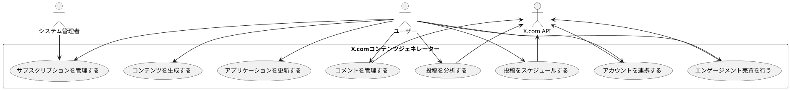

# X.com コンテンツジェネレーター要件定義書

**文書番号:** XCG-REQ-2025-001  
**バージョン:** 1.0.0  
**作成日:** 2025-04-28  
**最終更新日:** 2025-04-28  
**作成者:** RyuhoW  
**承認者:** {承認者名}  
**ステータス:** ドラフト

## 変更履歴

| 日付 | バージョン | 担当者 | 変更内容 |
|------|------------|---------|----------|
| 2025-04-28 | 1.0.0 | RyuhoW | 初版作成 |

## 目次

1. [プロジェクト概要](#1-プロジェクト概要)
2. [システム要件](#2-システム要件)
3. [機能要件](#3-機能要件)
4. [非機能要件](#4-非機能要件)
5. [外部インターフェース要件](#5-外部インターフェース要件)
6. [制約条件](#6-制約条件)
7. [データ要件](#7-データ要件)
8. [付録](#8-付録)

## 1. プロジェクト概要

### 1.1 目的

X.comコンテンツジェネレーターは、X.com（旧Twitter）ユーザー向けに最適化された投稿コンテンツを自動生成し、効果的なスケジュール管理と分析機能を提供するデスクトップアプリケーションです。ユーザーはキーワードとテーマを指定するだけで、エンゲージメントを最大化するためのコンテンツを生成し、最適なタイミングで投稿することができます。

本アプリケーションの主な目的は以下の通りです：

- ユーザーの時間と労力を節約する高品質なX.com投稿コンテンツの自動生成
- 最適な投稿タイミングの提案と自動投稿スケジューリング
- 投稿パフォーマンスの詳細な分析とインサイトの提供
- コメント管理と非関連コメントのフィルタリング
- 複数のサブスクリプションプランによる段階的な機能提供

### 1.2 対象ユーザー

本アプリケーションの主要ターゲットユーザーは以下の通りです：

1. **コンテンツクリエイター**
   - 定期的に質の高いコンテンツを投稿する必要があるインフルエンサー
   - ブログやウェブサイトの宣伝を行うコンテンツライター

2. **ビジネスアカウント運用者**
   - ブランドイメージを維持しながら定期的な情報発信を行う企業
   - マーケティング担当者や社内コミュニケーションチーム

3. **個人X.comユーザー**
   - より効果的な情報発信を望むアクティブユーザー
   - フォロワー獲得・エンゲージメント向上を目指すユーザー

4. **エージェンシー/マーケター**
   - 複数クライアントのSNS運用を代行する代理店
   - デジタルマーケティングの一環としてX.comを活用する専門家

### 1.3 用語定義

| 用語 | 定義 |
|------|------|
| コンテンツジェネレーション | キーワードやテーマに基づいて、X.com用の投稿文を自動作成する機能 |
| スケジュール投稿 | 指定した日時に自動投稿するよう予約する機能 |
| エンゲージメント | いいね、リポスト、返信、引用などのユーザー反応の総称 |
| エンゲージメント率 | 投稿到達数に対するエンゲージメント数の割合 |
| テンプレート | 投稿コンテンツの基本構造を定義した雛形 |
| コメント非表示機能 | 投稿に対する関連性の低いコメントを自動的に非表示にする機能 |
| 機械学習モデル | コメント関連性判断や投稿最適化に使用する人工知能アルゴリズム |
| プラン | 利用可能な機能セットを定義するサブスクリプションレベル |
| エンゲージメント売買 | ブラックプランで提供される相互エンゲージメント向上支援機能 |

### 1.4 参考資料

- X.com API公式ドキュメント
- X.com開発者ポリシーとガイドライン
- ソーシャルメディア最適化ベストプラクティス
- 日本語自然言語処理技術資料
- GDPR及び個人情報保護法関連資料

## 2. システム要件

### 2.1 システム構成

X.comコンテンツジェネレーターは以下のコンポーネントで構成されます：

1. **クライアントアプリケーション**
   - GUI: JavaFXベースのユーザーインターフェース
   - ビジネスロジック: コンテンツ生成、スケジュール管理、分析機能を実装
   - データアクセス層: ローカルデータベースとの連携
   - API連携モジュール: X.com APIとの通信機能

2. **ローカルデータベース**
   - SQLiteデータベース
   - アカウント情報、テンプレート、投稿履歴、分析データの保存

3. **機械学習モジュール**
   - テキスト分析エンジン
   - エンゲージメント予測モデル
   - コメント関連性分類器

4. **外部連携サービス**
   - X.com API
   - Strapi決済システム
   - アップデートサーバー

### 2.2 ハードウェア要件

#### 最小システム要件

- プロセッサ: Intel Core i3 / AMD Ryzen 3 以上
- メモリ: 4GB RAM
- ストレージ: 500MB以上の空き容量
- ディスプレイ解像度: 1280×720 以上
- ネットワーク: インターネット接続必須

#### 推奨システム要件

- プロセッサ: Intel Core i5 / AMD Ryzen 5 以上
- メモリ: 8GB RAM以上
- ストレージ: 1GB以上の空き容量
- ディスプレイ解像度: 1920×1080 以上
- ネットワーク: 高速インターネット接続

#### サポート対象プラットフォーム

- Windows 10/11（64ビット）
- macOS 11 Big Sur以降
- Ubuntu 20.04 LTS以降（およびその他の主要Linuxディストリビューション）

### 2.3 ソフトウェア要件

#### 必要なソフトウェアコンポーネント

- Java Runtime Environment (JRE) 11以上
- SQLiteデータベースエンジン
- R言語ランタイム（テキスト分析に使用）
- Python 3.8以上（機械学習モデル実行に使用）

#### 依存ライブラリ

- JavaFX 17以上
- SQLite JDBC Driver
- Apache HttpClient
- Google Gson
- Log4j 2
- JEP (Java Embedded Python)
- rJava
- TensorFlow/Keras（Pythonモジュール）

#### サポートするOS

- Windows 10/11（64ビット）
- macOS 11 Big Sur以降
- Ubuntu 20.04 LTS以降

### 2.4 ネットワーク要件

#### 必要なネットワーク環境

- 安定したインターネット接続
- X.com APIとの通信（HTTPS/REST）
- Strapi決済システムとの通信（HTTPS/REST）
- アップデートサーバーとの通信（HTTPS）

#### オンライン/オフラインモード

- 基本的にオンライン接続が必要
- 一部機能（下書き作成、保存済みテンプレート使用）はオフラインでも利用可能
- オフラインで作成したコンテンツは、オンライン接続時に自動同期

#### データ転送量の見積もり

- 通常使用時: 約50〜100MB/月
- 高頻度使用時: 約200〜300MB/月
- アップデート時: 約10〜50MB/アップデート（バージョンによる）

## 3. 機能要件

### 3.1 コア機能

#### 3.1.1 コンテンツ生成機能

**a. 自動コンテンツ生成**

- キーワードに基づいたX.com投稿文の自動生成
- トピック関連キーワードの提案
- 複数バリエーションの生成（プランに応じた制限あり）
- 文字数制限遵守と自動最適化

**b. テンプレート管理**

- 複数のテンプレートカテゴリ（質問形式、ニュース形式、プロモーション形式など）
- カスタムテンプレートの作成と保存（プランに応じた制限あり）
- テンプレートのインポート/エクスポート
- テンプレート使用統計の表示

**c. キーワード管理**

- よく使用するキーワードの保存と管理
- キーワードカテゴリ分類
- 関連キーワード自動提案
- トレンドキーワード表示（プロプラン以上）

**d. AI最適化**

- エンゲージメント最大化のための文章最適化
- パーソナライズされた文体と表現の調整
- ハッシュタグ最適化と提案
- トピック関連性スコアリング

**e. メディア添付機能**

- 画像、動画の添付
- メディアプレビュー
- 代替テキスト設定

#### 3.1.2 投稿管理機能

**a. スケジュール投稿**

- プランに応じた予約投稿機能
  - ビギナー: 週1回まで、最大1回の予約、翌週までの予約
  - アマチュア: 週3回まで、最大10件の予約、1ヶ月先までの予約
  - プロ: 無制限の投稿、無制限の予約、最大3ヶ月先までの予約
- カレンダービュー表示
- 最適投稿時間の自動提案（プロプラン）
- 定期投稿設定（毎日、毎週、毎月など）（プロプラン）

**b. 下書き管理**

- 投稿下書きの保存
- 下書きの編集とプレビュー
- 下書きの整理とカテゴリ分け
- テンプレートとしての保存

**c. 投稿履歴管理**

- 過去の投稿一覧表示
- 投稿パフォーマンス概要
- リポスト/引用/返信機能
- 投稿の整理と検索

**d. キュー管理**

- 投稿キューの表示と編集
- 順序の変更
- スケジュール変更
- 一括操作（削除、延期など）

#### 3.1.3 分析機能

**a. エンゲージメント分析**

- 計測項目：いいね、リポスト、引用、返信、インプレッション数
- 投稿ごとのエンゲージメント詳細
- エンゲージメント時系列分析
- プロプラン特典:
  - いいね数÷経過日数順分析
  - インプレッション数÷経過日数順分析
  - リポスト数÷経過日数順分析
  - 引用数÷経過日数順分析

**b. パフォーマンスレポート**

- 日次/週次/月次レポート
- カスタム期間レポート
- カテゴリ別パフォーマンス比較
- データのエクスポート（CSV、PDF）（プロプラン）

**c. 最適投稿時間分析**

- ユーザーフォロワーの活動時間帯分析（プロプラン）
- 曜日・時間帯別エンゲージメント率の表示
- 過去のパフォーマンスに基づく推奨投稿時間
- カスタマイズ可能なタイムゾーン設定

**d. トピック分析**

- トピック別エンゲージメント比較（プロプラン）
- 話題のトピック推移
- フォロワーの興味分野マッピング
- コンテンツ戦略提案

#### 3.1.4 コメント管理機能（プロプランのみ）

**a. コメント非表示フィルター**

- 投稿内容と関連性のないコメントの自動検出
- 機械学習と深層学習を活用した関連性判定
- ユーザーのコメントデータを学習データとして活用
- フィルタリング感度の調整

**b. コメント管理ダッシュボード**

- 非表示コメントの一覧表示（関連性確度の低い順）
- コメント個別の表示/非表示切替
- フィルタリング閾値のカスタマイズ
- モデレーション履歴の確認

**c. コメント分析**

- 非表示率統計
- 精度レポート（手動で覆された判定の割合）
- コメントパターン分析
- 時系列でのトレンド分析

### 3.2 アカウント管理機能

**a. アカウント認証**

- OAuth認証によるX.comアカウント連携
- 安全な認証情報の保存
- 認証の定期的な更新

**b. マルチアカウント管理**

- 複数アカウントの追加と切替（プランに応じた上限あり）
  - ビギナー: 1アカウント
  - アマチュア: 3アカウントまで
  - プロ: 10アカウントまで
- アカウントごとの設定保存
- アカウント情報の同期

**c. 権限管理**

- アクセス権限の設定
- パスワード保護
- アクティビティログ

### 3.3 サブスクリプションプラン管理

#### 3.3.1 ビギナープラン

- **料金**: 月額2,000円
- **スケジュール機能**:
  - 週1回までのスケジュール投稿
  - 同時に予約可能な投稿は1件まで
  - 最大1週間先までの予約が可能
- **コンテンツ生成**:
  - 基本テンプレートのみ（10種類）
  - AI最適化は1日3回まで
- **コメント管理**: 利用不可
- **アナリティクス**: 基本統計のみ（いいね数、リポスト数、閲覧数）
- **その他制限**:
  - アカウント接続は1つまで
  - ハッシュタグ自動生成は1日3回まで

#### 3.3.2 アマチュアプラン

- **料金**: 月額4,000円
- **スケジュール機能**:
  - 週3回までのスケジュール投稿
  - 同時に予約可能な投稿は10件まで
  - 最大1か月先までの予約が可能
- **コンテンツ生成**:
  - 拡張テンプレート（30種類）
  - AI最適化は1日10回まで
  - カスタムテンプレート作成（最大5個）
- **コメント管理**: 利用不可
- **アナリティクス**: 基本統計のみ（トレンド表示機能付き）
- **その他特典**:
  - アカウント接続は3つまで
  - ハッシュタグ自動生成は無制限
  - バリエーション生成機能（1投稿あたり3つまで）

#### 3.3.3 プロプラン

- **料金**: 月額5,000円
- **スケジュール機能**:
  - スケジュール投稿回数無制限
  - 予約投稿数無制限
  - 最大3か月先までの予約が可能
  - 再投稿最適化機能（過去の好成績投稿の自動リサイクル）
- **コンテンツ生成**:
  - プロフェッショナルテンプレート全種類（50種類+定期追加）
  - AI最適化は無制限
  - カスタムテンプレート作成（無制限）
  - 高度なコンテキスト分析と推奨機能
- **コメント管理**: 完全利用可能
  - 非関連コメントの自動非表示
  - コメント管理ダッシュボード
  - カスタムモデレーションルール設定
- **アナリティクス**: 高度な分析機能
  - いいね数÷経過日数順分析
  - インプレッション数÷経過日数順分析
  - リポスト数÷経過日数順分析
  - 引用数÷経過日数順分析
  - トピック別エンゲージメント分析
  - 時間帯・曜日別最適投稿タイミング分析
  - オーディエンス行動パターン分析
  - 競合アカウント比較分析（最大10アカウント）
- **その他特典**:
  - アカウント接続は10つまで
  - 優先サポート（24時間以内の返信）
  - バリエーション生成機能（1投稿あたり10つまで）
  - カスタムレポート出力（PDF/Excel）

### 3.4 その他の機能

**a. バックアップ/復元**

- データの自動バックアップ
- クラウドバックアップ（プロプラン）
- マニュアルバックアップ作成
- バックアップからの復元

**b. 設定管理**

- インターフェース設定
- 言語設定
- 通知設定
- データ使用設定

**c. ヘルプ/サポート**

- チュートリアル
- コンテキスト依存ヘルプ
- サポートチケット作成（プロプラン優先対応）
- よくある質問と回答

**d. 将来計画：ブラックプラン機能**

- **料金**: 月額10,000円（招待制）
- **エンゲージメント売買システム**:
  - 同一グループ内でのエンゲージメント売買
  - リポスト、いいね、引用、コメントの売買
  - オークション形式の価格決定
  - 予算に基づく最大効果の自動最適化
  - トピック関連性を考慮したマッチング
  - 取引の10%を手数料として徴収
  - 相乗効果ボーナス制度

## 4. 非機能要件

### 4.1 パフォーマンス要件

**a. 応答時間**

- UI操作の応答時間: 200ms以内
- コンテンツ生成処理: 3秒以内
- データ読み込み: 1秒以内
- API通信: 5秒以内でタイムアウト処理

**b. スループット**

- 同時実行可能なバックグラウンドタスク: 最低5つ
- 1時間あたりの最大スケジュール投稿数: 60件
- バッチ処理能力: 1回あたり最大100件の投稿分析

**c. リソース使用効率**

- メモリ使用量: 最大2GB以下
- CPU使用率: アイドル時5%以下、処理時50%以下
- ディスク使用量: 初期インストール時500MB以下、運用時データ増加率月間50MB以下

### 4.2 セキュリティ要件

**a. 認証/認可**

- OAuth 2.0によるX.comアカウント認証
- アプリケーション起動時のパスワード保護オプション
- セッションタイムアウトと自動ログアウト機能
- 権限レベルに応じた機能制限

**b. データ保護**

- OAuth認証トークンの暗号化保存（AES-256）
- パスワードのソルト付きハッシュ保存
- ローカルデータベースの暗号化
- 環境依存キー導出によるデータ保護

**c. セキュアな通信**

- すべての外部通信でのHTTPSの使用
- SSL/TLS証明書の検証
- API通信での適切な認証ヘッダー使用
- センシティブデータの通信時暗号化

### 4.3 信頼性要件

**a. 可用性**

- アプリケーションの安定動作時間: 99.5%以上
- 計画外のクラッシュ発生率: 0.1%未満
- 自動リカバリー機能の実装

**b. 耐障害性**

- ネットワーク接続切断時のグレースフル・デグラデーション
- 未送信データの一時保存と自動再送
- X.com API障害時の適切なフォールバック処理
- データ破損防止機能

**c. リカバリー要件**

- 自動保存と作業復元機能
- 異常終了時のデータ復元
- 定期的な自動バックアップ
- ワンクリックでのデータ復元機能

### 4.4 ユーザビリティ要件

**a. UI/UX要件**

- モダンで直感的なインターフェース設計
- レスポンシブなレイアウト（最小解像度1280×720に対応）
- ダークモード/ライトモードの切り替え
- ドラッグ＆ドロップによる操作サポート

**b. アクセシビリティ**

- スクリーンリーダー対応
- キーボードによる完全操作
- 高コントラストモードオプション
- フォントサイズの調整機能

**c. 学習容易性**

- 初回起動時のチュートリアル
- コンテキスト依存のヘルプ
- ツールチップと説明テキスト
- サンプルテンプレートと使用例の提供

### 4.5 保守性要件

**a. 拡張性**

- プラグイン方式によるモジュール追加
- カスタムテンプレートのインポート/エクスポート
- APIの変更に迅速に対応できる設計
- 新機能の段階的なリリース対応

**b. テスト容易性**

- 自動化されたユニットテストとUIテスト
- テストモードの実装
- テストカバレッジ80%以上を維持
- モック接続による外部依存のテスト

**c. アップデート方法**

- アプリケーション内からの自動更新
- デルタアップデートによる効率的な更新
- ロールバック機能
- バックグラウンドダウンロードとスケジュール更新

### 4.6 その他の非機能要件

**a. 国際化/ローカライゼーション**

- 日本語と英語の完全サポート
- 追加言語の拡張性を確保
- 日時と数値の地域フォーマット対応
- 言語リソースの外部化

**b. コンプライアンス要件**

- X.com API利用規約の完全準拠
- GDPR対応（ユーザーデータの取り扱いに関する規定）
- 個人情報保護法対応
- アクセシビリティ基準への準拠

## 5. 外部インターフェース要件

### 5.1 X.com API連携

**a. 認証方式**

- OAuth 1.0a認証フロー実装
- リクエストトークン取得と検証
- アクセストークンの安全な保存
- トークン期限管理と自動更新

**b. 利用するAPIエンドポイント**

- ツイート投稿 API
- メディアアップロード API
- ユーザー情報取得 API
- タイムライン取得 API
- アナリティクス API
- コメント（返信）管理 API

**c. レート制限対応**

- API呼び出し頻度の制限遵守
- レート制限監視とスロットリング
- 制限到達時の適切なエラーハンドリング
- バックオフとリトライのアルゴリズム実装

### 5.2 決済システム連携

**a. Strapi決済システム**

- REST APIベースの連携
- JSONデータ交換形式
- HTTPS通信による安全な接続
- トークンベースの認証

**b. サブスクリプション管理**

- プラン情報の取得と表示
- サブスクリプション状態の確認
- 支払い履歴の確認
- プランのアップグレード/ダウングレード処理

**c. 支払い処理**

- クレジットカード決済
- 代替支払い方法（PayPal等）
- 請求書の生成と表示
- 支払い失敗時のリカバリー処理

**d. 更新通知**

- サブスクリプション期限切れ前の通知
- 支払い成功/失敗通知
- プラン変更確認通知
- 特別オファー通知

### 5.3 その他の外部連携

**a. データ分析サービス**

- ユーザー行動分析のためのデータ連携
- 匿名化されたユーザーデータの収集
- パフォーマンスベンチマーク比較
- トレンド分析とレポート

**b. 更新配信システム**

- アプリケーション更新の自動チェック
- デルタアップデートのダウンロード
- バージョン互換性チェック
- インストール前の署名検証

**c. 機械学習サービス**

- コメント関連性分析モデルの更新
- テキスト生成モデルの更新
- 予測モデルのトレーニングデータ送信
- モデルパフォーマンス評価フィードバック

## 6. 制約条件

### 6.1 法的制約

**a. 法令遵守**

- 個人情報保護法への準拠
- 電子商取引法への準拠
- 著作権法への準拠
- 各国のデータプライバシー規制への対応

**b. プライバシー要件**

- 明示的なユーザー同意の取得
- データ収集目的の明確な説明
- ユーザーデータの匿名化処理
- データ削除要求への対応機能

**c. X.comの利用規約遵守**

- API使用制限の完全遵守
- コンテンツポリシーへの準拠
- 自動化規則への準拠
- スパム防止ポリシーの尊重

### 6.2 技術的制約

**a. 使用すべき/避けるべき技術**

- 使用すべき技術:
  - JavaおよびJavaFX
  - SQLite
  - RESTful API通信
  - OAuth認証
- 避けるべき技術:
  - 非推奨のX.com API
  - 過度に重いフレームワーク
  - ブラウザ埋め込み技術（セキュリティリスクあり）
  - プラットフォーム非互換の機能

**b. 互換性要件**

- 過去のデータフォーマットとの互換性維持
- 以前のバージョンからのアップグレードパス確保
- 複数OSプラットフォーム間の機能一貫性
- ファイル形式の標準化

**c. パフォーマンス制限**

- メモリ使用量の上限: 2GB
- 起動時間の上限: 5秒
- レスポンスタイムの基準値遵守
- バックグラウンド処理のCPU使用率制限

### 6.3 ビジネス制約

**a. 予算**

- 初期開発予算の上限
- 運用コストの管理
- 第三者ライブラリ/サービスの費用考慮
- ROI目標の設定と評価

**b. スケジュール**

- 初期リリース: 2025年第3四半期
- アルファテスト: 2025年7月
- ベータテスト: 2025年8月
- 製品リリース: 2025年9月

**c. リソース制限**

- 開発チーム規模: 4〜5人
- QAリソース: 2人
- デザインリソース: 1人
- 運用サポート: 2人

## 7. データ要件

### 7.1 データモデル概要

**a. 主要エンティティ**

- ユーザー: アプリケーションユーザー情報
- アカウント: 接続されたX.comアカウント情報
- コンテンツ: 生成されたコンテンツとメタデータ
- テンプレート: コンテンツ生成テンプレート
- スケジュール: 投稿スケジュール情報
- アナリティクス: 投稿パフォーマンスデータ

**b. リレーションシップ**

- ユーザーは複数のアカウントを所有
- アカウントは複数のコンテンツに紐づく
- コンテンツはテンプレートから生成される
- スケジュールはコンテンツとアカウントに紐づく
- アナリティクスはコンテンツに紐づく

### 7.2 データ量と増加率

**a. 初期データ量**

- 基本テンプレート: 約50件（500KB）
- システム設定: 約20件（100KB）
- アプリケーション基本データ: 約5MB

**b. 成長予測**

- ユーザーデータ: 1アカウントあたり初期10MB、月間成長約5MB
- コンテンツデータ: 投稿100件あたり約1MB
- アナリティクスデータ: 投稿1件あたり月間約50KB
- テンプレートデータ: ユーザー作成テンプレート1件あたり約20KB

**c. アーカイブ要件**

- 3ヶ月以上前の詳細アナリティクスデータの圧縮保存
- 1年以上前の未使用コンテンツの自動アーカイブ
- アーカイブデータの復元機能
- データアーカイブ設定のカスタマイズ

### 7.3 データ保持ポリシー

**a. バックアップ要件**

- ローカルデータの自動バックアップ（日次）
- バックアップ世代管理（最新5世代の保持）
- 手動バックアップ作成オプション
- エクスポート/インポート機能によるポータビリティ確保

**b. データ保持期間**

- アカウント情報: アカウントが接続されている限り保持
- 投稿コンテンツ: 無期限（ユーザー削除可能）
- アナリティクスデータ: 詳細データは1年間、集計データは無期限
- ログデータ: 90日間

**c. データ削除ポリシー**

- ユーザーリクエストによる即時削除オプション
- アカウント接続解除時のデータ処理オプション
- 定期的な未使用データクリーンアップ
- プライバシーポリシーに基づくデータ処理

## 8. 付録

### 8.1 ユースケース図

### 8.2 プロトタイプ参照

初期UIプロトタイプは以下の場所で参照できます：

- デスクトップアプリケーションUI: `/designs/desktop-ui-prototype.pdf`
- モバイル連携画面UI: `/designs/mobile-companion-ui.pdf`
- ダッシュボード画面: `/designs/analytics-dashboard.png`

### 8.3 要件優先度一覧

| 要件ID | 要件概要 | 優先度 | フェーズ |
|--------|---------|-------|---------|
| REQ-001 | 基本コンテンツ生成機能 | 高 | フェーズ1 |
| REQ-002 | アカウント連携機能 | 高 | フェーズ1 |
| REQ-003 | 基本スケジュール機能 | 高 | フェーズ1 |
| REQ-004 | 基本分析機能 | 中 | フェーズ1 |
| REQ-005 | サブスクリプション管理 | 高 | フェーズ1 |
| REQ-006 | 高度分析機能 | 中 | フェーズ2 |
| REQ-007 | コメント管理機能 | 中 | フェーズ2 |
| REQ-008 | カスタムテンプレート機能 | 中 | フェーズ2 |
| REQ-009 | マルチアカウント機能 | 中 | フェーズ2 |
| REQ-010 | エンゲージメント売買システム | 低 | フェーズ3 |

---

*この文書はX.comコンテンツジェネレーターの要件を定義するものであり、開発過程で更新される可能性があります。*
